# Informe del Trabajo (VERSION AV1, TB1, AV2 O TB2)

  

  
Universidad Peruana de Ciencias Aplicadas

  
Facultad de Ingeniería

  
Carrera: Ingeniería de Software

  
<b>Periodo: 2026-20</b>

  
Código del curso: 1ASI0732

  
Nombre del curso: Diseño de Experimentos de Ingeniería de Software

  
NRC: 9100

  
Nombre del profesor: Sánchez Ponce Alex Humberto

  
<b>Informe de Trabajo Final</b>

  
Nombre del startup: NeuroDraw

  
Nombre del producto: NeuroZen

<h3 align="center">Relación de integrantes</h3>

<table>
  <thead>
    <tr>
      <th>Código</th>
      <th>Apellidos y Nombres</th>
    </tr>
  </thead>
  <tbody>
    <tr>
      <td>U20231G159</td>
      <td>Castro Picón, Manuel Fernando Joao</td>
    </tr>
    <tr>
      <td>U20201E781</td>
      <td>Huaman De La Cruz, Jean Pool</td>
    </tr>
    <tr>
      <td>U202321613</td></td>
      <td>Paredes Chavez, Carlos Augusto </td>
    </tr>
      <tr>
      <td>U20321774</td>
      <td>Requena Gutiérrez, Diego Gabriel</td>
    </tr>
    <tr>
      <td>U20231G054</td>
      <td>Vila Guillen, Miguel Angel</td>
    </tr>
  </tbody>
</table>

<b>Tabla 0.1.</b> Relación de integrantes del equipo.

  
  
<b>Septiembre, 2026</b>

---

## Registro de Versiones del Informe

| Versión | Fecha | Autores | Descripción |
|---------|-------|---------|-------------|
|  |  |  |  |

---

## Project Report Collaboration Insights

<!-- URL del repositorio del informe, explicación por entrega y capturas de analíticos de colaboración/commits -->

### Contribuciones por integrante

<table border="1" cellpadding="10" cellspacing="0" style="border-collapse: collapse; width: 100%;">
  <tr>
    <td align="center" style="border: 1px solid #ddd; padding: 8px;">Integrante</td>
    <td align="center" style="border: 1px solid #ddd; padding: 8px;">Tareas Asignadas</td>
  </tr>
  <tr>
    <td style="border: 1px solid #ddd; padding: 8px;"></td>
    <td style="border: 1px solid #ddd; padding: 8px;"></td>
  </tr>
</table>

# Contenido

- [Student Outcome](#student-outcome)

**Parte I: As-Is Software Project**

- [Capítulo I: Introducción](#capítulo-i-introducción)
  - [1.1. Startup Profile](#11-startup-profile)
    - [1.1.1. Descripción de la Startup](#111-descripción-de-la-startup)
    - [1.1.2. Perfiles de integrantes del equipo](#112-perfiles-de-integrantes-del-equipo)
  - [1.2. Solution Profile](#12-solution-profile)
    - [1.2.1. Antecedentes y problemática](#121-antecedentes-y-problemática)
    - [1.2.2. Lean UX Process](#122-lean-ux-process)
      - [1.2.2.1. Lean UX Problem Statements](#1221-lean-ux-problem-statements)
      - [1.2.2.2. Lean UX Assumptions](#1222-lean-ux-assumptions)
      - [1.2.2.3. Lean UX Hypothesis Statements](#1223-lean-ux-hypothesis-statements)
      - [1.2.2.4. Lean UX Canvas](#1224-lean-ux-canvas)
  - [1.3. Segmentos objetivo](#13-segmentos-objetivo)

- [Capítulo II: Requirements Elicitation & Analysis](#capítulo-ii-requirements-elicitation--analysis)
  - [2.1. Competidores](#21-competidores)
    - [2.1.1. Análisis competitivo](#211-análisis-competitivo)
    - [2.1.2. Estrategias y tácticas frente a competidores](#212-estrategias-y-tácticas-frente-a-competidores)
  - [2.2. Entrevistas](#22-entrevistas)
    - [2.2.1. Diseño de entrevistas](#221-diseño-de-entrevistas)
    - [2.2.2. Registro de entrevistas](#222-registro-de-entrevistas)
    - [2.2.3. Análisis de entrevistas](#223-análisis-de-entrevistas)
  - [2.3. Needfinding](#23-needfinding)
    - [2.3.1. User Personas](#231-user-personas)
    - [2.3.2. User Task Matrix](#232-user-task-matrix)
    - [2.3.3. User Journey Mapping](#233-user-journey-mapping)
    - [2.3.4. Empathy Mapping](#234-empathy-mapping)
    - [2.3.5. As-is Scenario Mapping](#235-as-is-scenario-mapping)
  - [2.4. Ubiquitous Language](#24-ubiquitous-language)

- [Capítulo III: Requirements Specification](#capítulo-iii-requirements-specification)
  - [3.1. To-Be Scenario Mapping](#31-to-be-scenario-mapping)
  - [3.2. User Stories](#32-user-stories)
  - [3.3. Product Backlog](#33-product-backlog)
  - [3.4. Impact Mapping](#34-impact-mapping)

- [Capítulo IV: Product Design](#capítulo-iv-product-design)
  - [4.1. Style Guidelines](#41-style-guidelines)
    - [4.1.1. General Style Guidelines](#411-general-style-guidelines)
    - [4.1.2. Web Style Guidelines](#412-web-style-guidelines)
    - [4.1.3. Mobile Style Guidelines](#413-mobile-style-guidelines)
      - [4.1.3.1. iOS Mobile Style Guidelines](#4131-ios-mobile-style-guidelines)
      - [4.1.3.2. Android Mobile Style Guidelines](#4132-android-mobile-style-guidelines)
  - [4.2. Information Architecture](#42-information-architecture)
    - [4.2.1. Organization Systems](#421-organization-systems)
    - [4.2.2. Labeling Systems](#422-labeling-systems)
    - [4.2.3. SEO Tags and Meta Tags](#423-seo-tags-and-meta-tags)
    - [4.2.4. Searching Systems](#424-searching-systems)
    - [4.2.5. Navigation Systems](#425-navigation-systems)
  - [4.3. Landing Page UI Design](#43-landing-page-ui-design)
    - [4.3.1. Landing Page Wireframe](#431-landing-page-wireframe)
    - [4.3.2. Landing Page Mock-up](#432-landing-page-mock-up)
  - [4.4. Mobile Applications UX/UI Design](#44-mobile-applications-uxui-design)
    - [4.4.1. Mobile Applications Wireframes](#441-mobile-applications-wireframes)
    - [4.4.2. Mobile Applications Wireflow Diagrams](#442-mobile-applications-wireflow-diagrams)
    - [4.4.3. Mobile Applications Mock-ups](#443-mobile-applications-mock-ups)
    - [4.4.4. Mobile Applications User Flow Diagrams](#444-mobile-applications-user-flow-diagrams)
  - [4.5. Mobile Applications Prototyping](#45-mobile-applications-prototyping)
    - [4.5.1. Android Mobile Applications Prototyping](#451-android-mobile-applications-prototyping)
    - [4.5.2. iOS Mobile Applications Prototyping](#452-ios-mobile-applications-prototyping)
  - [4.6. Web Applications UX/UI Design](#46-web-applications-uxui-design)
    - [4.6.1. Web Applications Wireframes](#461-web-applications-wireframes)
    - [4.6.2. Web Applications Wireflow Diagrams](#462-web-applications-wireflow-diagrams)
    - [4.6.3. Web Applications Mock-ups](#463-web-applications-mock-ups)
    - [4.6.4. Web Applications User Flow Diagrams](#464-web-applications-user-flow-diagrams)
  - [4.7. Web Applications Prototyping](#47-web-applications-prototyping)
  - [4.8. Domain-Driven Software Architecture](#48-domain-driven-software-architecture)
    - [4.8.1. Software Architecture Context Diagram](#481-software-architecture-context-diagram)
    - [4.8.2. Software Architecture Container Diagrams](#482-software-architecture-container-diagrams)
    - [4.8.3. Software Architecture Components Diagrams](#483-software-architecture-components-diagrams)
  - [4.9. Software Object-Oriented Design](#49-software-object-oriented-design)
    - [4.9.1. Class Diagrams](#491-class-diagrams)
    - [4.9.2. Class Dictionary](#492-class-dictionary)
  - [4.10. Database Design](#410-database-design)
    - [4.10.1. Relational/Non-Relational Database Diagram](#4101-relationalnon-relational-database-diagram)

- [Capítulo V: Product Implementation](#capítulo-v-product-implementation)
  - [5.1. Software Configuration Management](#51-software-configuration-management)
    - [5.1.1. Software Development Environment Configuration](#511-software-development-environment-configuration)
    - [5.1.2. Source Code Management](#512-source-code-management)
    - [5.1.3. Source Code Style Guide & Conventions](#513-source-code-style-guide--conventions)
    - [5.1.4. Software Deployment Configuration](#514-software-deployment-configuration)
  - [5.2. Product Implementation & Deployment](#52-product-implementation--deployment)
    - [5.2.1. Sprint Backlogs](#521-sprint-backlogs)
    - [5.2.2. Implemented Landing Page Evidence](#522-implemented-landing-page-evidence)
    - [5.2.3. Implemented Frontend-Web Application Evidence](#523-implemented-frontend-web-application-evidence)
    - [5.2.4. Acuerdo de Servicio - SaaS](#524-acuerdo-de-servicio---saas)
    - [5.2.5. Implemented Native-Mobile Application Evidence](#525-implemented-native-mobile-application-evidence)
    - [5.2.6. Implemented RESTful API and/or Serverless Backend Evidence](#526-implemented-restful-api-andor-serverless-backend-evidence)
    - [5.2.7. RESTful API documentation](#527-restful-api-documentation)
    - [5.2.8. Team Collaboration Insights](#528-team-collaboration-insights)
  - [5.3. Video About-the-Product](#53-video-about-the-product)

**Parte II: Verification, Validation & Pipeline**

- [Capítulo VI: Product Verification & Validation](#capítulo-vi-product-verification--validation)
  - [6.1. Testing Suites & Validation](#61-testing-suites--validation)
    - [6.1.1. Core Entities Unit Tests](#611-core-entities-unit-tests)
    - [6.1.2. Core Integration Tests](#612-core-integration-tests)
    - [6.1.3. Core Behavior-Driven Development](#613-core-behavior-driven-development)
    - [6.1.4. Core System Tests](#614-core-system-tests)
  - [6.2. Static testing & Verification](#62-static-testing--verification)
    - [6.2.1. Static Code Analysis](#621-static-code-analysis)
      - [6.2.1.1. Coding standard & Code conventions](#6211-coding-standard--code-conventions)
      - [6.2.1.2. Code Quality & Code Security](#6212-code-quality--code-security)
    - [6.2.2. Reviews](#622-reviews)
  - [6.3. Validation Interviews](#63-validation-interviews)
    - [6.3.1. Diseño de Entrevistas](#631-diseño-de-entrevistas)
    - [6.3.2. Registro de Entrevistas](#632-registro-de-entrevistas)
    - [6.3.3. Evaluaciones según heurísticas](#633-evaluaciones-según-heurísticas)
  - [6.4. Auditoría de Experiencias de Usuario](#64-auditoría-de-experiencias-de-usuario)
    - [6.4.1. Auditoría realizada](#641-auditoría-realizada)
      - [6.4.1.1. Información del grupo auditado](#6411-información-del-grupo-auditado)
      - [6.4.1.2. Cronograma de auditoría realizada](#6412-cronograma-de-auditoría-realizada)
      - [6.4.1.3. Contenido de auditoría realizada](#6413-contenido-de-auditoría-realizada)
    - [6.4.2. Auditoría recibida](#642-auditoría-recibida)
      - [6.4.2.1. Información del grupo auditor](#6421-información-del-grupo-auditor)
      - [6.4.2.2. Cronograma de auditoría recibida](#6422-cronograma-de-auditoría-recibida)
      - [6.4.2.3. Contenido de auditoría recibida](#6423-contenido-de-auditoría-recibida)
      - [6.4.2.4. Resumen de modificaciones para subsanar hallazgos](#6424-resumen-de-modificaciones-para-subsanar-hallazgos)

- [Capítulo VII: DevOps Practices](#capítulo-vii-devops-practices)
  - [7.1. Continuous Integration](#71-continuous-integration)
    - [7.1.1. Tools and Practices](#711-tools-and-practices)
    - [7.1.2. Build & Test Suite Pipeline Components](#712-build--test-suite-pipeline-components)
  - [7.2. Continuous Delivery](#72-continuous-delivery)
    - [7.2.1. Tools and Practices](#721-tools-and-practices)
    - [7.2.2. Stages Deployment Pipeline Components](#722-stages-deployment-pipeline-components)
  - [7.3. Continuous deployment](#73-continuous-deployment)
    - [7.3.1. Tools and Practices](#731-tools-and-practices)
    - [7.3.2. Production Deployment Pipeline Components](#732-production-deployment-pipeline-components)
  - [7.4. Continuous Monitoring](#74-continuous-monitoring)
    - [7.4.1. Tools and Practices](#741-tools-and-practices)
    - [7.4.2. Monitoring Pipeline Components](#742-monitoring-pipeline-components)
    - [7.4.3. Alerting Pipeline Components](#743-alerting-pipeline-components)
    - [7.4.4. Notification Pipeline Components](#744-notification-pipeline-components)

**Parte III: Experiment-Driven Lifecycle**

- [Capítulo VIII: Experiment-Driven Development](#capítulo-viii-experiment-driven-development)
  - [8.1. Experiment Planning](#81-experiment-planning)
    - [8.1.1. As-Is Summary](#811-as-is-summary)
    - [8.1.2. Raw Material: Assumptions, Knowledge Gaps, Ideas, Claims](#812-raw-material-assumptions-knowledge-gaps-ideas-claims)
    - [8.1.3. Experiment-Ready Questions](#813-experiment-ready-questions)
    - [8.1.4. Question Backlog](#814-question-backlog)
    - [8.1.5. Experiment Cards](#815-experiment-cards)
  - [8.2. Experiment Design](#82-experiment-design)
    - [8.2.1. Hypotheses](#821-hypotheses)
    - [8.2.2. Domain Business Metrics](#822-domain-business-metrics)
    - [8.2.3. Measures](#823-measures)
    - [8.2.4. Conditions](#824-conditions)
    - [8.2.5. Scale Calculations and Decisions](#825-scale-calculations-and-decisions)
    - [8.2.6. Methods Selection](#826-methods-selection)
    - [8.2.7. Data Analytics: Goals, KPIs and Metrics Selection](#827-data-analytics-goals-kpis-and-metrics-selection)
    - [8.2.8. Web and Mobile Tracking Plan](#828-web-and-mobile-tracking-plan)
  - [8.3. Experimentation](#83-experimentation)
    - [8.3.1. To-Be User Stories](#831-to-be-user-stories)
    - [8.3.2. To-Be Product Backlog](#832-to-be-product-backlog)
    - [8.3.3. Pipeline-supported, Experiment-Driven To-Be Software Platform Lifecycle](#833-pipeline-supported-experiment-driven-to-be-software-platform-lifecycle)
      - [8.3.3.1. To-Be Sprint Backlogs](#8331-to-be-sprint-backlogs)
      - [8.3.3.2. Implemented To-Be Landing Page Evidence](#8332-implemented-to-be-landing-page-evidence)
      - [8.3.3.3. Implemented To-Be Frontend-Web Application Evidence](#8333-implemented-to-be-frontend-web-application-evidence)
      - [8.3.3.4. Implemented To-Be Native-Mobile Application Evidence](#8334-implemented-to-be-native-mobile-application-evidence)
      - [8.3.3.5. Implemented To-Be RESTful API and/or Serverless Backend Evidence](#8335-implemented-to-be-restful-api-andor-serverless-backend-evidence)
      - [8.3.3.6. Team Collaboration Insights](#8336-team-collaboration-insights)
    - [8.3.4. To-Be Validation Interviews](#834-to-be-validation-interviews)
      - [8.3.4.1. Diseño de Entrevistas](#8341-diseño-de-entrevistas)
      - [8.3.4.2. Registro de Entrevistas](#8342-registro-de-entrevistas)
  - [8.4. Experiment Aftermath & Analysis](#84-experiment-aftermath--analysis)
    - [8.4.1. Analysis and Interpretation of Results](#841-analysis-and-interpretation-of-results)
    - [8.4.2. Re-scored and Re-prioritized Question Backlog](#842-re-scored-and-re-prioritized-question-backlog)
  - [8.5. Continuous Learning](#85-continuous-learning)
    - [8.5.1. Shareback Session Artifacts: Learning Workflow](#851-shareback-session-artifacts-learning-workflow)
  - [8.6. To-Be Software Platform Pre-launch](#86-to-be-software-platform-pre-launch)
    - [8.6.1. About-the-Product Intro Video](#861-about-the-product-intro-video)
    - [8.6.2. Resumen usando Gees Framework](#862-resumen-usando-gees-framework)
    - [8.6.3. Matriz de Evaluación Ética y de Impacto](#863-matriz-de-evaluación-ética-y-de-impacto)

- [Conclusiones](#conclusiones)
  - [Conclusiones y recomendaciones](#conclusiones-y-recomendaciones)
  - [Video App Validation](#video-app-validation)
  - [Video About-the-Team](#video-about-the-team)

- [Bibliografía](#bibliografía)

- [Anexos](#anexos)
  - [Anexo A. Estructura para la sección Objetivo del Estudiante (Student Outcome)](#anexo-a-estructura-para-la-sección-objetivo-del-estudiante-student-outcome)
  - [Anexo B. Estructura para el Informe de participación](#anexo-b-estructura-para-el-informe-de-participación)
  - [Anexo C. Indicaciones para secciones que incluyen Videos](#anexo-c-indicaciones-para-secciones-que-incluyen-videos)
  - [Anexo D. Formato para Evaluación de User Experience según Heurísticas](#anexo-d-formato-para-evaluación-de-user-experience-según-heurísticas)
  - [Anexo E. Errores típicos en la traducción y uso de términos para Ingeniería de Software](#anexo-e-errores-típicos-en-la-traducción-y-uso-de-términos-para-ingeniería-de-software)
  - [Anexo F. Matriz de Evaluación Ética y de Impacto](#anexo-f-matriz-de-evaluación-ética-y-de-impacto)
  - [Anexo G. Videos de Exposiciones](#anexo-g-videos-de-exposiciones)

## Student Outcome

# Parte I: As-Is Software Project

# Capítulo I: Introducción

## 1.1. Startup Profile

NeuroDraw es una startup tecnológica orientada al desarrollo de soluciones digitales para la identificación, seguimiento y gestión del estrés relacionado con el contexto laboral. La startup busca aprovechar las capacidades de las aplicaciones web y móviles para proporcionar a las personas herramientas que les permitan comprender mejor las situaciones que afectan su bienestar, reconocer patrones asociados al estrés y acceder a alternativas que contribuyan a su gestión.

Como parte de esta visión, NeuroDraw desarrolla **NeuroZen**, una plataforma digital enfocada en personas laboralmente activas expuestas a situaciones de estrés relacionadas con sus actividades de trabajo. NeuroZen constituye el producto principal de la startup y reúne diferentes mecanismos de autoevaluación, seguimiento, identificación de factores asociados al estrés, actividades orientadas a su gestión y acceso a recursos de apoyo profesional.

### 1.1.1. Descripción de la Startup

NeuroDraw nace con el propósito de utilizar la ingeniería de software para desarrollar herramientas que ayuden a las personas a identificar y gestionar situaciones de estrés asociadas con su actividad laboral.

La startup reconoce que el estrés relacionado con el trabajo puede manifestarse de diferentes maneras y estar vinculado con factores como jornadas extensas, sobrecarga de actividades, presión por resultados, relaciones interpersonales, disponibilidad constante o dificultad para establecer límites entre el trabajo y la vida personal.

Su principal producto es **NeuroZen**, una plataforma digital que busca integrar diferentes mecanismos de apoyo dentro de una misma experiencia. La propuesta contempla autoevaluaciones, registro de información relacionada con señales físicas y emocionales asociadas al estrés, seguimiento histórico, identificación de patrones y factores desencadenantes, actividades orientadas a la gestión del estrés, recursos informativos y acceso a orientación profesional.

NeuroZen se plantea como una herramienta de acompañamiento y apoyo para la identificación y gestión personal del estrés. La plataforma no busca sustituir la evaluación, diagnóstico o tratamiento proporcionado por profesionales de la salud.

NeuroDraw busca que la evolución del producto se encuentre respaldada por investigación con usuarios, análisis de información y experimentación controlada. De esta manera, las decisiones sobre nuevas funcionalidades o modificaciones del producto podrán sustentarse en evidencia obtenida a partir de necesidades y comportamientos observables de sus usuarios.

Asimismo, debido a la naturaleza de la información que puede ser registrada en NeuroZen, la startup considera principios fundamentales la privacidad, seguridad, transparencia, accesibilidad y uso responsable de los datos.

### 1.1.2. Perfiles de integrantes del equipo

## 1.2. Solution Profile

NeuroZen propone una solución digital orientada a apoyar a personas laboralmente activas en la identificación, seguimiento y gestión del estrés asociado con sus actividades de trabajo.

La propuesta parte de reconocer que las situaciones de estrés no siempre se presentan como eventos aislados y que pueden relacionarse con diferentes factores laborales, físicos y emocionales. Por ello, NeuroZen busca proporcionar al usuario mecanismos que le permitan registrar información sobre su situación, realizar autoevaluaciones, identificar factores asociados, observar cambios a través del tiempo y acceder a actividades y recursos que contribuyan a gestionar el estrés.

La plataforma busca integrar estas capacidades dentro de una experiencia web y móvil accesible, permitiendo que el usuario mantenga continuidad sobre su información y pueda reconocer patrones que podrían resultar difíciles de observar mediante registros aislados.

NeuroZen no tiene como objetivo realizar diagnósticos médicos, psicológicos o psiquiátricos. La información presentada por el producto tendrá carácter orientativo y de acompañamiento, complementándose con mecanismos para facilitar el acceso a profesionales cuando el usuario considere necesaria una orientación especializada.

La evolución de la solución será guiada por investigación con usuarios, análisis de datos y experimentación, buscando comprobar mediante evidencia si las funcionalidades propuestas generan valor y contribuyen efectivamente a las necesidades identificadas.

### 1.2.1. Antecedentes y problemática

Para comprender el contexto en el que se plantea NeuroZen, se aplicó la técnica **5W+2H**, permitiendo analizar el problema desde las perspectivas de qué ocurre, quiénes se encuentran involucrados, dónde y cuándo se presenta, por qué resulta relevante, cómo se manifiesta y cuál es su magnitud.

#### What — ¿Qué ocurre?

El estrés relacionado con el trabajo puede aparecer como consecuencia de diferentes factores asociados con la actividad laboral, como jornadas extensas, sobrecarga de trabajo, presión por resultados, exigencias emocionales, relaciones interpersonales conflictivas, disponibilidad constante o dificultad para separar la vida laboral de la personal.

Uno de los principales problemas es que las personas no siempre cuentan con mecanismos continuos que les permitan identificar cómo evoluciona su nivel de estrés, reconocer qué situaciones pueden estar relacionadas con sus cambios y actuar de manera oportuna frente a ellos.

#### Who — ¿A quién afecta?

La problemática afecta principalmente a personas laboralmente activas expuestas de manera recurrente a situaciones capaces de generar estrés.

Para NeuroZen se consideran especialmente dos contextos: personas con jornadas laborales extendidas y personas que desarrollan actividades informales, independientes o bajo horarios flexibles.

También pueden verse afectados indirectamente el entorno familiar, social y laboral de estas personas, así como las organizaciones con las que se relacionan.

#### Where — ¿Dónde ocurre?

Las situaciones relacionadas con estrés laboral pueden presentarse en diferentes modalidades de trabajo, incluyendo entornos presenciales, remotos e híbridos.

También pueden producirse fuera del espacio físico de trabajo cuando las responsabilidades laborales, la disponibilidad permanente o las preocupaciones relacionadas con la actividad profesional continúan afectando al usuario después de finalizar su jornada.

El alcance inicial de NeuroZen se encuentra orientado al contexto peruano.

#### When — ¿Cuándo ocurre?

El estrés puede manifestarse durante períodos de alta carga laboral, cumplimiento de plazos, jornadas extensas, conflictos interpersonales, cambios organizacionales, incertidumbre económica o períodos en los que el trabajador dispone de poco control sobre sus actividades.

También puede desarrollarse progresivamente cuando estos factores se mantienen durante un período prolongado sin que la persona cuente con mecanismos para reconocer su evolución.

#### Why — ¿Por qué es importante atenderlo?

El estrés relacionado con el trabajo puede afectar el bienestar de las personas y generar consecuencias sobre su desempeño, relaciones interpersonales y calidad de vida.

La identificación temprana de cambios y factores asociados puede facilitar que la persona adopte acciones orientadas a gestionar estas situaciones antes de que se intensifiquen.

Por ello, resulta relevante disponer de herramientas accesibles que permitan registrar información, observar cambios y proporcionar alternativas de apoyo sin presentar estos mecanismos como sustitutos de la atención profesional.

#### How — ¿Cómo se aborda actualmente?

Actualmente, una persona puede recurrir a distintas alternativas de forma independiente, como aplicaciones de relajación, cuestionarios, contenido informativo, registros personales, ejercicios de respiración o atención con profesionales.

Sin embargo, estas alternativas pueden encontrarse distribuidas entre diferentes herramientas y no necesariamente permiten relacionar autoevaluaciones, señales percibidas, factores desencadenantes, actividades realizadas y evolución histórica dentro de un mismo proceso.

NeuroZen busca abordar esta fragmentación mediante una plataforma que permita integrar estos elementos y proporcionar al usuario una visión más organizada de su relación con el estrés laboral.

#### How Much — ¿Cuál es la magnitud del problema?

La información disponible evidencia que el estrés relacionado con el trabajo constituye una problemática relevante.

En Perú, EsSalud informó que, entre enero y septiembre de 2024, evaluó a 927 trabajadores asegurados pertenecientes a diferentes empresas de Lima y encontró que aproximadamente el **84 % presentaba algún grado de estrés laboral**. Entre los factores señalados se encontraban la excesiva carga de trabajo, las altas exigencias emocionales, la falta de autonomía y las relaciones interpersonales conflictivas.

Asimismo, el Instituto Nacional de Salud Mental “Honorio Delgado - Hideyo Noguchi” señaló que durante 2023 se atendieron más de **42 000 casos de estrés severo** en el país.

A nivel internacional, la Organización Mundial de la Salud estima que la depresión y la ansiedad generan aproximadamente **12 mil millones de días laborales perdidos anualmente**, representando alrededor de **US$1 billón en pérdida de productividad**.

Estas cifras permiten dimensionar la importancia de promover herramientas y estrategias que contribuyan a reconocer y gestionar oportunamente situaciones relacionadas con el estrés.

#### Antecedentes

El estrés laboral ha adquirido mayor relevancia debido a la relación existente entre las condiciones de trabajo y el bienestar de las personas.

Factores como la carga excesiva de actividades, jornadas prolongadas, presión por resultados, bajo nivel de autonomía, relaciones laborales conflictivas y dificultades para mantener una separación entre las responsabilidades laborales y personales pueden influir en la aparición o incremento de situaciones de estrés.

Al mismo tiempo, el crecimiento del uso de aplicaciones web y móviles permite explorar nuevas formas de acompañamiento digital. Estas herramientas pueden facilitar que las personas registren información, realicen autoevaluaciones, observen su evolución y accedan a actividades relacionadas con la gestión del estrés.

Sin embargo, debido a que este tipo de información se relaciona con aspectos personales y de bienestar, las soluciones digitales deben evitar presentar sus resultados como diagnósticos clínicos y considerar cuidadosamente la privacidad y seguridad de los datos recopilados.

Dentro de este contexto surge NeuroZen como una plataforma orientada a integrar mecanismos para la identificación, seguimiento y gestión del estrés relacionado con el trabajo.

#### Problemática

Las personas laboralmente activas pueden encontrarse expuestas de manera recurrente a factores capaces de generar estrés sin disponer de mecanismos continuos que les permitan reconocer cómo evoluciona su situación, relacionar los cambios percibidos con posibles factores desencadenantes y tomar acciones de manera oportuna.

Si bien existen cuestionarios, aplicaciones de bienestar, técnicas de relajación, contenido informativo y servicios profesionales, estos recursos suelen utilizarse de forma aislada. Esta fragmentación dificulta mantener una visión continua que relacione autoevaluaciones, señales físicas o emocionales percibidas, situaciones laborales, actividades realizadas y evolución histórica.

Por ello, se identifica la necesidad de proporcionar una experiencia digital que permita al usuario recopilar y organizar información relacionada con su estrés laboral, observar patrones a través del tiempo y acceder a herramientas que contribuyan a su gestión.

NeuroZen busca responder a esta problemática integrando mecanismos de autoevaluación, registro de señales y factores asociados al estrés, seguimiento histórico, actividades orientadas a su gestión, recursos informativos y acceso a orientación profesional.

#### Objetivos de la solución

NeuroZen busca:

- Facilitar mecanismos de autoevaluación que permitan al usuario reflexionar sobre situaciones relacionadas con su nivel de estrés.
- Permitir el registro de información sobre factores, situaciones y señales físicas o emocionales asociadas con episodios de estrés.
- Proporcionar visualizaciones históricas que faciliten el seguimiento y reconocimiento de patrones.
- Brindar actividades y estrategias que puedan contribuir a la gestión personal del estrés.
- Proporcionar recursos informativos relacionados con el estrés y el bienestar.
- Facilitar el acceso a orientación profesional cuando el usuario considere necesario recibir apoyo especializado.
- Integrar las principales funcionalidades dentro de experiencias web y móviles consistentes.
- Obtener, mediante autorización del usuario y bajo criterios de privacidad, información que permita evaluar y mejorar progresivamente el producto.

#### Restricciones de alcance

Para delimitar el alcance de NeuroZen se establecen las siguientes restricciones:

- NeuroZen no realizará diagnósticos médicos, psicológicos o psiquiátricos.
- Los resultados de autoevaluaciones y análisis tendrán carácter orientativo.
- La identificación de señales o patrones no deberá presentarse como confirmación de una condición clínica.
- La plataforma no sustituirá la evaluación ni el tratamiento realizado por profesionales de la salud.
- NeuroZen no funcionará como servicio de emergencia o atención inmediata frente a situaciones de crisis.
- Cualquier mecanismo que utilice información física, emocional o biométrica deberá contar con conocimiento y consentimiento del usuario.
- El tratamiento de información personal deberá considerar privacidad, seguridad y transparencia.
- Las funcionalidades incorporadas deberán mantenerse dentro del alcance técnico definido para el proyecto y ser evaluadas antes de considerarse parte definitiva del producto.

### 1.2.2. Lean UX Process

El Lean UX Process permite establecer una visión inicial del producto a partir de supuestos sobre el problema, los usuarios y el modelo de negocio, identificando aquellos aspectos que posteriormente deberán ser contrastados mediante investigación y validación.

Para NeuroZen, este proceso parte de la dificultad que pueden experimentar las personas laboralmente activas para identificar, registrar y gestionar de manera continua situaciones de estrés asociadas con su actividad laboral.

A partir de este problema se plantean supuestos relacionados con la utilidad de combinar autoevaluaciones, información sobre factores y señales asociadas al estrés, seguimiento histórico, actividades de gestión y acceso a orientación profesional dentro de una misma plataforma.

Los elementos desarrollados durante esta etapa representan supuestos iniciales y no hechos confirmados. Posteriormente deberán contrastarse mediante entrevistas, análisis de usuarios, validaciones y evidencia obtenida a partir del uso de NeuroZen.

#### 1.2.2.1. Lean UX Problem Statements

##### Domain

NeuroZen se desarrolla dentro del dominio de las soluciones digitales orientadas a la **identificación, seguimiento y gestión del estrés relacionado con el trabajo**.

La propuesta combina tecnología, seguimiento personal y acceso a recursos de bienestar para ayudar a los usuarios a reconocer factores y señales asociados con situaciones de estrés y adoptar acciones que puedan contribuir a su gestión.

##### Customer Segments

Se consideran inicialmente dos segmentos:

- **Personas laboralmente activas con jornadas extendidas**, expuestas a alta carga de trabajo, presión por resultados y disponibilidad limitada para gestionar situaciones de estrés.
- **Personas con trabajo informal, independiente o con horarios flexibles**, cuyas actividades pueden caracterizarse por horarios variables, disponibilidad constante, incertidumbre económica o dificultad para establecer límites entre trabajo y vida personal.

##### Pain Points

Inicialmente se identifican los siguientes puntos de dolor:

- Dificultad para reconocer oportunamente cambios relacionados con el estrés.
- Falta de continuidad para registrar y consultar la evolución de situaciones de estrés.
- Dificultad para relacionar determinadas situaciones laborales con señales físicas o emocionales percibidas.
- Falta de claridad sobre qué factores se repiten con mayor frecuencia.
- Uso de diferentes herramientas sin un historial común.
- Dificultad para incorporar actividades de gestión del estrés dentro de la rutina.
- Fricción para encontrar orientación profesional cuando resulta necesaria.
- Preocupación por la privacidad de la información relacionada con el bienestar.

##### Gap

Existen diferentes herramientas para realizar cuestionarios, registrar estados personales, practicar técnicas de relajación, consultar recursos o acceder a profesionales.

Sin embargo, estas funcionalidades suelen encontrarse distribuidas entre diferentes productos y no necesariamente permiten relacionar de forma continua autoevaluaciones, señales percibidas, factores desencadenantes, actividades realizadas y evolución histórica.

Se identifica una oportunidad para integrar estos elementos dentro de una misma experiencia digital orientada específicamente al estrés relacionado con la actividad laboral.

##### Vision and Strategy

NeuroZen busca convertirse en una plataforma digital capaz de ayudar a las personas laboralmente activas a comprender mejor cómo se manifiesta y evoluciona el estrés asociado con su trabajo.

La estrategia consiste en combinar autoevaluaciones, registro de factores y señales relacionadas con el estrés, seguimiento histórico, identificación de patrones, actividades de gestión, recursos y acceso a orientación profesional.

La evolución de la solución estará dirigida por evidencia obtenida mediante investigación con usuarios, métricas de uso y experimentación.

##### Initial Segment

Las primeras actividades de investigación priorizarán adultos de aproximadamente **20 a 50 años** pertenecientes a alguno de los dos segmentos identificados y que manifiesten haber experimentado situaciones de estrés relacionadas con su actividad laboral.

##### Problem Statement

Las personas laboralmente activas pueden estar expuestas de manera recurrente a situaciones capaces de generar estrés sin contar con mecanismos continuos que les permitan relacionar los factores laborales, señales percibidas y cambios en su nivel de estrés a través del tiempo.

Aunque existen diferentes herramientas de evaluación, bienestar y orientación profesional, su utilización de manera independiente puede dificultar la construcción de una visión integrada de la situación del usuario.

NeuroZen busca abordar esta brecha mediante una plataforma que permita registrar información relevante, realizar autoevaluaciones, observar patrones históricos, acceder a actividades para gestionar el estrés y encontrar orientación profesional cuando resulte necesario.

#### 1.2.2.2. Lean UX Assumptions

Los siguientes supuestos representan creencias iniciales del equipo y deberán ser contrastados posteriormente mediante investigación con usuarios.

##### Business Assumptions

1. Existen personas laboralmente activas que consideran relevante identificar y dar seguimiento a situaciones de estrés relacionadas con su trabajo.

2. Integrar autoevaluaciones, registro de señales y factores asociados, seguimiento histórico y actividades de gestión dentro de una misma plataforma puede proporcionar mayor valor que utilizar diferentes herramientas de forma aislada.

3. El registro histórico permitirá que el valor percibido de NeuroZen aumente a medida que el usuario acumule información y pueda reconocer patrones.

4. Relacionar situaciones laborales con señales físicas o emocionales percibidas puede facilitar que los usuarios comprendan mejor los factores asociados con su estrés.

5. Las actividades breves y fáciles de incorporar a la rutina tendrán una mayor probabilidad de utilización.

6. Facilitar el acceso a profesionales puede proporcionar una alternativa adicional para los usuarios que consideren insuficientes las herramientas de autogestión.

7. La privacidad, transparencia y control sobre la información serán factores fundamentales para generar confianza.

8. Uno de los principales riesgos será lograr que los usuarios mantengan continuidad en el registro de información.

9. Otro riesgo será que los usuarios interpreten evaluaciones o patrones como diagnósticos clínicos.

10. Las funcionalidades relacionadas con señales físicas o biométricas solo generarán confianza si el usuario comprende qué información se recopila, cómo se utiliza y cuáles son sus limitaciones.

##### User Assumptions

1. **¿Quién es el usuario?**

   Una persona laboralmente activa que experimenta situaciones de estrés relacionadas con sus actividades de trabajo.

2. **¿Qué problema necesita resolver?**

   Necesita comprender cómo evoluciona su estrés, reconocer factores recurrentes y disponer de alternativas que puedan contribuir a gestionarlo.

3. **¿Qué información podría resultarle útil?**

   - Resultados históricos de autoevaluaciones.
   - Factores desencadenantes registrados.
   - Señales físicas o emocionales percibidas.
   - Frecuencia de determinados episodios.
   - Actividades realizadas.
   - Cambios observados a través del tiempo.

4. **¿Qué funcionalidades pueden resultar importantes?**

   - Autoevaluaciones.
   - Registro de factores desencadenantes.
   - Registro de señales físicas y emocionales.
   - Historial y visualización de tendencias.
   - Actividades de respiración, relajación u otras estrategias de gestión.
   - Recursos informativos.
   - Recordatorios configurables.
   - Información y acceso a profesionales.

5. **¿Cuándo podría utilizar NeuroZen?**

   - Cuando perciba un incremento del estrés.
   - Al finalizar una jornada laboral.
   - Durante pausas.
   - Al registrar una situación laboral relevante.
   - Al realizar una autoevaluación periódica.
   - Al revisar su evolución.
   - Al buscar una actividad que le ayude a gestionar una situación.
   - Al considerar necesario recibir orientación profesional.

6. **¿Qué puede impedir su adopción?**

   - Falta de hábito para registrar información.
   - Preocupación por la privacidad.
   - Evaluaciones demasiado extensas.
   - Exceso de notificaciones.
   - Resultados difíciles de interpretar.
   - Sensación de no obtener información útil después de registrar datos.
   - Desconfianza frente a mecanismos que procesen información personal o biométrica.

#### 1.2.2.3. Lean UX Hypothesis Statements

A partir de los supuestos planteados se definen las siguientes hipótesis iniciales. Los criterios establecidos representan umbrales preliminares y deberán contrastarse posteriormente mediante investigación y validación.

##### Hypothesis 01 — Seguimiento e identificación de patrones

**Creemos que** permitir a los usuarios registrar autoevaluaciones, factores asociados y señales percibidas, y posteriormente visualizar su evolución, facilitará que reconozcan patrones relacionados con su estrés laboral.

**Sabremos que hemos tenido éxito cuando** al menos el **70 % de los participantes que utilicen el seguimiento histórico pueda identificar al menos un patrón o factor recurrente relacionado con sus situaciones de estrés**.

##### Hypothesis 02 — Continuidad del seguimiento

**Creemos que** ofrecer un historial sencillo y comprensible incentivará a los usuarios a mantener un seguimiento periódico de su nivel de estrés.

**Sabremos que hemos tenido éxito cuando** al menos el **60 % de los usuarios que completen una primera autoevaluación realice una nueva evaluación o registro durante las siguientes dos semanas**.

##### Hypothesis 03 — Actividades para gestionar el estrés

**Creemos que** proporcionar actividades breves y contextualizadas permitirá que los usuarios incorporen con mayor facilidad acciones orientadas a gestionar situaciones de estrés dentro de su rutina.

**Sabremos que hemos tenido éxito cuando** al menos el **60 % de los usuarios que consulte una actividad complete al menos una durante el período de observación y la mayoría la valore como útil**.

##### Hypothesis 04 — Acceso a orientación profesional

**Creemos que** proporcionar información clara sobre profesionales y un proceso sencillo para solicitar orientación reducirá la fricción de los usuarios que consideren necesario buscar apoyo especializado.

**Sabremos que hemos tenido éxito cuando** al menos el **80 % de los participantes en pruebas de usabilidad pueda localizar información de un profesional e iniciar el proceso de solicitud de orientación sin asistencia externa**.

#### 1.2.2.4. Lean UX Canvas

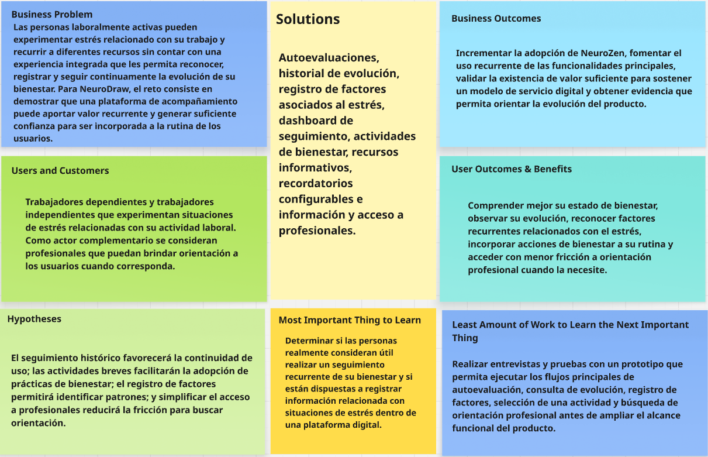

## 1.3. Segmentos objetivo

NeuroZen se dirige a personas laboralmente activas que se encuentran expuestas a situaciones de estrés relacionadas con las características de su trabajo y que pueden beneficiarse de herramientas digitales para identificar, dar seguimiento y gestionar dicho estrés.

Tomando como base el dominio del problema, se consideran inicialmente dos segmentos objetivo: **personas laboralmente activas con jornadas extendidas** y **personas con trabajo informal, independiente o con horarios flexibles**.

Esta segmentación busca representar dos contextos laborales diferentes en los que pueden presentarse factores de estrés. La caracterización definitiva de sus comportamientos, necesidades, objetivos y frustraciones será contrastada posteriormente mediante entrevistas y el proceso de Needfinding.

### Segmento 1: Personas laboralmente activas con jornadas extendidas

Este segmento está conformado por adultos que desarrollan actividades laborales con jornadas prolongadas, alta carga de trabajo o períodos frecuentes de exigencia laboral.

Puede incluir trabajadores de organizaciones públicas o privadas, independientemente de que su modalidad sea presencial, híbrida o remota. Entre las características que diferencian inicialmente a este segmento se encuentran la exposición a horarios extensos, cumplimiento de objetivos, presión por resultados, responsabilidades acumuladas y dificultad para mantener límites claros entre las actividades laborales y personales.

Los proyectos anteriores de NeuroZen también identificaron este segmento como uno de los principales grupos de interés del producto, especialmente por la exposición prolongada a situaciones laborales capaces de generar estrés y por la necesidad de disponer de herramientas que puedan incorporarse dentro de rutinas con disponibilidad limitada. :contentReference[oaicite:1]{index=1}

Para la investigación actual se priorizarán adultos laboralmente activos dentro del rango aproximado de **20 a 50 años**, manteniendo continuidad con el público considerado en las versiones anteriores de NeuroZen.

### Segmento 2: Personas con trabajo informal, independiente o con horarios flexibles

Este segmento está conformado por adultos cuyas actividades laborales no necesariamente siguen una jornada fija o una estructura organizacional tradicional.

Puede incluir trabajadores independientes, freelancers, trabajadores informales, emprendedores, prestadores de servicios u otras personas cuya carga laboral y horarios dependan de proyectos, clientes, demanda o necesidades económicas.

Los antecedentes de NeuroZen identificaron que este tipo de trabajador puede enfrentarse a una disponibilidad laboral continua, horarios variables y límites poco claros entre trabajo y vida personal. El análisis de entrevistas del proyecto anterior también mostró interés por herramientas digitales que pudieran adaptarse a rutinas irregulares y requerir poco tiempo de uso. :contentReference[oaicite:2]{index=2}

Al igual que en el primer segmento, para las actividades iniciales de investigación se considerarán principalmente adultos entre **20 y 50 años**.

### Sustento de los segmentos

La elección de ambos segmentos responde al propósito original de NeuroZen de abordar la identificación y gestión del estrés asociado con el contexto laboral.

Mientras que el primer segmento permite analizar situaciones relacionadas con jornadas extensas, presión organizacional y alta carga de trabajo, el segundo permite estudiar escenarios caracterizados por horarios variables, autonomía laboral, disponibilidad constante y menor separación entre las actividades laborales y personales.

La existencia de estas diferencias permitirá posteriormente comparar cómo se manifiesta el estrés laboral en ambos contextos y determinar si los mecanismos de autoevaluación, seguimiento, identificación de factores asociados, actividades de gestión del estrés y acceso a orientación profesional deben adaptarse de manera diferente para cada segmento.

# Capítulo II: Requirements Elicitation & Analysis

## 2.1. Competidores

### 2.1.1. Análisis competitivo

### 2.1.2. Estrategias y tácticas frente a competidores

## 2.2. Entrevistas

Con el propósito de comprender las experiencias, necesidades y comportamientos de los segmentos objetivo de NeuroZen, se realizaron entrevistas a representantes de ambos grupos identificados durante el análisis inicial.

La investigación busca contrastar los supuestos establecidos previamente sobre las situaciones de estrés relacionadas con el trabajo, las estrategias utilizadas actualmente por los participantes y las características que podrían generar valor dentro de una solución digital.

Las entrevistas fueron estructuradas de acuerdo con las particularidades de cada segmento y posteriormente analizadas para identificar patrones objetivos y subjetivos que servirán como insumo para el proceso de Needfinding.

---

## 2.2.1. Diseño de entrevistas.

**Segmento 1: Personas activas en el ámbito laboral con jornadas extendidas**

Para evaluar las necesidades y experiencias de profesionales con horarios laborales extensos que
enfrentan altos niveles de estrés, hemos desarrollado una serie de preguntas enfocadas en comprender
su rutina diaria, factores estresantes, y estrategias actuales para manejar la presión laboral. Esta
información nos permitirá identificar oportunidades para que nuestra plataforma ofrezca soluciones
efectivas que mejoren su calidad de vida y rendimiento profesional.

Introducción:

Buenos días/tardes, soy [...], representante de [Nombre del Proyecto]. Estamos
desarrollando una plataforma destinada a ayudar a profesionales con horarios laborales extensos a
manejar mejor el estrés y mejorar su calidad de vida. Nos gustaría conocer más sobre tu experiencia
laboral y los desafíos que enfrentas en tu día a día. Tu perspectiva será muy valiosa para desarrollar
una solución que realmente responda a las necesidades de personas como tú.

Preguntas:

1. Para comenzar, ¿podrías presentarte y contarnos brevemente sobre tu profesión y el sector en
   el que trabajas?
2. ¿Cómo describirías una jornada laboral típica para ti? ¿Cuántas horas trabajas habitualmente?
3. ¿Qué aspectos de tu trabajo consideras que generan mayor presión o estrés?
4. ¿Has notado cambios en tu salud física o mental que atribuyas al estrés laboral?
5. ¿Cómo suele afectar el estrés laboral a tu rendimiento en el trabajo y a tu vida personal?
6. ¿Qué estrategias utilizas actualmente para manejar el estrés relacionado con tu trabajo?
7. ¿Tu empresa o lugar de trabajo ofrece algún programa o recurso para ayudar a los empleados
   a manejar el estrés?
8. En los momentos de mayor presión laboral, ¿qué tipo de apoyo o herramientas te resultarían
   más útiles?
9. ¿Utilizas actualmente alguna aplicación o plataforma digital para gestionar el estrés o mejorar
   tu bienestar? Si es así, ¿cuál y qué te parece?
10. ¿Qué características o funcionalidades consideras importantes en una plataforma diseñada
    para ayudar a reducir el estrés laboral?

**Segmento 2: Adultos entre 20 y 50 años con trabajo informal o sin horarios definidos**

Para evaluar las necesidades y experiencias de adultos que trabajan en el sector informal o con
horarios no definidos, hemos desarrollado preguntas orientadas a comprender cómo manejan sus
tiempos, los factores estresantes específicos de su situación laboral y sus mecanismos actuales para
gestionar el estrés. Esta información nos permitirá adaptar nuestra plataforma para ofrecer soluciones
que respondan a las características particulares de este segmento, que según estudios, experimenta
niveles variables de estrés debido a la naturaleza omnipresente de su trabajo.

Introducción:

Buenos días/tardes, soy [...], representante de NeuroZen. Estamos desarrollando una
plataforma para ayudar a personas que trabajan sin horarios fijos o en el sector informal a manejar
mejor el estrés y mejorar su calidad de vida. Nos interesa conocer tu experiencia para crear una
solución que realmente funcione para personas como tú. Agradecemos mucho tu tiempo y sinceridad
en esta conversación.

Preguntas:

1. Para empezar, ¿podrías contarnos a qué te dedicas y cómo es tu rutina de trabajo habitual?
2. ¿Cómo organizas tu tiempo entre el trabajo y otras actividades? ¿Tienes algún método para
   establecer límites?
3. ¿Sientes que tu trabajo "te sigue a todas partes"? ¿Puedes describir cómo es esa experiencia?
4. ¿Cuáles son los principales factores que te generan estrés en tu trabajo?
5. ¿Cómo describirías el nivel de estrés que experimentas habitualmente (bajo, medio, alto)?
   ¿Varía mucho dependiendo de las temporadas o circunstancias?
6. ¿De qué manera crees que el no tener un horario fijo afecta tu nivel de estrés, en comparación
   con trabajos formales con horarios establecidos?
7. ¿Has notado algún impacto en tu salud física o mental debido al estrés relacionado con tu
   trabajo?
8. ¿Qué estrategias o métodos utilizas actualmente para manejar el estrés cuando sientes que el
   trabajo invade todos los aspectos de tu vida?
9. ¿Utilizas alguna aplicación, plataforma o recurso digital para ayudarte a organizar tu trabajo o
   manejar el estrés? ¿Cuál ha sido tu experiencia?
10. ¿Qué momentos del día considerarías más apropiados para dedicar tiempo a actividades para
    reducir el estrés?

## 2.2.2. Registro de entrevistas

**Segmento 1: Personas activas en el ámbito laboral con jornadas extendidas**

Entrevista N°1

● Nombre: Enzo Joaquín Alatrista Amaya.

● Sexo: Masculino.

● Edad: 25.

● Estado Civil: Soltero.

● Labor: Ingeniero de Sistemas.

Detalles de la entrevista:

● Duración: 03:26

[● Link: https://drive.google.com/file/d/13V0bp8f4mNgHBX6nU5c74mhhuCYzXYmT/view?usp=sharing](https://drive.google.com/file/d/13V0bp8f4mNgHBX6nU5c74mhhuCYzXYmT/view?usp=sharing)

Resumen de los puntos clave en la entrevista:

La entrevista con Enzo, ingeniero de sistemas de 25 años, revela el alto nivel de presión en el
sector tecnológico. Sus jornadas laborales de hasta 11 horas, sumadas a la disponibilidad
constante y los cambios de último minuto, han afectado su salud con insomnio, dolores de
cabeza e irritabilidad. Esto impacta su productividad y vida personal, generando agotamiento
emocional. Aunque intenta manejar el estrés con caminatas y ejercicios de respiración, su
rutina no le permite ser constante. Su empresa no ofrece apoyo real para el manejo del estrés,
más allá de charlas esporádicas. Enzo valora herramientas simples y accesibles, con
recordatorios para pausas, ejercicios rápidos y la opción de contactar a un profesional desde
la misma app.

Entrevista N°2

● Nombre: Andrés Luján Carrión

● Sexo: Masculino

● Edad: 40

● Estado Civil: Soltero

● Labor: Rector(USL)

Detalles de la entrevista:

● Duración: 4min11seg

[● Link: https://drive.google.com/file/d/1aePzhaW86rM-1leKeeb1c65SbWk9Y0yZ/view?usp=sharing](https://drive.google.com/file/d/1aePzhaW86rM-1leKeeb1c65SbWk9Y0yZ/view?usp=sharing)

Resumen de los puntos clave en la entrevista:

- El entrevistado trabaja entre 10 y 12 horas diarias.
- Su principal fuente de estrés son la necesidad de resultados rápidos frente a cambios que
  requieren tiempo.
- Ha notado fatiga mental, insomnio y tensión muscular.
- Le parecerían útiles herramientas como coaching personalizado y plataformas digitales.
- Le gustaría que la aplicación contase con coaching emocional, seguimiento de estrés y una
  comunidad de apoyo.

Entrevista N°3

● Nombre: Valentina Flores.

● Sexo: Femenino.

● Edad: 24 años.

● Estado Civil: Soltera.

● Labor: Analista de Recursos Humanos.

Detalles de la entrevista:

● Duración: 02:25

[● Link: https://drive.google.com/file/d/10gpZrHKXRZATb-VCJ6RAm-Zu81CONRbT/view?usp=sharing](https://drive.google.com/file/d/10gpZrHKXRZATb-VCJ6RAm-Zu81CONRbT/view?usp=sharing)

Resumen de los puntos clave en la entrevista:

La entrevista con Valentina Flores (24 años), analista de Recursos Humanos, evidencia cómo las
jornadas extensas y la alta carga laboral generan estrés, insomnio y agotamiento emocional.
El estrés afecta su concentración, estado de ánimo y vida personal. Aunque intenta aliviarlo con
pausas o caminatas, la falta de tiempo y apoyo institucional limita sus esfuerzos. Valentina
considera útil una app con ejercicios guiados, recordatorios y seguimiento emocional, que le
ayude a equilibrar su bienestar en el entorno laboral.

**Segmento 2: Adultos entre 20 y 50 años con trabajo informal o sin horarios definidos**

Entrevista N°4

● Nombre: Cristofer Pablo Paucar

● Sexo: Masculino

● Edad: 21

● Estado Civil: Soltero

● Labor: Repartidor

Detalles de la entrevista:

● Duración: 6:27

[● Link: https://drive.google.com/file/d/1SRe3Ilrde37SMS8YGALvpk9OqU4jpwh0/view?usp=sharing](https://drive.google.com/file/d/1SRe3Ilrde37SMS8YGALvpk9OqU4jpwh0/view?usp=sharing)

Resumen de los puntos clave en la entrevista:

La entrevista con Cristofer Paucar, un repartidor delivery de 21 años que trabaja sin un
horario fijo. Organiza su jornada en función de la demanda y necesidades económicas, lo que
implica horarios variables que a menudo se extienden hasta la noche. Reconoce que tiene
dificultades para establecer límites entre su vida personal y laboral, ya que su trabajo "lo
sigue a todas partes" debido a la constante atención al celular.
Los principales factores de estrés que enfrenta son la inestabilidad laboral, la incertidumbre
económica, fallas en las aplicaciones de reparto, el tráfico, clientes exigentes y el desgaste
físico. Califica su nivel de estrés como medio, aunque se eleva en situaciones específicas
como fines de mes o días lluviosos.

Cristofer considera que la falta de un horario fijo agrava el estrés al dificultar la separación
entre el trabajo y la vida personal. Ha notado efectos negativos en su salud física y mental,
incluyendo dolores corporales, cansancio, insomnio e irritabilidad. Para manejar el estrés,
intenta desconectarse ocasionalmente, escuchar música o realizar actividades recreativas,
aunque no siempre lo logra. Si bien usa aplicaciones básicas para organizar su vida personal,
no emplea herramientas específicas para el manejo del estrés, pero le gustaría explorar
alguna. Identifica la mañana y la noche como los momentos más adecuados para realizar
actividades relajantes, aunque muchas veces depende del flujo de trabajo diario.

Entrevista N°5

● Nombre: Laura Méndez

● Sexo: Mujer

● Edad: 24 años

● Estado Civil: Soltera

● Labor: Freelancer diseñadora gráfica y fotógrafa de eventos

Detalles de la entrevista:

● Duración: 8 minutos con 39 segundos

[● Link: https://drive.google.com/file/d/1qmh7C8VD0SDWj4DvPe7hUj3HFCdga7o5/view?usp=sharing](https://drive.google.com/file/d/1qmh7C8VD0SDWj4DvPe7hUj3HFCdga7o5/view?usp=sharing)

Resumen de los puntos clave en la entrevista:

La entrevista con Laura Méndez, una diseñadora gráfica freelance y fotógrafa de 24 años,
revela los desafíos únicos que enfrenta como trabajadora con horarios irregulares. Su
situación laboral se caracteriza por la ausencia de límites entre vida personal y profesional,
con un teléfono que funciona como "oficina móvil" y clientes que esperan disponibilidad
constante. Los principales factores de estrés identificados incluyen la inestabilidad económica
que la lleva a sobrecargarse de trabajo, las expectativas poco realistas de los clientes, y la
imposibilidad de desconectar completamente, resultando en un nivel de estrés medio-alto con
picos que afectan su salud física y creatividad. Aunque intenta implementar estrategias como
yoga o ejercicio, estas prácticas son inconsistentes debido a su carga laboral, por lo que
necesita soluciones flexibles que se adapten a su ritmo caótico: herramientas rápidas
accesibles desde el móvil, técnicas para establecer límites sin perder clientes y métodos
efectivos para "apagar" su mente al finalizar la jornada.

Entrevista N°6

● Nombre: Jose Feliciano

● Sexo: Hombre

● Edad: 48 años

● Estado Civil: Casado

● Labor: Trabajador independiente en Software.

Detalles de la entrevista:

● Duración: 2 minutos con 50 segundos

[● Link:https://drive.google.com/file/d/1x6wdR-u7jdTX1J-8nMbbKf8xzeWVYhVH/view](https://drive.google.com/file/d/1x6wdR-u7jdTX1J-8nMbbKf8xzeWVYhVH/view)

Resumen de los puntos clave en la entrevista:

La entrevista con José Feliciano, un trabajador independiente en software de 56 años, muestra las dificultades de mantener equilibrio entre la vida laboral y personal cuando se trabaja por cuenta propia. Su rutina varía constantemente, sin horarios fijos, lo que le genera complicaciones para desconectarse del trabajo. José comenta que su celular y laptop son herramientas esenciales pero también fuentes de distracción y presión constante. Entre los principales factores de estrés menciona los plazos ajustados, los cambios imprevistos y la falta de pausas reales durante el día. Describe su nivel de estrés como medio, con aumentos en épocas de alta carga laboral. Este estilo de trabajo flexible le otorga libertad, pero también incrementa su dificultad para descansar y cuidar su salud, notando síntomas como dolores de cabeza y cansancio. Para manejar el estrés recurre a caminatas, música y pausas cortas, además de apoyarse en herramientas digitales como Google Calendar y Notion. Considera que los mejores momentos para relajarse son las noches o las mañanas antes de empezar la jornada.

## 2.2.3. Análisis de entrevistas

**Segmento 1: Personas activas en el ámbito laboral con jornadas extendidas**

Hallazgos:

● Los profesionales experimentan jornadas laborales extendidas de 10-12 horas diarias,
sin límites claros entre vida laboral y personal.

● Enfrentan presión constante por resultados inmediatos ante cambios que requieren
tiempo.

● Presentan síntomas físicos y emocionales similares: fatiga mental, insomnio, tensión
muscular, irritabilidad y dolores de cabeza.

● Las empresas ofrecen poco o nulo apoyo real para el manejo del estrés laboral.

● Aunque intentan implementar técnicas de manejo del estrés, la carga laboral impide
ser constantes.

● Valoran soluciones digitales accesibles, rápidas y adaptables a sus horarios saturados.

Conclusión:

Los profesionales con jornadas extendidas constituyen un segmento vulnerable al estrés
crónico debido a la combinación de largas horas de trabajo, disponibilidad permanente y
presión por resultados inmediatos. Sus intentos individuales de manejar el estrés mediante
técnicas convencionales resultan insuficientes ante la falta de límites laborales claros y apoyo
institucional. Este grupo necesita soluciones tecnológicas personalizadas que se integren
fácilmente a su rutina, ofrezcan intervenciones breves pero efectivas, y proporcionen tanto
seguimiento automatizado como acceso a apoyo profesional cuando sea necesario. La
aplicación debe enfocarse en crear micro hábitos de bienestar que puedan sostenerse incluso
en entornos laborales exigentes, permitiéndoles recuperar el equilibrio sin comprometer su
desempeño profesional.

**Segmento 2: Adultos entre 20 y 50 años con trabajo informal o sin horarios definidos**

Hallazgos:

● Ausencia de límites trabajo-vida personal: Los entrevistados experimentan una fusión entre su vida laboral y personal, con el teléfono móvil como vínculo constante al trabajo.

● Horarios irregulares: Ninguno tiene un horario fijo, organizándose según demanda y
necesidades económicas.

● Principales factores de estrés: Comparten preocupaciones por la inestabilidad
económica, las expectativas de disponibilidad constante y la dificultad para
desconectar.

● Impacto en la salud: Los entrevistados reportan efectos negativos como dolores físicos,
cansancio e irritabilidad.

● Estrategias de afrontamiento inconsistentes: Aunque intentan aplicar métodos para
manejar el estrés (música, ejercicio, yoga), no logran mantenerlos de forma regular.

● Necesidad de herramientas adaptables: Los dos expresan interés en explorar
soluciones que se ajusten a sus horarios variables.

Conclusión:

Los testimonios recibidos de los entrevistados revelan una realidad laboral cada vez más común: trabajadores con horarios flexibles que enfrentan una constante disponibilidad laboral mediada por dispositivos móviles, generando una difuminación de límites entre trabajo y vida personal que impacta negativamente su bienestar. Esta situación crea un ciclo donde la inestabilidad económica los impulsa a aceptar más trabajo, intensificando el estrés y deteriorando su salud física y mental. Sus casos evidencian la necesidad urgente de desarrollar herramientas y estrategias específicamente diseñadas para trabajadores con horarios irregulares, que sean accesibles desde dispositivos móviles, requieran poco tiempo de implementación y ayuden efectivamente a establecer límites saludables sin comprometer su sustento económico.

## 2.3. Needfinding

### 2.3.1. User Personas

### 2.3.2. User Task Matrix

### 2.3.3. User Journey Mapping

### 2.3.4. Empathy Mapping

### 2.3.5. As-is Scenario Mapping

## 2.4. Ubiquitous Language

Este glosario define los términos clave que usamos en el proyecto para mantener un lenguaje común entre el equipo de desarrollo y los expertos en salud mental.

| Término                            | Definición                                                                                                                     |
| ---------------------------------- | ------------------------------------------------------------------------------------------------------------------------------ |
| **Usuario**                        | Persona adulta (20–50 años) que utiliza la app para evaluar, monitorear y gestionar su estrés laboral.                         |
| **Perfil biométrico**              | Conjunto de datos físicos iniciales del usuario (postura, rostro, respiración) que sirven como línea base.                     |
| **Test de autoevaluación**         | Cuestionario digital que mide síntomas y sensaciones de estrés percibidas por el usuario.                                      |
| **Análisis biométrico**            | Proceso de escaneo mediante la cámara/sensores para detectar señales físicas de estrés.                                        |
| **Síntomas físicos**               | Manifestaciones registradas por el usuario, como dolores de cabeza, insomnio, tensión muscular.                                |
| **Nivel de estrés**                | Clasificación automática (bajo, medio, alto) que combina datos de tests y biometría.                                           |
| **Recomendaciones personalizadas** | Consejos, ejercicios o pausas sugeridas por la app en base al estado actual del usuario.                                       |
| **Ejercicios de respiración**      | Actividad guiada por la app para reducir la tensión y ansiedad en pocos minutos.                                               |
| **Pausas activas**                 | Recordatorios programados que invitan al usuario a descansar o hacer micro ejercicios durante la jornada laboral.              |
| **Dashboard personal**             | Panel con estadísticas, tendencias y patrones de estrés en el tiempo.                                                          |
| **Desencadenante de estrés**       | Evento o situación registrada por el usuario que provoca incremento de su estrés (ej. exceso de trabajo, conflictos, tráfico). |
| **Informe de progreso**            | Documento generado con evolución de estrés y hábitos del usuario, que puede compartirse con un psicólogo.                      |
| **Especialista en salud mental**   | Psicólogo disponible en la plataforma para consultas y tratamiento profesional.                                                |
| **Cita**                           | Agendamiento de una sesión con un especialista, virtual o presencial.                                                          |
| **Grupo de apoyo**                 | Comunidad virtual de usuarios que comparten experiencias y consejos sobre el manejo del estrés.                                |
| **Biblioteca de recursos**         | Colección digital de artículos, videos o guías relacionadas al bienestar laboral y manejo del estrés.                          |

# Capítulo III: Requirements Specification

## 3.1. To-Be Scenario Mapping

## 3.2. User Stories

## 3.3. Product Backlog

## 3.4. Impact Mapping

# Capítulo IV: Product Design

## 4.1. Style Guidelines.

NeuroDraw, dedicado a la detección rápida y manejo del estrés laboral, transmite calma, confianza y profesionalismo. Nuestra identidad visual combina tonos azules y verdes para evocar tranquilidad, con tipografía clara y espacios limpios. Comunicamos con un lenguaje accesible pero riguroso, transformando conceptos complejos de neurociencia en soluciones prácticas para el bienestar laboral.

---

### 4.1.1. General Style Guidelines.

Logo: El logo de NeuroZen fusiona elementos neurológicos y serenidad en un diseño significativo. La silueta de perfil humano en Verde Bosque muestra circuitos cerebrales que simbolizan cómo nuestra plataforma conecta ciencia y bienestar mental.

  

Tipografía:

La tipografía de la página debe ser fácil de leer, adaptándose al dispositivo en el que se encuentre. Para ello, se emplearán dos fuentes sans-serif (sin remates decorativos) porque son más legibles y claras. Además, el contenido mostrado debe de resaltar.

Color Guide:

1. Verde Bosque (#2D5A4A)
Representación: El verde bosque simboliza estabilidad, crecimiento y conexión con la naturaleza. En el contexto de NeuroZen, este color representa la base sólida que ofrece la plataforma para ayudar a los usuarios a manejar su estrés. Se utiliza en elementos principales como el logotipo y encabezados, transmitiendo confianza y un ambiente relajante que invita a la calma mental.

  

2. Verde Menta (#A2C4B5)
Representación: El verde menta evoca frescura, renovación y claridad mental. Este color más suave complementa al verde bosque y se utiliza en áreas secundarias de la plataforma. Representa la sensación refrescante que experimentan los usuarios al reducir su estrés mediante las técnicas proporcionadas por NeuroZen, creando un ambiente digital que respira tranquilidad.

  

3. Beige Cálido (#F1E9D4)
Representación: El beige cálido transmite neutralidad, confort y serenidad. En NeuroZen, este color se utiliza para fondos y espacios de descanso visual, proporcionando un ambiente acogedor que reduce la fatiga visual durante las sesiones de meditación o ejercicios anti-estrés. El beige crea un entorno digital que se siente como un refugio seguro.

  

4. Turquesa Profundo (#1A6F78)
Representación: El turquesa profundo simboliza la profundidad emocional, la comunicación y la sabiduría. Este color representa el componente científico y psicológico de NeuroZen, destacando las herramientas basadas en evidencia para el manejo del estrés. Se utiliza en elementos interactivos y botones de acción, invitando a los usuarios a explorar soluciones más profundas.

  

5. Gris Piedra (#8C9893)
Representación: El gris piedra evoca neutralidad, equilibrio y estabilidad. En NeuroZen, este color funciona como un ancla visual que equilibra los verdes y turquesas más expresivos. Se utiliza para texto secundario y elementos de interfaz sutiles, aportando sofisticación sin competir con los colores principales que transmiten calma y bienestar.

  

La paleta de colores de NeuroZen combina verdes y turquesas para transmitir naturaleza y tecnología, beige para crear un entorno acogedor y gris piedra para aportar profesionalismo. En conjunto, el diseño busca generar una experiencia visual relajante y coherente con la misión de reducir el estrés del usuario.

Buttons:

La plataforma NeuroZen para control del estrés presenta una interfaz intuitiva con botones fácilmente identificables en toda la experiencia. Los botones principales utilizan Verde Bosque (#2D5A4A) para acciones importantes como iniciar meditaciones, mientras que los secundarios aparecen en Verde Menta (#A2C4B5), creando jerarquía visual. El fondo en Beige Cálido (#F1E9D4) proporciona un ambiente relajante, complementado por elementos interactivos en Turquesa Profundo (#1A6F78) para funciones especiales y Gris Piedra (#8C9893) para textos y detalles sutiles. Todos los botones tienen formas redondeadas y tamaños generosos, facilitando su uso incluso en momentos de estrés, mientras que los estados de hover y feedback ofrecen respuestas visuales claras que refuerzan la sensación de calma y control que define la experiencia de NeuroZen.

Variaciones del logo en diferentes representaciones:

  

-Una opción minimalista, sin muchos detalles y relajante a la vista.

  

-Una opción con mejor detalle y uso de colores.

  

-Una representación más abstracta que inspira relajación.

  

-Una opción que combina las dos primeras ideas.

---

### 4.1.2. Web Style Guidelines.

Para NeuroZen, estamos desarrollando una plataforma web y una landing page enfocada en el bienestar laboral. Por ello, implementaremos un diseño adaptable (Web Responsive Design) que optimice la presentación de la información en cualquier dispositivo, ya sea computadora, tablet o smartphone. Esto garantizará que el contenido sea accesible y claro en todo momento, mejorando la experiencia de los usuarios.

Como equipo, hemos decidido incorporar el patrón de diseño en forma de Z para la página principal. Esta técnica es ideal para dirigir la atención de los visitantes hacia los elementos más importantes de NeuroZen, como el objetivo del proyecto, el acceso al test de estrés y los beneficios de la plataforma. Colocaremos el logotipo de NeuroZen en la esquina superior izquierda para reforzar el reconocimiento de marca, mientras que en la esquina superior derecha estará la barra de navegación y un botón de llamado a la acción destacado que invite a registrarse o probar el test inicial.

---

### 4.1.3. Mobile Style Guidelines

#### 4.1.3.1. iOS Mobile Style Guidelines

#### 4.1.3.2. Android Mobile Style Guidelines

## 4.2. Information Architecture.

NeuroZen detecta el estrés laboral combinando datos biométricos (postura, tensión facial, respiración) con autoevaluaciones emocionales para generar un perfil de estrés personalizado. La app ofrece recomendaciones y ejercicios para reducir los síntomas, envía notificaciones en tiempo real ante aumentos de estrés y permite revisar un historial de tendencias para identificar patrones.

A futuro, se integrará con psicólogos y programas de bienestar laboral para empresas, convirtiéndose en una herramienta completa de prevención y gestión del estrés.

---

### 4.2.1. Organization Systems

La información se organiza de forma lógica para que el usuario encuentre rápido lo que necesita:

Estructura basada en módulos claros: inicio, autoevaluación, recomendaciones, profesionales, comunidad y recursos.

Jerarquización de contenidos: lo más usado (tests y recomendaciones) aparece en posiciones destacadas.

---

### 4.2.2. Labeling Systems

El etiquetado debe ser claro, breve y familiar para los usuarios:

Uso de términos simples como: Inicio, Test de Estrés, Recomendaciones, Comunidad, Psicólogos, Recursos.

Evitar tecnicismos clínicos, priorizando un lenguaje cotidiano.

Consistencia en los nombres en toda la app y web.

---

### 4.2.3. SEO Tags and Meta Tags

Meta títulos: deben incluir palabras clave relacionadas con salud mental, estrés laboral y bienestar.

Meta descripciones: claras, con llamado a la acción (ejemplo: “Evalúa tu nivel de estrés y recibe recomendaciones personalizadas”).

Etiquetas alt en imágenes con descripciones concisas.

Uso de headings (H1, H2, H3) para mejorar la indexación en buscadores.

---

### 4.2.4. Searching Systems

Búsqueda interna intuitiva, con autocompletado y sugerencias rápidas.

Posibilidad de filtrar resultados (ejemplo: artículos, psicólogos, recursos, ejercicios).

Optimización para resultados relevantes según la necesidad del usuario.

---

### 4.2.5. Navigation Systems

Menú principal: siempre visible, con las secciones clave (Inicio, Autoevaluación, Recomendaciones, Comunidad, Contacto).

Breadcrumbs para indicar dónde se encuentra el usuario.

CTA (Call To Action) claros y visibles, guiando al usuario hacia las acciones más importantes (hacer test, contactar especialista, unirse a un grupo).

Compatibilidad responsive, manteniendo la navegación fluida en móviles y escritorio.

---

## 4.3. Landing Page UI Design.

El diseño de la interfaz de usuario para la landing page de NeuroZen será un elemento clave, ya que representará la primera impresión que recibirán los usuarios sobre la aplicación. Su objetivo es ofrecer una experiencia visual atractiva y fácil de usar que despierte el interés de los visitantes y los motive a conocer más sobre las funciones de la plataforma.

---

### 4.3.1. Landing Page Wireframe.

Los Wireframes de la página son una versión simplificada de la manera en la que se organizará la información. Se hace una organización de la estructura visual de todos los componentes previo a centrarse en la parte visual de la página. Gracias a esto, podemos observar que cosas se necesitan cambiar si fuera necesario, agilizando el tiempo de organizar los datos.

  

  
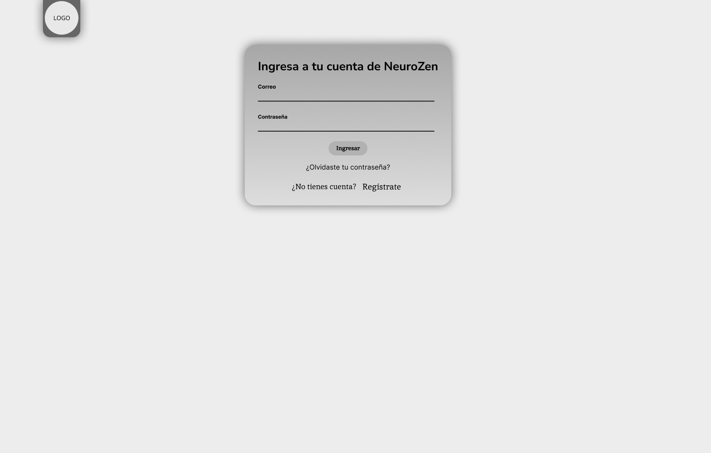

  

  
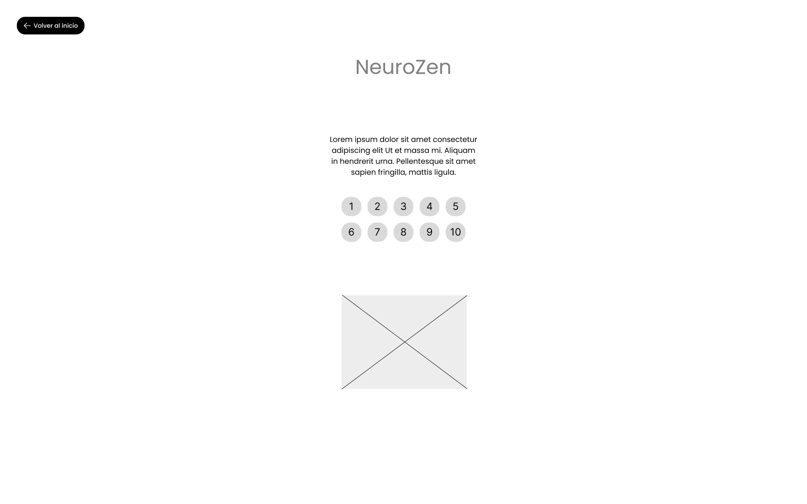

---

### 4.3.2. Landing Page Mock-up.

Un mockup es una representación visual de un producto que muestra cómo lucirá, a diferencia de un wireframe, que se enfoca en la estructura. Aunque no es interactivo, puede ser de media o alta fidelidad y ayuda a tomar decisiones finales sobre aspectos como esquemas de colores, estilo visual y tipografía. Es una herramienta valiosa en el proceso de diseño para alinear expectativas y obtener retroalimentación antes de la implementación.

  

  

  

  

Nuestro Landing Page:

## [● Link: [https://neurozen-home.netlify.app](https://neurozen-home.netlify.app)]

### 4.4. Mobile Applications UX/UI Design

El diseño de experiencia de usuario (UX) y de interfaz de usuario (UI) busca ofrecer una interacción digital clara, sencilla y motivadora. La UX se enfoca en entender las necesidades de las personas que buscan manejar su estrés y en crear flujos que les permitan registrar sus datos, evaluar su estado y recibir recomendaciones de forma rápida. La UI complementa esta experiencia con un diseño visual relajante y ordenado, usando colores, íconos y botones que transmiten calma y profesionalismo. Al combinar funcionalidad intuitiva con una estética agradable, se logra que el usuario se sienta acompañado y en control de su bienestar.

#### 4.4.1. Mobile Applications Wireframes

Los wireframes representan la estructura básica de las pantallas clave de la aplicación web, evidenciando la aplicación de principios de simplicidad, consistencia visual y accesibilidad.

**Boarding**

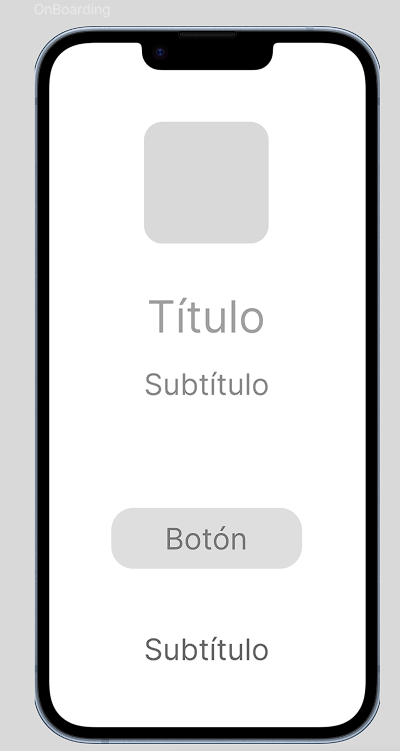 

**Login / Registro**

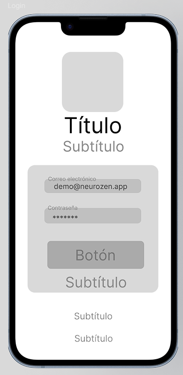

**Home**

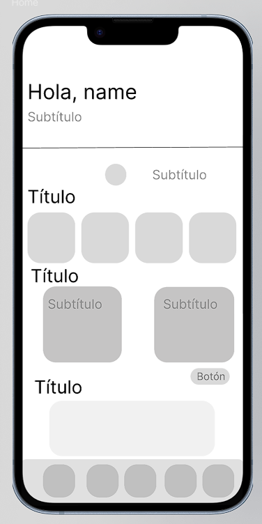

**Sessions**

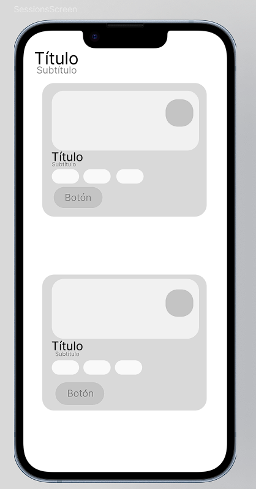

**Breathing**

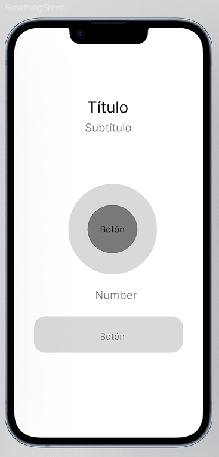

**Profile**

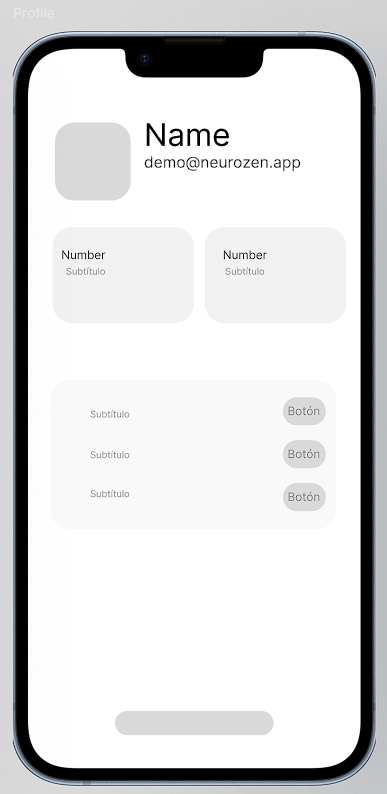

**Product Detail**

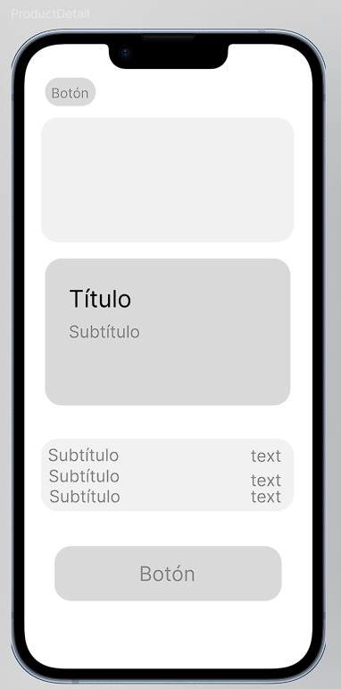

#### 4.4.2. Mobile Applications Wireflow Diagrams

Los wireflows ilustran cómo se enlazan los wireframes a través de interacciones típicas de los usuarios (User Goals).

**Wireflow 1: Boarding e inicio de sesión**

Este wireflow representa el proceso inicial de acceso a la aplicación. El usuario comienza visualizando la pantalla de bienvenida (Boarding), donde conoce las principales funcionalidades y beneficios de la plataforma. Desde esta ventana puede continuar hacia la pantalla de Login para autenticarse y acceder a una experiencia personalizada dentro de la aplicación.

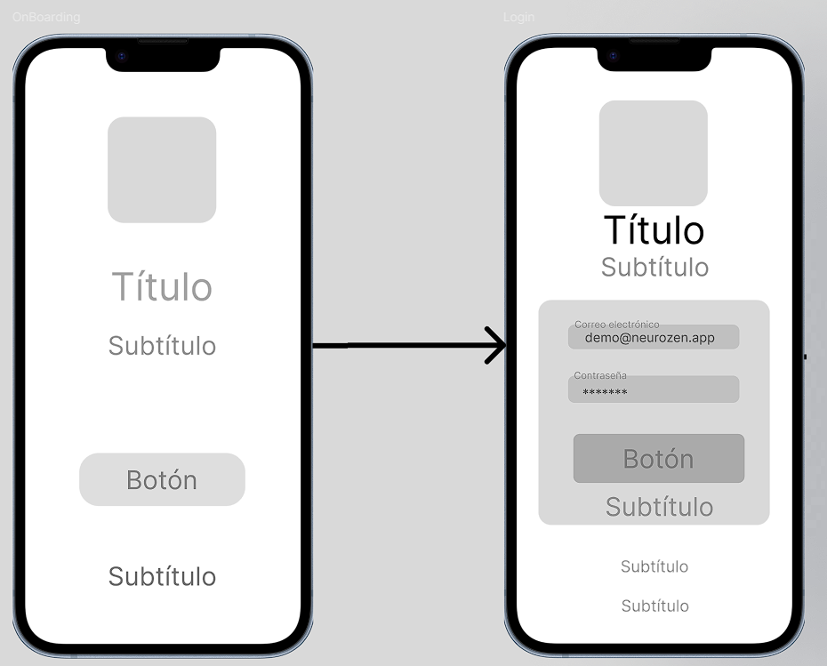

**Wireflow 2: Inicio de sesión y acceso al Home**

Este wireflow muestra el proceso mediante el cual el usuario inicia sesión dentro de la aplicación y accede a la pantalla principal Home. Una vez autenticado, el usuario puede visualizar las principales funcionalidades y navegar hacia sesiones, ejercicios de respiración, perfil y recursos disponibles dentro de la plataforma.

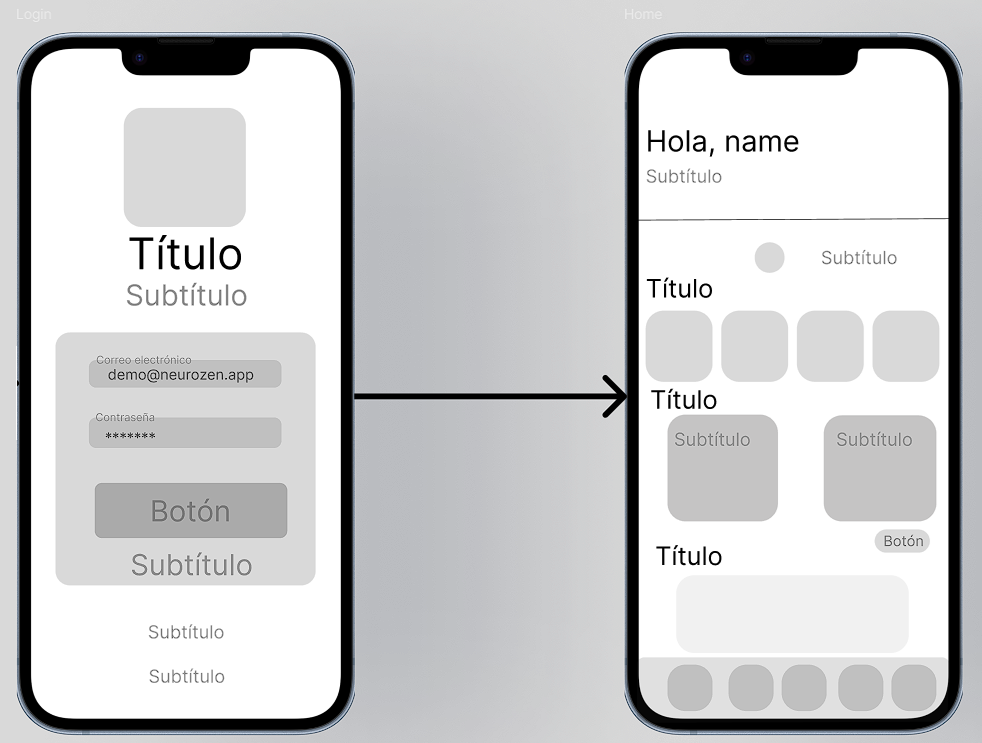

**Wireflow 3: Navegación hacia sesiones y ejercicios de respiración**

Este wireflow representa la navegación principal desde la pantalla Home hacia las funcionalidades de sesiones guiadas y ejercicios de respiración. El usuario puede acceder rápidamente a herramientas enfocadas en el bienestar, relajación y seguimiento de actividades de mindfulness dentro de la aplicación.

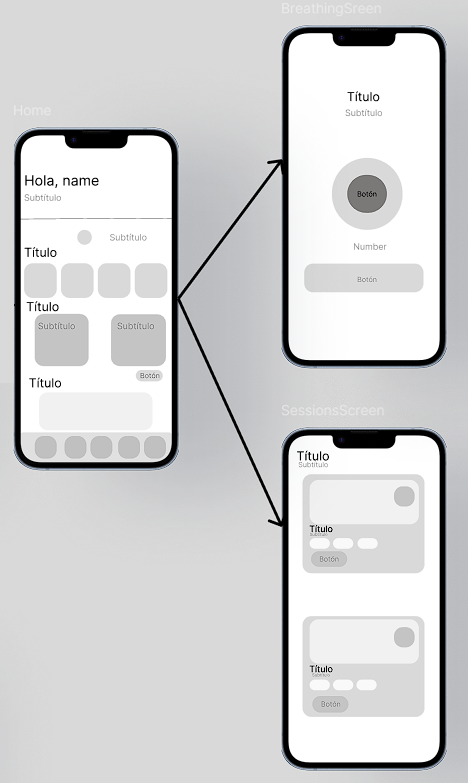

**Wireflow 4: Acceso al perfil de usuario**

Este wireflow muestra el recorrido del usuario desde la pantalla Home hacia la sección Profile. Dentro de esta ventana, el usuario puede visualizar y administrar su información personal, configuraciones, preferencias y progreso registrado dentro de la plataforma.

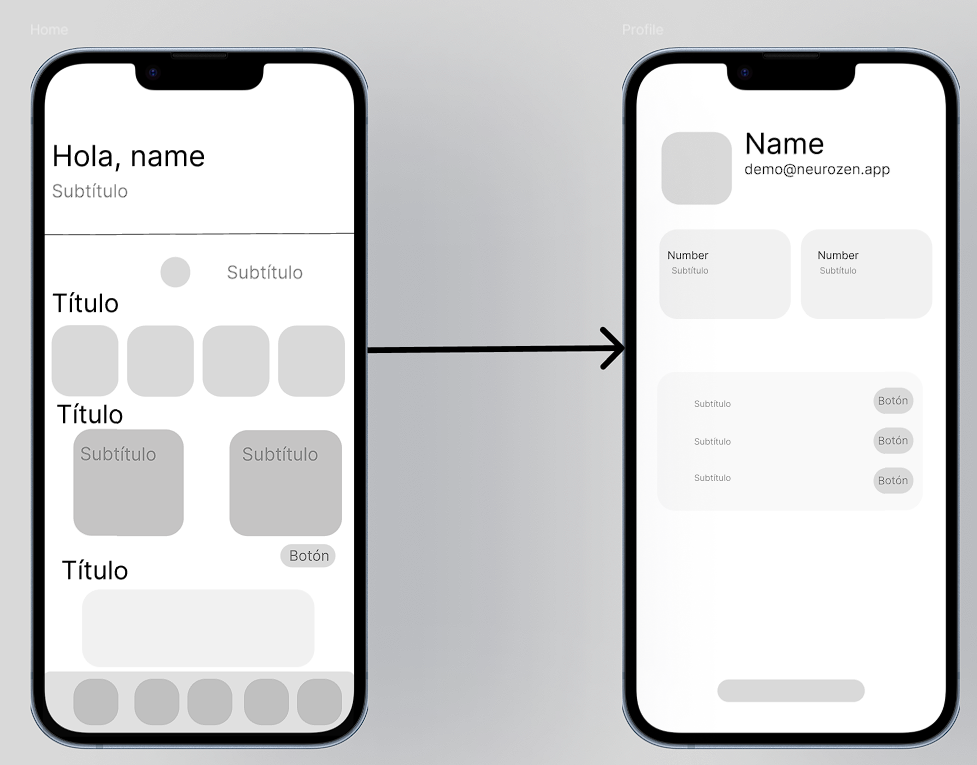

**Wireflow 5: Visualización de detalle de producto o recurso**

Este wireflow representa el flujo de navegación desde la pantalla Home hacia la visualización detallada de un producto, recurso o contenido específico de la aplicación. El usuario puede revisar información relevante y explorar contenido relacionado antes de interactuar con el recurso seleccionado.

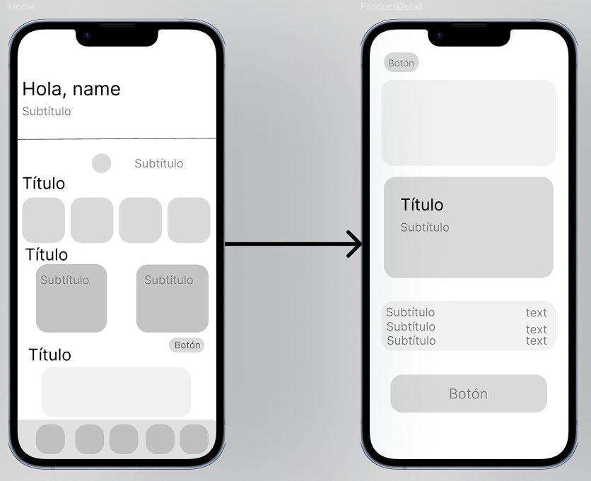

#### 4.4.3. Mobile Applications Mock-ups

Los mock-ups muestran la versión visual detallada de las pantallas, aplicando la identidad visual de NeuroZen (colores, tipografías y estilos inclusivos). Aquí se evidencian las decisiones finales de diseño.

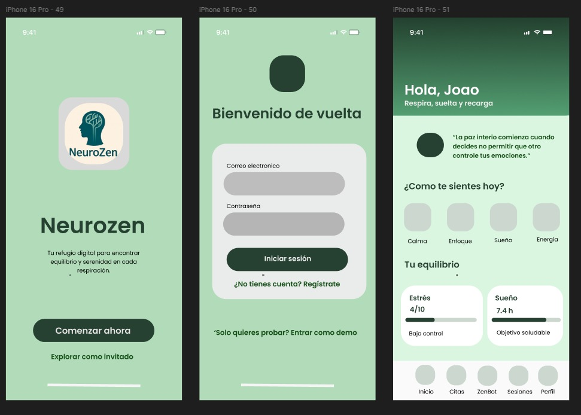

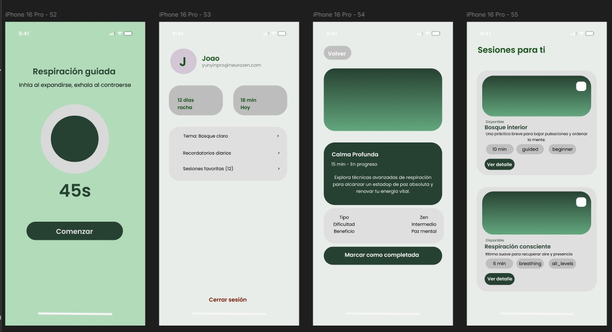

### 4.4.4. Mobile Applications User Flow Diagrams

## 4.5. Mobile Applications Prototyping

### 4.5.1. Android Mobile Applications Prototyping

### 4.5.2. iOS Mobile Applications Prototyping

## 4.6. Web Applications UX/UI Design

### 4.6.1. Web Applications Wireframes

### 4.6.2. Web Applications Wireflow Diagrams

### 4.6.3. Web Applications Mock-ups

### 4.6.4. Web Applications User Flow Diagrams

## 4.7. Web Applications Prototyping

## 4.8. Domain-Driven Software Architecture

### 4.8.1. Software Architecture Context Diagram

### 4.8.2. Software Architecture Container Diagrams

### 4.8.3. Software Architecture Components Diagrams

## 4.9. Software Object-Oriented Design

### 4.9.1. Class Diagrams

### 4.9.2. Class Dictionary

## 4.10. Database Design

### 4.10.1. Relational/Non-Relational Database Diagram

# Capítulo V: Product Implementation

## 5.1. Software Configuration Management

### 5.1.1. Software Development Environment Configuration

### 5.1.2. Source Code Management

### 5.1.3. Source Code Style Guide & Conventions

### 5.1.4. Software Deployment Configuration

## 5.2. Product Implementation & Deployment

### 5.2.1. Sprint Backlogs

### 5.2.2. Implemented Landing Page Evidence

### 5.2.3. Implemented Frontend-Web Application Evidence

### 5.2.4. Acuerdo de Servicio - SaaS

### 5.2.5. Implemented Native-Mobile Application Evidence

### 5.2.6. Implemented RESTful API and/or Serverless Backend Evidence

### 5.2.7. RESTful API documentation

### 5.2.8. Team Collaboration Insights

## 5.3. Video About-the-Product

# Parte II: Verification, Validation & Pipeline

# Capítulo VI: Product Verification & Validation

## 6.1. Testing Suites & Validation

### 6.1.1. Core Entities Unit Tests

### 6.1.2. Core Integration Tests

### 6.1.3. Core Behavior-Driven Development

### 6.1.4. Core System Tests

## 6.2. Static testing & Verification

### 6.2.1. Static Code Analysis

#### 6.2.1.1. Coding standard & Code conventions

#### 6.2.1.2. Code Quality & Code Security

### 6.2.2. Reviews

## 6.3. Validation Interviews

### 6.3.1. Diseño de Entrevistas

### 6.3.2. Registro de Entrevistas

### 6.3.3. Evaluaciones según heurísticas

## 6.4. Auditoría de Experiencias de Usuario

### 6.4.1. Auditoría realizada

#### 6.4.1.1. Información del grupo auditado

#### 6.4.1.2. Cronograma de auditoría realizada

#### 6.4.1.3. Contenido de auditoría realizada

### 6.4.2. Auditoría recibida

#### 6.4.2.1. Información del grupo auditor

#### 6.4.2.2. Cronograma de auditoría recibida

#### 6.4.2.3. Contenido de auditoría recibida

#### 6.4.2.4. Resumen de modificaciones para subsanar hallazgos

# Capítulo VII: DevOps Practices

## 7.1. Continuous Integration

### 7.1.1. Tools and Practices

### 7.1.2. Build & Test Suite Pipeline Components

## 7.2. Continuous Delivery

### 7.2.1. Tools and Practices

### 7.2.2. Stages Deployment Pipeline Components

## 7.3. Continuous deployment

### 7.3.1. Tools and Practices

### 7.3.2. Production Deployment Pipeline Components

## 7.4. Continuous Monitoring

### 7.4.1. Tools and Practices

### 7.4.2. Monitoring Pipeline Components

### 7.4.3. Alerting Pipeline Components

### 7.4.4. Notification Pipeline Components

# Parte III: Experiment-Driven Lifecycle

# Capítulo VIII: Experiment-Driven Development

## 8.1. Experiment Planning

### 8.1.1. As-Is Summary

### 8.1.2. Raw Material: Assumptions, Knowledge Gaps, Ideas, Claims

### 8.1.3. Experiment-Ready Questions

### 8.1.4. Question Backlog

### 8.1.5. Experiment Cards

## 8.2. Experiment Design

### 8.2.1. Hypotheses

### 8.2.2. Domain Business Metrics

### 8.2.3. Measures

### 8.2.4. Conditions

### 8.2.5. Scale Calculations and Decisions

### 8.2.6. Methods Selection

### 8.2.7. Data Analytics: Goals, KPIs and Metrics Selection

### 8.2.8. Web and Mobile Tracking Plan

## 8.3. Experimentation

### 8.3.1. To-Be User Stories

### 8.3.2. To-Be Product Backlog

### 8.3.3. Pipeline-supported, Experiment-Driven To-Be Software Platform Lifecycle

#### 8.3.3.1. To-Be Sprint Backlogs

#### 8.3.3.2. Implemented To-Be Landing Page Evidence

#### 8.3.3.3. Implemented To-Be Frontend-Web Application Evidence

#### 8.3.3.4. Implemented To-Be Native-Mobile Application Evidence

#### 8.3.3.5. Implemented To-Be RESTful API and/or Serverless Backend Evidence

#### 8.3.3.6. Team Collaboration Insights

### 8.3.4. To-Be Validation Interviews

#### 8.3.4.1. Diseño de Entrevistas

#### 8.3.4.2. Registro de Entrevistas

## 8.4. Experiment Aftermath & Analysis

### 8.4.1. Analysis and Interpretation of Results

### 8.4.2. Re-scored and Re-prioritized Question Backlog

## 8.5. Continuous Learning

### 8.5.1. Shareback Session Artifacts: Learning Workflow

## 8.6. To-Be Software Platform Pre-launch

### 8.6.1. About-the-Product Intro Video

### 8.6.2. Resumen usando Gees Framework

### 8.6.3. Matriz de Evaluación Ética y de Impacto

# Conclusiones

## Conclusiones y recomendaciones

## Video App Validation

## Video About-the-Team

# Bibliografía

# Anexos

## Anexo A. Estructura para la sección Objetivo del Estudiante (Student Outcome)

## Anexo B. Estructura para el Informe de participación

## Anexo C. Indicaciones para secciones que incluyen Videos

## Anexo D. Formato para Evaluación de User Experience según Heurísticas

## Anexo E. Errores típicos en la traducción y uso de términos para Ingeniería de Software

## Anexo F. Matriz de Evaluación Ética y de Impacto

## Anexo G. Videos de Exposiciones
