# Informe del Trabajo AV1
<div>
  <p align="center"></p>
  <p align="center">Universidad Peruana de Ciencias Aplicadas</p>
  <p align="center">Facultad de Ingeniería</p>
  <p align="center">Carrera: Ingeniería de Software</p>
  <p align="center"><b>Periodo: 2026-20</b></p>
  <p align="center">Código del curso: 1ASI0732</p>
  <p align="center">Nombre del curso: Diseño de Experimentos de Ingeniería de Software</p>
  <p align="center">NRC: 9100</p>
  <p align="center">Nombre del profesor: Sánchez Ponce Alex Humberto</p>
  <p align="center"><b>Informe de Trabajo Final</b></p>
  <p align="center">Nombre del startup: NeuroDraw</p>
  <p align="center">Nombre del producto: NeuroZen</p>
</div>

<h3 align="center">Relación de integrantes</h3>

<div align="center">

<table>
  <thead>
    <tr>
      <th>Código</th>
      <th>Apellidos y Nombres</th>
    </tr>
  </thead>
  <tbody>
    <tr>
      <td>U20231G159</td>
      <td>Castro Picón, Manuel Fernando Joao</td>
    </tr>
    <tr>
      <td>U20201E781</td>
      <td>Huaman De La Cruz, Jean Pool</td>
    </tr>
    <tr>
      <td>U202321613</td></td>
      <td>Paredes Chavez, Carlos Augusto </td>
    </tr>
      <tr>
      <td>U20321774</td>
      <td>Requena Gutiérrez, Diego Gabriel</td>
    </tr>
    <tr>
      <td>U20231G054</td>
      <td>Vila Guillen, Miguel Angel</td>
    </tr>
  </tbody>
</table>

</div>

<p align="center"><b>Tabla 0.1.</b> Relación de integrantes del equipo.</p>

<div>
  
  <p align="center"><b>Septiembre, 2026</b></p>
</div>

---
<div style="page-break-after: always;"></div>
<!--Registro de versiones-->
<h1 align="left">Registro de versiones del Informe</h1>
</br>
<table border="1" cellpadding="10" cellspacing="0" style="border-collapse: collapse; width: 100%;">
  <tr>
    <td align="center" style="border: 1px solid #ddd; padding: 8px;">Versión</td>
    <td align="center" style="border: 1px solid #ddd; padding: 8px;">Fecha</td>
    <td align="center" style="border: 1px solid #ddd; padding: 8px;">Autores</td>
    <td align="center" style="border: 1px solid #ddd; padding: 8px;">Descripción</td>
  </tr>
  <tr>
    <td style="border: 1px solid #ddd; padding: 8px;">AV1</td>
    <td style="border: 1px solid #ddd; padding: 8px;">15/09/2026</td>
    <td style="border: 1px solid #ddd; padding: 8px;">
      <ul>
        <li>Requena Gutiérrez, Diego Gabriel</li>
      </ul>
    </td>
    <td style="border: 1px solid #ddd; padding: 8px;">            
      <ul>
        <li>Capítulo I: 1.1 Startup Profile, 1.2 Solution Profile, 1.3 Segmentos objetivo</li>
        <li>Capítulo II: 2.1 Competidores, 2.2 Entrevistas, 2.3 Needfinding, 2.4 Ubiquitous Language</li>
        <li>Capítulo III: 3.1 To-Be Scenario Mapping, 3.2 User Stories, 3.3 Product Backlog, 3.4 Impact Mapping</li>
        <li>Capítulo IV: 4.1 Style Guidelines, 4.2 Information Architecture, 4.3 Landing Page UI Design, 4.6 Web Applications UX/UI Design, 4.8 Domain-Driven Software Architecture, 4.9 Software Object-Oriented Design, 4.10 Database Design</li>
        <li>Capítulo V: 5.1 Software Configuration Management, 5.3 Video About-the-Product</li>
      </ul>
    </td>
  </tr>
  <tr>
    <td style="border: 1px solid #ddd; padding: 8px;">AV1</td>
    <td style="border: 1px solid #ddd; padding: 8px;">15/09/2026</td>
    <td style="border: 1px solid #ddd; padding: 8px;">
      <ul>
        <li>Vila Guillen, Miguel Angel</li>
      </ul>
    </td>
    <td style="border: 1px solid #ddd; padding: 8px;">            
      <ul>
        <li>Capítulo V: 5.1.1 Software Development Environment Configuration, 5.2 Product Implementation & Deployment, 5.2.1 Sprint Backlogs, 5.2.2 Implemented Landing Page Evidence, 5.2.3 Implemented Frontend-Web Application Evidence, 5.2.4 Acuerdo de Servicio - SaaS, 5.2.5 Implemented Native-Mobile Application Evidence, 5.2.6 Implemented RESTful API and/or Serverless Backend Evidence, 5.2.7 RESTful API documentation, 5.2.8 Team Collaboration Insights</li>
        <li>Imágenes de apoyo para Capítulos I, II, III y IV</li>
        <li>Mock-ups images</li>
      </ul>
    </td>
  </tr>
  <tr>
    <td style="border: 1px solid #ddd; padding: 8px;">AV1</td>
    <td style="border: 1px solid #ddd; padding: 8px;">15/09/2026</td>
    <td style="border: 1px solid #ddd; padding: 8px;">
      <ul>
        <li>Castro Picón, Manuel Fernando Joao</li>
      </ul>
    </td>
    <td style="border: 1px solid #ddd; padding: 8px;">            
      <ul>
        <li>Student Outcome / Matriz de Evaluación Ética y de Impacto</li>
        <li>Capítulo IV: 4.6.1 Web Applications Wireframes, 4.6.3 Web Applications Mock-ups</li>
        <li>Actualizaciones de README</li>
      </ul>
    </td>
  </tr>
  <tr>
    <td style="border: 1px solid #ddd; padding: 8px;">AV1</td>
    <td style="border: 1px solid #ddd; padding: 8px;">15/09/2026</td>
    <td style="border: 1px solid #ddd; padding: 8px;">
      <ul>
        <li>Jean Pool Huaman de la Cruz</li>
      </ul>
    </td>
    <td style="border: 1px solid #ddd; padding: 8px;">            
      <ul>
        <li>Estructura inicial del repositorio, tabla de contenidos (Contenido)</li>
        <li>Carátula, Student Outcome</li>
        <li>Capítulo IV: 4.1.3 Mobile Style Guidelines, 4.1.3.1 iOS Mobile Style Guidelines, 4.1.3.2 Android Mobile Style Guidelines, 4.5 Mobile Applications Prototyping</li>
        <li>Assets</li>
      </ul>
    </td>
  </tr>
  <tr>
    <td style="border: 1px solid #ddd; padding: 8px;">AV1</td>
    <td style="border: 1px solid #ddd; padding: 8px;">15/09/2026</td>
    <td style="border: 1px solid #ddd; padding: 8px;">
      <ul>
        <li>Paredes Chavez, Carlos Augusto</li>
      </ul>
    </td>
    <td style="border: 1px solid #ddd; padding: 8px;">            
      <ul>
        <li>Capítulo I: 1.2 Solution Profile (refinamiento Lean UX)</li>
        <li>Capítulo II: 2.1 Competidores, 2.2 Entrevistas, 2.3 Needfinding, 2.4 Ubiquitous Language</li>
        <li>Capítulo IV: 4.1 Style Guidelines, 4.2 Information Architecture, 4.3 Landing Page UI Design, 4.4 Mobile Applications UX/UI Design, 4.5 Mobile Applications Prototyping</li>
        <li>Integración de ramas y revisión de PRs</li>
      </ul>
    </td>
  </tr>
    <tr>
    <td style="border: 1px solid #ddd; padding: 8px;">TB1</td>
    <td style="border: 1px solid #ddd; padding: 8px;">05/10/2026</td>
    <td style="border: 1px solid #ddd; padding: 8px;">
      <ul>
        <li>Requena Gutiérrez, Diego Gabriel</li>
      </ul>
    </td>
    <td style="border: 1px solid #ddd; padding: 8px;">
      <ul>
        <li>Capítulo IV: elaboración de wireframes y wireflows de las plataformas, correcciones de diseños en Figma y actualización de la documentación relacionada</li>
        <li>Capítulo V: desarrollo de la landing page, sección 5.2.2 Implemented Landing Page Evidence</li>
        <li>Capítulo VI: pruebas unitarias e integrales del frontend y backend</li>
        <li>Correcciones generales del reporte</li>
      </ul>
    </td>
  </tr>
  <tr>
    <td style="border: 1px solid #ddd; padding: 8px;">TB1</td>
    <td style="border: 1px solid #ddd; padding: 8px;">05/10/2026</td>
    <td style="border: 1px solid #ddd; padding: 8px;">
      <ul>
        <li>Vila Guillen, Miguel Angel</li>
      </ul>
    </td>
    <td style="border: 1px solid #ddd; padding: 8px;">
      <ul>
        <li>Capítulo VI: pruebas unitarias e integrales del backend, incluyendo pruebas de servicios y del controlador Triggers</li>
        <li>Capítulo VII: elaboración de archivos YAML para la integración continua y el despliegue del backend</li>
        <li>Configuración de la ejecución de pruebas y del despliegue del backend en Render</li>
      </ul>
    </td>
  </tr>
  <tr>
    <td style="border: 1px solid #ddd; padding: 8px;">TB1</td>
    <td style="border: 1px solid #ddd; padding: 8px;">05/10/2026</td>
    <td style="border: 1px solid #ddd; padding: 8px;">
      <ul>
        <li>Castro Picón, Manuel Fernando Joao</li>
      </ul>
    </td>
    <td style="border: 1px solid #ddd; padding: 8px;">
      <ul>
        <li>Capítulo VI: pruebas unitarias, de integración y automatizadas de la aplicación móvil</li>
        <li>Capítulo VII: automatización de las pruebas móviles mediante GitHub Actions</li>
        <li>Coordinación del equipo como Team Leader, distribución de tareas y toma de decisiones</li>
      </ul>
    </td>
  </tr>
  <tr>
    <td style="border: 1px solid #ddd; padding: 8px;">TB1</td>
    <td style="border: 1px solid #ddd; padding: 8px;">05/10/2026</td>
    <td style="border: 1px solid #ddd; padding: 8px;">
      <ul>
        <li>Jean Pool Huaman de la Cruz</li>
      </ul>
    </td>
    <td style="border: 1px solid #ddd; padding: 8px;">
      <ul>
        <li>Capítulo VI: pruebas unitarias del frontend web con Vitest y Vue Test Utils</li>
        <li>Capítulo VI: pruebas de integración del frontend web</li>
      </ul>
    </td>
  </tr>
  <tr>
    <td style="border: 1px solid #ddd; padding: 8px;">TB1</td>
    <td style="border: 1px solid #ddd; padding: 8px;">05/10/2026</td>
    <td style="border: 1px solid #ddd; padding: 8px;">
      <ul>
        <li>Paredes Chavez, Carlos Augusto</li>
      </ul>
    </td>
    <td style="border: 1px solid #ddd; padding: 8px;">
      <ul>
        <li>Capítulo VI: estructuración de escenarios Gherkin para las pruebas BDD a partir de los criterios de aceptación</li>
        <li>Capítulo VI: consolidación de las pruebas de sistema</li>
      </ul>
    </td>
  </tr>
</table><br>


# Project Report Collaboration Insights

El equipo ha trabajado de manera colaborativa en el repositorio de GitHub, registrando avances constantes en la construcción del informe. Repositorio del informe: [https://github.com/Proyecto-1ASI0732-2620-Experimentos/Report-NeuroZen-Experimento](https://github.com/Proyecto-1ASI0732-2620-Experimentos/Report-NeuroZen-Experimentos)

A continuación, se presentan las evidencias de participación y colaboración de los integrantes:

- Cada integrante del grupo realizó commits, modificaciones y carga de archivos en distintas secciones del informe.
- Se refleja la división de tareas entre redacción, correcciones de estilo, incorporación de imágenes y ajustes técnicos en Markdown.
- Todos los miembros participaron en mayor o menor medida, garantizando que el documento evolucionara de forma colaborativa y transparente.
- La evidencia gráfica incluye la vista de contribuciones, así como el historial de actividad donde se observa el detalle de commits y cambios en el repositorio.

<p align="center">
  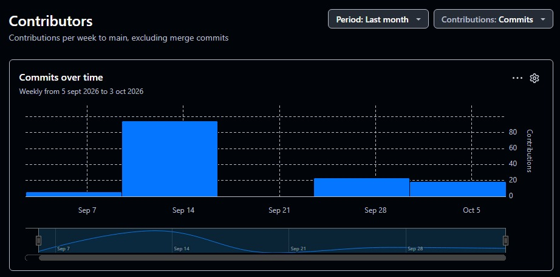
</p>
<p align="center">
  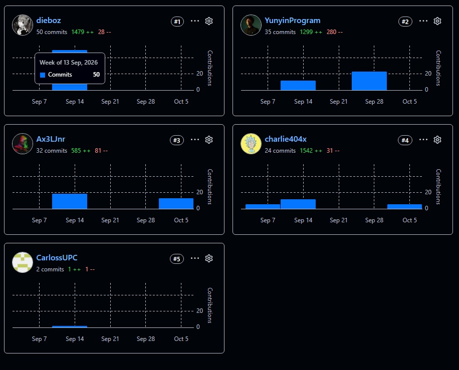
</p>
<p align="center">
  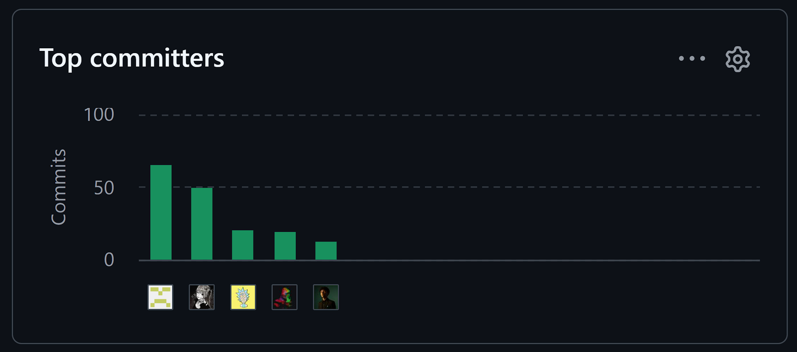
</p>

## Contribuciones por integrante

| Integrante | Tareas Asignadas |
| :--- | :--- |
| **Castro Picón, Manuel Fernando Joao** | • **Student Outcome**<br>• **Capítulo I – Introducción**<br>&nbsp;&nbsp;&nbsp;&nbsp;• **1.1 Startup Profile**<br>&nbsp;&nbsp;&nbsp;&nbsp;&nbsp;&nbsp;&nbsp;&nbsp;1.1.1 Descripción de la Startup<br>&nbsp;&nbsp;&nbsp;&nbsp;&nbsp;&nbsp;&nbsp;&nbsp;1.1.2 Perfiles de integrantes del equipo<br>&nbsp;&nbsp;&nbsp;&nbsp;• **1.2 Solution Profile**<br>&nbsp;&nbsp;&nbsp;&nbsp;&nbsp;&nbsp;&nbsp;&nbsp;1.2.1 Antecedentes y problemática<br>&nbsp;&nbsp;&nbsp;&nbsp;&nbsp;&nbsp;&nbsp;&nbsp;1.2.2 Lean UX Process<br>&nbsp;&nbsp;&nbsp;&nbsp;&nbsp;&nbsp;&nbsp;&nbsp;1.2.2.1 Lean UX Problem Statements<br>&nbsp;&nbsp;&nbsp;&nbsp;&nbsp;&nbsp;&nbsp;&nbsp;1.2.2.2 Lean UX Assumptions<br>&nbsp;&nbsp;&nbsp;&nbsp;&nbsp;&nbsp;&nbsp;&nbsp;1.2.2.3 Lean UX Hypothesis Statements<br>&nbsp;&nbsp;&nbsp;&nbsp;&nbsp;&nbsp;&nbsp;&nbsp;1.2.2.4 Lean UX Canvas<br>&nbsp;&nbsp;&nbsp;&nbsp;• **1.3 Segmentos objetivo**<br>• **4.1 Style Guidelines**<br>&nbsp;&nbsp;&nbsp;&nbsp;4.1.1 General Style Guidelines<br>&nbsp;&nbsp;&nbsp;&nbsp;4.1.2 Web Style Guidelines<br>&nbsp;&nbsp;&nbsp;&nbsp;4.1.3 Mobile Style Guidelines<br>• **4.9 Software Object-Oriented Design**<br>&nbsp;&nbsp;&nbsp;&nbsp;4.9.1 Class Diagrams<br>&nbsp;&nbsp;&nbsp;&nbsp;4.9.2 Class Dictionary<br>• **6.1 Testing Suites & Validation**<br>&nbsp;&nbsp;&nbsp;&nbsp;6.1.1 Core Entities Unit Tests<br>&nbsp;&nbsp;&nbsp;&nbsp;6.1.2 Core Integration Tests<br>• **7.1 Continuous Integration**<br>&nbsp;&nbsp;&nbsp;&nbsp;7.1.1 Tools and Practices<br>&nbsp;&nbsp;&nbsp;&nbsp;7.1.2 Build & Test Suite Pipeline Components |
| **Requena Gutiérrez, Diego Gabriel** | • **Capítulo II – Requirements Elicitation & Analysis**<br>&nbsp;&nbsp;&nbsp;&nbsp;• **2.1 Competidores**<br>&nbsp;&nbsp;&nbsp;&nbsp;&nbsp;&nbsp;&nbsp;&nbsp;2.1.1 Análisis competitivo<br>&nbsp;&nbsp;&nbsp;&nbsp;&nbsp;&nbsp;&nbsp;&nbsp;2.1.2 Estrategias y tácticas frente a competidores<br>&nbsp;&nbsp;&nbsp;&nbsp;• **2.2 Entrevistas**<br>&nbsp;&nbsp;&nbsp;&nbsp;&nbsp;&nbsp;&nbsp;&nbsp;2.2.1 Diseño de entrevistas<br>&nbsp;&nbsp;&nbsp;&nbsp;&nbsp;&nbsp;&nbsp;&nbsp;2.2.2 Registro de entrevistas<br>&nbsp;&nbsp;&nbsp;&nbsp;&nbsp;&nbsp;&nbsp;&nbsp;2.2.3 Análisis de entrevistas<br>• **4.10 Database Design**<br>&nbsp;&nbsp;&nbsp;&nbsp;4.10.1 Relational/Non-Relational Database Diagram<br>• **5.1 Software Configuration Management**<br>&nbsp;&nbsp;&nbsp;&nbsp;5.1.1 Software Development Environment Configuration<br>&nbsp;&nbsp;&nbsp;&nbsp;5.1.2 Source Code Management<br>&nbsp;&nbsp;&nbsp;&nbsp;5.1.3 Source Code Style Guide & Conventions<br>&nbsp;&nbsp;&nbsp;&nbsp;5.1.4 Software Deployment Configuration<br>• **5.2 Product Implementation & Deployment**<br>&nbsp;&nbsp;&nbsp;&nbsp;5.2.4 Acuerdo de Servicio - SaaS<br>&nbsp;&nbsp;&nbsp;&nbsp;5.2.6 Implemented RESTful API and/or Serverless Backend Evidence<br>&nbsp;&nbsp;&nbsp;&nbsp;5.2.7 RESTful API documentation<br>• **6.3 Validation Interviews**<br>&nbsp;&nbsp;&nbsp;&nbsp;6.3.1 Diseño de Entrevistas<br>&nbsp;&nbsp;&nbsp;&nbsp;6.3.2 Registro de Entrevistas<br>&nbsp;&nbsp;&nbsp;&nbsp;6.3.3 Evaluaciones según heurísticas |
| **Huaman De La Cruz, Jean Pool** | • **2.3 Needfinding**<br>&nbsp;&nbsp;&nbsp;&nbsp;2.3.1 User Personas<br>&nbsp;&nbsp;&nbsp;&nbsp;2.3.2 User Task Matrix<br>&nbsp;&nbsp;&nbsp;&nbsp;2.3.3 User Journey Mapping<br>&nbsp;&nbsp;&nbsp;&nbsp;2.3.4 Empathy Mapping<br>&nbsp;&nbsp;&nbsp;&nbsp;2.3.5 As-is Scenario Mapping<br>• **2.4 Ubiquitous Language**<br>• **4.2 Information Architecture**<br>&nbsp;&nbsp;&nbsp;&nbsp;4.2.1 Organization Systems<br>&nbsp;&nbsp;&nbsp;&nbsp;4.2.2 Labeling Systems<br>&nbsp;&nbsp;&nbsp;&nbsp;4.2.3 SEO Tags and Meta Tags<br>&nbsp;&nbsp;&nbsp;&nbsp;4.2.4 Searching Systems<br>&nbsp;&nbsp;&nbsp;&nbsp;4.2.5 Navigation Systems<br>• **4.5 Mobile Applications Prototyping**<br>&nbsp;&nbsp;&nbsp;&nbsp;4.5.1 Android Mobile Applications Prototyping<br>&nbsp;&nbsp;&nbsp;&nbsp;4.5.2 iOS Mobile Applications Prototyping<br>• **4.7 Web Applications Prototyping**<br>• **6.2 Static testing & Verification**<br>&nbsp;&nbsp;&nbsp;&nbsp;6.2.1 Static Code Analysis<br>&nbsp;&nbsp;&nbsp;&nbsp;6.2.2 Reviews<br>• **6.4 Auditoría de Experiencias de Usuario**<br>&nbsp;&nbsp;&nbsp;&nbsp;6.4.1 Auditoría realizada<br>&nbsp;&nbsp;&nbsp;&nbsp;6.4.2 Auditoría recibida |
| **Paredes Chavez, Carlos Augusto** | • **Capítulo IV – Product Design**<br>&nbsp;&nbsp;&nbsp;&nbsp;• **4.3 Landing Page UI Design**<br>&nbsp;&nbsp;&nbsp;&nbsp;&nbsp;&nbsp;&nbsp;&nbsp;4.3.1 Landing Page Wireframe<br>&nbsp;&nbsp;&nbsp;&nbsp;&nbsp;&nbsp;&nbsp;&nbsp;4.3.2 Landing Page Mock-up<br>&nbsp;&nbsp;&nbsp;&nbsp;• **4.4 Mobile Applications UX/UI Design**<br>&nbsp;&nbsp;&nbsp;&nbsp;&nbsp;&nbsp;&nbsp;&nbsp;4.4.1 Mobile Applications Wireframes<br>&nbsp;&nbsp;&nbsp;&nbsp;&nbsp;&nbsp;&nbsp;&nbsp;4.4.2 Mobile Applications Wireflow Diagrams<br>&nbsp;&nbsp;&nbsp;&nbsp;&nbsp;&nbsp;&nbsp;&nbsp;4.4.3 Mobile Applications Mock-ups<br>&nbsp;&nbsp;&nbsp;&nbsp;&nbsp;&nbsp;&nbsp;&nbsp;4.4.4 Mobile Applications User Flow Diagrams<br>&nbsp;&nbsp;&nbsp;&nbsp;• **4.6 Web Applications UX/UI Design**<br>&nbsp;&nbsp;&nbsp;&nbsp;&nbsp;&nbsp;&nbsp;&nbsp;4.6.1 Web Applications Wireframes<br>&nbsp;&nbsp;&nbsp;&nbsp;&nbsp;&nbsp;&nbsp;&nbsp;4.6.2 Web Applications Wireflow Diagrams<br>&nbsp;&nbsp;&nbsp;&nbsp;&nbsp;&nbsp;&nbsp;&nbsp;4.6.3 Web Applications Mock-ups<br>&nbsp;&nbsp;&nbsp;&nbsp;&nbsp;&nbsp;&nbsp;&nbsp;4.6.4 Web Applications User Flow Diagrams<br>• **5.2 Product Implementation & Deployment**<br>&nbsp;&nbsp;&nbsp;&nbsp;5.2.2 Implemented Landing Page Evidence<br>&nbsp;&nbsp;&nbsp;&nbsp;5.2.3 Implemented Frontend-Web Application Evidence<br>&nbsp;&nbsp;&nbsp;&nbsp;5.2.5 Implemented Native-Mobile Application Evidence<br>• **5.3 Video About-the-Product** |
| **Vila Guillen, Miguel Angel** | • **Capítulo III – Requirements Specification**<br>&nbsp;&nbsp;&nbsp;&nbsp;3.1 To-Be Scenario Mapping<br>&nbsp;&nbsp;&nbsp;&nbsp;3.2 User Stories<br>&nbsp;&nbsp;&nbsp;&nbsp;3.3 Product Backlog<br>&nbsp;&nbsp;&nbsp;&nbsp;3.4 Impact Mapping<br>• **4.8 Domain-Driven Software Architecture**<br>&nbsp;&nbsp;&nbsp;&nbsp;4.8.1 Software Architecture Context Diagram<br>&nbsp;&nbsp;&nbsp;&nbsp;4.8.2 Software Architecture Container Diagrams<br>&nbsp;&nbsp;&nbsp;&nbsp;4.8.3 Software Architecture Components Diagrams<br>• **5.2 Product Implementation & Deployment**<br>&nbsp;&nbsp;&nbsp;&nbsp;5.2.1 Sprint Backlogs<br>&nbsp;&nbsp;&nbsp;&nbsp;5.2.8 Team Collaboration Insights<br>• **6.1 Testing Suites & Validation**<br>&nbsp;&nbsp;&nbsp;&nbsp;6.1.3 Core Behavior-Driven Development<br>&nbsp;&nbsp;&nbsp;&nbsp;6.1.4 Core System Tests<br>• **7.2 Continuous Delivery**<br>&nbsp;&nbsp;&nbsp;&nbsp;7.2.1 Tools and Practices<br>&nbsp;&nbsp;&nbsp;&nbsp;7.2.2 Stages Deployment Pipeline Components<br>• **7.3 Continuous deployment**<br>&nbsp;&nbsp;&nbsp;&nbsp;7.3.1 Tools and Practices<br>&nbsp;&nbsp;&nbsp;&nbsp;7.3.2 Production Deployment Pipeline Components |


<div style="page-break-after: always;"></div>

# Contenido

- [Student Outcome](#student-outcome)

**Parte I: As-Is Software Project**

- [Capítulo I: Introducción](#capítulo-i-introducción)
  - [1.1. Startup Profile](#11-startup-profile)
    - [1.1.1. Descripción de la Startup](#111-descripción-de-la-startup)
    - [1.1.2. Perfiles de integrantes del equipo](#112-perfiles-de-integrantes-del-equipo)
  - [1.2. Solution Profile](#12-solution-profile)
    - [1.2.1. Antecedentes y problemática](#121-antecedentes-y-problemática)
    - [1.2.2. Lean UX Process](#122-lean-ux-process)
      - [1.2.2.1. Lean UX Problem Statements](#1221-lean-ux-problem-statements)
      - [1.2.2.2. Lean UX Assumptions](#1222-lean-ux-assumptions)
      - [1.2.2.3. Lean UX Hypothesis Statements](#1223-lean-ux-hypothesis-statements)
      - [1.2.2.4. Lean UX Canvas](#1224-lean-ux-canvas)
  - [1.3. Segmentos objetivo](#13-segmentos-objetivo)

- [Capítulo II: Requirements Elicitation & Analysis](#capítulo-ii-requirements-elicitation--analysis)
  - [2.1. Competidores](#21-competidores)
    - [2.1.1. Análisis competitivo](#211-análisis-competitivo)
    - [2.1.2. Estrategias y tácticas frente a competidores](#212-estrategias-y-tácticas-frente-a-competidores)
  - [2.2. Entrevistas](#22-entrevistas)
    - [2.2.1. Diseño de entrevistas](#221-diseño-de-entrevistas)
    - [2.2.2. Registro de entrevistas](#222-registro-de-entrevistas)
    - [2.2.3. Análisis de entrevistas](#223-análisis-de-entrevistas)
  - [2.3. Needfinding](#23-needfinding)
    - [2.3.1. User Personas](#231-user-personas)
    - [2.3.2. User Task Matrix](#232-user-task-matrix)
    - [2.3.3. User Journey Mapping](#233-user-journey-mapping)
    - [2.3.4. Empathy Mapping](#234-empathy-mapping)
    - [2.3.5. As-is Scenario Mapping](#235-as-is-scenario-mapping)
  - [2.4. Ubiquitous Language](#24-ubiquitous-language)

- [Capítulo III: Requirements Specification](#capítulo-iii-requirements-specification)
  - [3.1. To-Be Scenario Mapping](#31-to-be-scenario-mapping)
  - [3.2. User Stories](#32-user-stories)
  - [3.3. Product Backlog](#33-product-backlog)
  - [3.4. Impact Mapping](#34-impact-mapping)

- [Capítulo IV: Product Design](#capítulo-iv-product-design)
  - [4.1. Style Guidelines](#41-style-guidelines)
    - [4.1.1. General Style Guidelines](#411-general-style-guidelines)
    - [4.1.2. Web Style Guidelines](#412-web-style-guidelines)
    - [4.1.3. Mobile Style Guidelines](#413-mobile-style-guidelines)
      - [4.1.3.1. iOS Mobile Style Guidelines](#4131-ios-mobile-style-guidelines)
      - [4.1.3.2. Android Mobile Style Guidelines](#4132-android-mobile-style-guidelines)
  - [4.2. Information Architecture](#42-information-architecture)
    - [4.2.1. Organization Systems](#421-organization-systems)
    - [4.2.2. Labeling Systems](#422-labeling-systems)
    - [4.2.3. SEO Tags and Meta Tags](#423-seo-tags-and-meta-tags)
    - [4.2.4. Searching Systems](#424-searching-systems)
    - [4.2.5. Navigation Systems](#425-navigation-systems)
  - [4.3. Landing Page UI Design](#43-landing-page-ui-design)
    - [4.3.1. Landing Page Wireframe](#431-landing-page-wireframe)
    - [4.3.2. Landing Page Mock-up](#432-landing-page-mock-up)
  - [4.4. Mobile Applications UX/UI Design](#44-mobile-applications-uxui-design)
    - [4.4.1. Mobile Applications Wireframes](#441-mobile-applications-wireframes)
    - [4.4.2. Mobile Applications Wireflow Diagrams](#442-mobile-applications-wireflow-diagrams)
    - [4.4.3. Mobile Applications Mock-ups](#443-mobile-applications-mock-ups)
    - [4.4.4. Mobile Applications User Flow Diagrams](#444-mobile-applications-user-flow-diagrams)
  - [4.5. Mobile Applications Prototyping](#45-mobile-applications-prototyping)
    - [4.5.1. Android Mobile Applications Prototyping](#451-android-mobile-applications-prototyping)
    - [4.5.2. iOS Mobile Applications Prototyping](#452-ios-mobile-applications-prototyping)
  - [4.6. Web Applications UX/UI Design](#46-web-applications-uxui-design)
    - [4.6.1. Web Applications Wireframes](#461-web-applications-wireframes)
    - [4.6.2. Web Applications Wireflow Diagrams](#462-web-applications-wireflow-diagrams)
    - [4.6.3. Web Applications Mock-ups](#463-web-applications-mock-ups)
    - [4.6.4. Web Applications User Flow Diagrams](#464-web-applications-user-flow-diagrams)
  - [4.7. Web Applications Prototyping](#47-web-applications-prototyping)
  - [4.8. Domain-Driven Software Architecture](#48-domain-driven-software-architecture)
    - [4.8.1. Software Architecture Context Diagram](#481-software-architecture-context-diagram)
    - [4.8.2. Software Architecture Container Diagrams](#482-software-architecture-container-diagrams)
    - [4.8.3. Software Architecture Components Diagrams](#483-software-architecture-components-diagrams)
  - [4.9. Software Object-Oriented Design](#49-software-object-oriented-design)
    - [4.9.1. Class Diagrams](#491-class-diagrams)
    - [4.9.2. Class Dictionary](#492-class-dictionary)
  - [4.10. Database Design](#410-database-design)
    - [4.10.1. Relational/Non-Relational Database Diagram](#4101-relationalnon-relational-database-diagram)

- [Capítulo V: Product Implementation](#capítulo-v-product-implementation)
  - [5.1. Software Configuration Management](#51-software-configuration-management)
    - [5.1.1. Software Development Environment Configuration](#511-software-development-environment-configuration)
    - [5.1.2. Source Code Management](#512-source-code-management)
    - [5.1.3. Source Code Style Guide & Conventions](#513-source-code-style-guide--conventions)
    - [5.1.4. Software Deployment Configuration](#514-software-deployment-configuration)
  - [5.2. Product Implementation & Deployment](#52-product-implementation--deployment)
    - [5.2.1. Sprint Backlogs](#521-sprint-backlogs)
    - [5.2.2. Implemented Landing Page Evidence](#522-implemented-landing-page-evidence)
    - [5.2.3. Implemented Frontend-Web Application Evidence](#523-implemented-frontend-web-application-evidence)
    - [5.2.4. Acuerdo de Servicio - SaaS](#524-acuerdo-de-servicio---saas)
    - [5.2.5. Implemented Native-Mobile Application Evidence](#525-implemented-native-mobile-application-evidence)
    - [5.2.6. Implemented RESTful API and/or Serverless Backend Evidence](#526-implemented-restful-api-andor-serverless-backend-evidence)
    - [5.2.7. RESTful API documentation](#527-restful-api-documentation)
    - [5.2.8. Team Collaboration Insights](#528-team-collaboration-insights)
  - [5.3. Video About-the-Product](#53-video-about-the-product)

**Parte II: Verification, Validation & Pipeline**

- [Capítulo VI: Product Verification & Validation](#capítulo-vi-product-verification--validation)
  - [6.1. Testing Suites & Validation](#61-testing-suites--validation)
    - [6.1.1. Core Entities Unit Tests](#611-core-entities-unit-tests)
    - [6.1.2. Core Integration Tests](#612-core-integration-tests)
    - [6.1.3. Core Behavior-Driven Development](#613-core-behavior-driven-development)
    - [6.1.4. Core System Tests](#614-core-system-tests)
  - [6.2. Static testing & Verification](#62-static-testing--verification)
    - [6.2.1. Static Code Analysis](#621-static-code-analysis)
      - [6.2.1.1. Coding standard & Code conventions](#6211-coding-standard--code-conventions)
      - [6.2.1.2. Code Quality & Code Security](#6212-code-quality--code-security)
    - [6.2.2. Reviews](#622-reviews)
  - [6.3. Validation Interviews](#63-validation-interviews)
    - [6.3.1. Diseño de Entrevistas](#631-diseño-de-entrevistas)
    - [6.3.2. Registro de Entrevistas](#632-registro-de-entrevistas)
    - [6.3.3. Evaluaciones según heurísticas](#633-evaluaciones-según-heurísticas)
  - [6.4. Auditoría de Experiencias de Usuario](#64-auditoría-de-experiencias-de-usuario)
    - [6.4.1. Auditoría realizada](#641-auditoría-realizada)
      - [6.4.1.1. Información del grupo auditado](#6411-información-del-grupo-auditado)
      - [6.4.1.2. Cronograma de auditoría realizada](#6412-cronograma-de-auditoría-realizada)
      - [6.4.1.3. Contenido de auditoría realizada](#6413-contenido-de-auditoría-realizada)
    - [6.4.2. Auditoría recibida](#642-auditoría-recibida)
      - [6.4.2.1. Información del grupo auditor](#6421-información-del-grupo-auditor)
      - [6.4.2.2. Cronograma de auditoría recibida](#6422-cronograma-de-auditoría-recibida)
      - [6.4.2.3. Contenido de auditoría recibida](#6423-contenido-de-auditoría-recibida)
      - [6.4.2.4. Resumen de modificaciones para subsanar hallazgos](#6424-resumen-de-modificaciones-para-subsanar-hallazgos)

- [Capítulo VII: DevOps Practices](#capítulo-vii-devops-practices)
  - [7.1. Continuous Integration](#71-continuous-integration)
    - [7.1.1. Tools and Practices](#711-tools-and-practices)
    - [7.1.2. Build & Test Suite Pipeline Components](#712-build--test-suite-pipeline-components)
  - [7.2. Continuous Delivery](#72-continuous-delivery)
    - [7.2.1. Tools and Practices](#721-tools-and-practices)
    - [7.2.2. Stages Deployment Pipeline Components](#722-stages-deployment-pipeline-components)
  - [7.3. Continuous deployment](#73-continuous-deployment)
    - [7.3.1. Tools and Practices](#731-tools-and-practices)
    - [7.3.2. Production Deployment Pipeline Components](#732-production-deployment-pipeline-components)
  - [7.4. Continuous Monitoring](#74-continuous-monitoring)
    - [7.4.1. Tools and Practices](#741-tools-and-practices)
    - [7.4.2. Monitoring Pipeline Components](#742-monitoring-pipeline-components)
    - [7.4.3. Alerting Pipeline Components](#743-alerting-pipeline-components)
    - [7.4.4. Notification Pipeline Components](#744-notification-pipeline-components)

**Parte III: Experiment-Driven Lifecycle**

- [Capítulo VIII: Experiment-Driven Development](#capítulo-viii-experiment-driven-development)
  - [8.1. Experiment Planning](#81-experiment-planning)
    - [8.1.1. As-Is Summary](#811-as-is-summary)
    - [8.1.2. Raw Material: Assumptions, Knowledge Gaps, Ideas, Claims](#812-raw-material-assumptions-knowledge-gaps-ideas-claims)
    - [8.1.3. Experiment-Ready Questions](#813-experiment-ready-questions)
    - [8.1.4. Question Backlog](#814-question-backlog)
    - [8.1.5. Experiment Cards](#815-experiment-cards)
  - [8.2. Experiment Design](#82-experiment-design)
    - [8.2.1. Hypotheses](#821-hypotheses)
    - [8.2.2. Domain Business Metrics](#822-domain-business-metrics)
    - [8.2.3. Measures](#823-measures)
    - [8.2.4. Conditions](#824-conditions)
    - [8.2.5. Scale Calculations and Decisions](#825-scale-calculations-and-decisions)
    - [8.2.6. Methods Selection](#826-methods-selection)
    - [8.2.7. Data Analytics: Goals, KPIs and Metrics Selection](#827-data-analytics-goals-kpis-and-metrics-selection)
    - [8.2.8. Web and Mobile Tracking Plan](#828-web-and-mobile-tracking-plan)
  - [8.3. Experimentation](#83-experimentation)
    - [8.3.1. To-Be User Stories](#831-to-be-user-stories)
    - [8.3.2. To-Be Product Backlog](#832-to-be-product-backlog)
    - [8.3.3. Pipeline-supported, Experiment-Driven To-Be Software Platform Lifecycle](#833-pipeline-supported-experiment-driven-to-be-software-platform-lifecycle)
      - [8.3.3.1. To-Be Sprint Backlogs](#8331-to-be-sprint-backlogs)
      - [8.3.3.2. Implemented To-Be Landing Page Evidence](#8332-implemented-to-be-landing-page-evidence)
      - [8.3.3.3. Implemented To-Be Frontend-Web Application Evidence](#8333-implemented-to-be-frontend-web-application-evidence)
      - [8.3.3.4. Implemented To-Be Native-Mobile Application Evidence](#8334-implemented-to-be-native-mobile-application-evidence)
      - [8.3.3.5. Implemented To-Be RESTful API and/or Serverless Backend Evidence](#8335-implemented-to-be-restful-api-andor-serverless-backend-evidence)
      - [8.3.3.6. Team Collaboration Insights](#8336-team-collaboration-insights)
    - [8.3.4. To-Be Validation Interviews](#834-to-be-validation-interviews)
      - [8.3.4.1. Diseño de Entrevistas](#8341-diseño-de-entrevistas)
      - [8.3.4.2. Registro de Entrevistas](#8342-registro-de-entrevistas)
  - [8.4. Experiment Aftermath & Analysis](#84-experiment-aftermath--analysis)
    - [8.4.1. Analysis and Interpretation of Results](#841-analysis-and-interpretation-of-results)
    - [8.4.2. Re-scored and Re-prioritized Question Backlog](#842-re-scored-and-re-prioritized-question-backlog)
  - [8.5. Continuous Learning](#85-continuous-learning)
    - [8.5.1. Shareback Session Artifacts: Learning Workflow](#851-shareback-session-artifacts-learning-workflow)
  - [8.6. To-Be Software Platform Pre-launch](#86-to-be-software-platform-pre-launch)
    - [8.6.1. About-the-Product Intro Video](#861-about-the-product-intro-video)
    - [8.6.2. Resumen usando Gees Framework](#862-resumen-usando-gees-framework)
    - [8.6.3. Matriz de Evaluación Ética y de Impacto](#863-matriz-de-evaluación-ética-y-de-impacto)

- [Conclusiones](#conclusiones)
  - [Conclusiones y recomendaciones](#conclusiones-y-recomendaciones)
  - [Video App Validation](#video-app-validation)
  - [Video About-the-Team](#video-about-the-team)

- [Bibliografía](#bibliografía)

- [Anexos](#anexos)
  - [Anexo A. Estructura para la sección Objetivo del Estudiante (Student Outcome)](#anexo-a-estructura-para-la-sección-objetivo-del-estudiante-student-outcome)
  - [Anexo B. Estructura para el Informe de participación](#anexo-b-estructura-para-el-informe-de-participación)
  - [Anexo C. Indicaciones para secciones que incluyen Videos](#anexo-c-indicaciones-para-secciones-que-incluyen-videos)
  - [Anexo D. Formato para Evaluación de User Experience según Heurísticas](#anexo-d-formato-para-evaluación-de-user-experience-según-heurísticas)
  - [Anexo E. Errores típicos en la traducción y uso de términos para Ingeniería de Software](#anexo-e-errores-típicos-en-la-traducción-y-uso-de-términos-para-ingeniería-de-software)
  - [Anexo F. Matriz de Evaluación Ética y de Impacto](#anexo-f-matriz-de-evaluación-ética-y-de-impacto)
  - [Anexo G. Videos de Exposiciones](#anexo-g-videos-de-exposiciones)

<div style="page-break-after: always;"></div>

## Student Outcome

<div align="center">

## ABET – EAC - Student Outcome 4

</div>

**Criterio:** La capacidad de reconocer responsabilidades éticas y profesionales en situaciones de ingeniería y hacer juicios informados, que deben considerar el impacto de las soluciones de ingeniería en contextos globales, económicos, ambientales y sociales.

En el siguiente cuadro se describen las acciones realizadas y enunciados de conclusiones por parte del equipo del proyecto **NeuroZen**, que permiten sustentar el haber alcanzado el logro del ABET – EAC - Student Outcome 4 durante el **Segundo Hito: TRABAJO PARCIAL - Stage Review**.

<br>

| Criterio específico | Acciones realizadas | Conclusiones |
| :--- | :--- | :--- |
| **4.c.1 Reconoce responsabilidad ética y profesional en situaciones de ingeniería de software** | **Castro Picón, Manuel Fernando Joao:** Diseñó la arquitectura de software y la base de datos asegurando la privacidad de los datos de salud y perfiles biométricos de los usuarios en el AV1[cite: 1].<br>**TB1:** Desarrolló pruebas unitarias, de integración y automatizadas para la aplicación móvil, verificando el funcionamiento de sus componentes y flujos. Como Team Leader, coordinó la distribución de tareas y las decisiones del equipo, asumiendo la responsabilidad de organizar las verificaciones necesarias antes de presentar el producto.<br><br>**Huaman De La Cruz, Jean Pool:** Implementó módulos del Frontend Web Application en el AV1, garantizando una experiencia de usuario segura y un manejo ético de las sesiones de los psicólogos[cite: 1].<br>**TB1:** Desarrolló pruebas del frontend web para verificar reglas relacionadas con niveles de estrés, pausas activas, citas y datos de suscripción. Estas verificaciones contribuyen a detectar cálculos y entradas incorrectas antes de que afecten la información mostrada al usuario.<br><br>**Paredes Chavez, Carlos Augusto:** Configuró el contexto de *Auth & Profile* durante el AV1, asegurando que el registro y el manejo de datos personales cumplan con los estándares éticos de privacidad[cite: 1].<br>**TB1:** Estructuró escenarios BDD a partir de los criterios de aceptación, incluyendo la reserva de citas y el manejo de horarios ocupados. Definir el comportamiento esperado ante estos casos permite reconocer la responsabilidad de evitar confirmaciones incorrectas que afecten al usuario y al profesional.<br><br>**Requena Gutiérrez, Diego Gabriel:** Diseñó el *Dashboard & Navigation* en el AV1, aplicando principios éticos para que el usuario visualice sus métricas de estrés de forma segura[cite: 1].<br>**TB1:** Participó en pruebas unitarias e integrales del frontend y backend, desarrolló la landing page y realizó correcciones de wireframes, wireflows y del reporte. Estas actividades permiten revisar la coherencia entre las funciones implementadas, los recorridos de uso y la información comunicada sobre el producto.<br><br>**Vila Guillen, Miguel Angel:** Desarrolló los *endpoints* de la API para el *Service Booking* en el AV1, siguiendo convenciones de código profesional y asegurando transacciones seguras[cite: 1].<br>**TB1:** Elaboró pruebas unitarias para servicios del backend y una prueba de integración del controlador de Triggers. Además, configuró la integración continua para ejecutar las pruebas automáticamente, incorporando verificaciones de calidad al proceso de desarrollo y reduciendo el riesgo de integrar cambios con errores. | **AV1:** Como equipo, logramos establecer una sólida base ética y profesional en el desarrollo del sistema NeuroZen. Garantizamos la confidencialidad de la información médica y biométrica de los trabajadores mediante una arquitectura segura, interfaces confiables y el cumplimiento de estándares de codificación, reflejando nuestra máxima responsabilidad técnica con la privacidad de los usuarios y especialistas[cite: 1].<br><br>**TB1:** Como equipo, reforzamos nuestra responsabilidad profesional mediante pruebas del backend, frontend y aplicación móvil, escenarios de aceptación y automatización de verificaciones. Estas actividades permiten detectar errores en el manejo de datos y en los flujos del producto antes de su entrega. Asimismo, la coordinación de tareas y la actualización del reporte ayudan a mantener la correspondencia entre el trabajo realizado y las evidencias presentadas. |
| **4.c.2 Emite juicios informados considerando el impacto de las soluciones de ingeniería de software en contextos globales, económicos, ambientales y sociales** | **Castro Picón, Manuel Fernando Joao:** Evaluó el impacto económico en el *Startup Profile* (AV1), determinando que NeuroZen aumentará la productividad y reducirá el ausentismo laboral[cite: 1].<br>**TB1:** Mediante las pruebas de la aplicación móvil, abordó fallos que podrían interrumpir el uso de funciones como la gestión de citas y la sesión del usuario. Su aporte permite considerar las consecuencias de estas interrupciones sobre el tiempo de los usuarios y su acceso a los servicios de la plataforma.<br><br>**Huaman De La Cruz, Jean Pool:** Analizó el impacto social en el AV1 al estructurar las *User Personas*, enfocándose en cómo el estrés afecta la calidad de vida de los profesionales[cite: 1].<br>**TB1:** Verificó reglas del frontend relacionadas con el cálculo del nivel de estrés y la gestión de citas. La revisión de estos resultados permite considerar cómo una información incorrecta puede influir en las decisiones del usuario y afectar su confianza en NeuroZen.<br><br>**Paredes Chavez, Carlos Augusto:** Realizó el análisis competitivo de la plataforma en el AV1, evaluando el impacto global de soluciones de salud mental existentes en el mercado digital[cite: 1].<br>**TB1:** Definió escenarios de aceptación que contemplan conflictos de disponibilidad al reservar citas. Considerar estos casos permite analizar las consecuencias sociales y económicas de una reserva incorrecta, como la pérdida de tiempo del usuario y del profesional o la interrupción de una atención programada.<br><br>**Requena Gutiérrez, Diego Gabriel:** Diseñó el *Impact Mapping* en el AV1, emitiendo juicios sobre el impacto social en el segmento vulnerable de trabajadores informales[cite: 1].<br>**TB1:** Trabajó en la landing page y en los wireframes y wireflows de las plataformas. La revisión de la información y los recorridos contribuye a que los usuarios comprendan la propuesta de NeuroZen y puedan utilizar sus funciones con mayor claridad, considerando las necesidades de los segmentos objetivo.<br><br>**Vila Guillen, Miguel Angel:** Planificó la infraestructura tecnológica (*Deployment Configuration*) en el AV1, tomando decisiones informadas para un despliegue en la nube eficiente y ambientalmente responsable[cite: 1].<br>**TB1:** Configuró la ejecución de pruebas y el despliegue del backend mediante integración continua y automatización. Estas decisiones permiten considerar los costos de las fallas y del trabajo de corrección, así como el uso de recursos de infraestructura durante las compilaciones, pruebas y despliegues. | **AV1:** El grupo ha demostrado capacidad para analizar el entorno integral de NeuroZen, concluyendo que la plataforma tendrá un impacto social y económico positivo al reducir el estrés laboral crónico, mejorar la productividad empresarial y brindar apoyo accesible a distintos segmentos de trabajadores. Asimismo, tomamos decisiones tecnológicas conscientes para minimizar la huella ambiental mediante un despliegue optimizado en la nube[cite: 1].<br><br>**TB1:** El equipo relacionó las decisiones de diseño, verificación y despliegue con sus posibles consecuencias para usuarios y profesionales. Las pruebas permiten abordar riesgos asociados con información incorrecta, reservas conflictivas e interrupciones del servicio, mientras que la automatización ayuda a organizar el trabajo de revisión. También reconocemos que el alcance de la plataforma y el uso de infraestructura deben evaluarse considerando accesibilidad, costos y consumo de recursos, para sustentar sus efectos sociales, económicos, globales y ambientales. |

<br>

<div style="page-break-after: always;"></div>

# Parte I: As-Is Software Project

# Capítulo I: Introducción

## 1.1. Startup Profile

### 1.1.1. Descripción de la Startup

Nuestro startup llamado NeuroDraw está enfocado en una rápida detección del estrés en el ámbito
laboral de personas entre 20 a 50 años de edad. Abarcando temas como salud mental, presión laboral
y servicios, el software facilita el tratamiento del estrés laboral.
Los usuarios pueden realizar un test que recabará información de salud, comportamiento, actitudes y
patrones en la persona. La plataforma permite el contacto con un psicólogo. Además, fomenta
diversas actividades para complementar el tratamiento contra el estrés.

### 1.1.2. Perfiles de integrantes del equipo

| Foto                                                    | Nombres y Apellidos               | Carrera                | Descripción                                                                                                                                                                                                                                                 |
| ------------------------------------------------------- | --------------------------------- | ---------------------- | ----------------------------------------------------------------------------------------------------------------------------------------------------------------------------------------------------------------------------------------------------------- |
|     | Manuel Fernando Joao Castro Picón | Ingeniería de Software | Tengo 20 años y curso el 7to ciclo en la Universidad Peruana de Ciencias Aplicadas. Me gusta entrenar calistenia, escuchar música y jugar fútbol. Me considero responsable, adaptable al trabajo en equipo y con metas claras para ser un gran profesional. |
|     | Carlos Augusto Paredes Chavez | Ingeniería de Software | Soy estudiante de Ingeniería de Software con experiencia en proyectos de desarrollo, documentación técnica y trabajo colaborativo con Git y GitHub. Me interesa fortalecer mis conocimientos en pruebas de software, aseguramiento de calidad, DevOps e integración continua. Me considero responsable, constante y orientado a desarrollar soluciones bien estructuradas y alineadas con las necesidades de los usuarios. |
|   | Miguel Angel Vila Guillen         | Ingeniería de Software | Tengo 21 años y estudio el 7to ciclo en la Universidad Peruana de Ciencias Aplicadas. Me gusta jugar videojuegos, tocar la guitarra y el fútbol. Me considero capaz de trabajar en equipo y aspiro a ser un profesional competente.                         |
|  | Diego Gabriel Requena Gutiérrez   | Ingeniería de Software | Tengo 20 años y curso el 7to ciclo en la Universidad Peruana de Ciencias Aplicadas. Soy una persona comprometida con mis objetivos, busco optimizar mi rendimiento y mantener un equilibrio entre la excelencia y una vida saludable.                       |
|     | Huaman De La Cruz Jean Pool       | Ingeniería de Software | Tengo 23 años; Estoy cursando la carrera de ingeniería de software en quinto ciclo. Soy una persona orientada a objetivos y con una meta clara, quiero poder crear soluciones disruptivas que revolucionen el mercado.                                      |

## 1.2. Solution Profile

### 1.2.1. Antecedentes y problemática

El estrés laboral constituye una problemática de salud pública de alcance global que afecta de manera directa a la población económicamente activa. Se estima que el 15% de los adultos en edad de trabajar padece algún trastorno mental, siendo el entorno laboral uno de sus principales determinantes (OMS, 2024), mientras que anualmente se pierden alrededor de 12,000 millones de días de trabajo a causa de la depresión y la ansiedad, con un costo aproximado de un billón de dólares para la economía mundial (OIT, 2022). Frente a este escenario, el proyecto Neuro Zen propone un sistema de identificación y gestión del estrés laboral dirigido a adultos de entre 20 y 50 años, mediante el registro de señales corporales visibles —como postura, tensión muscular facial, cambios respiratorios, sudoración, temblores y rojeces en la piel— integradas en una aplicación móvil que permite al usuario autoevaluar su nivel de estrés, recibir recomendaciones personalizadas y acceder a estrategias prácticas, con el fin de mejorar el bienestar del trabajador, prevenir el estrés crónico y fortalecer la productividad organizacional.

### 1.2.2. Lean UX Process

#### 1.2.2.1. Lean UX Problem Statements

Nuestra app permite a los usuarios identificar y gestionar su estrés laboral mediante un
test de autoevaluación y la observación de señales físicas visibles como la postura, la
respiración y la tensión facial. Además, brinda acceso a psicólogos y actividades
prácticas para mejorar el bienestar.
Hemos observado que muchos adultos entre 20 y 50 años sufren niveles elevados de
estrés en el trabajo, pero no cuentan con herramientas simples, accesibles y efectivas
para reconocer estos niveles a tiempo ni saber cómo actuar al respecto.
¿Cómo pueden los trabajadores detectar y manejar su estrés de forma temprana y
efectiva en su entorno laboral, usando una herramienta accesible, fácil de usar e
integrada en su rutina diaria?

#### 1.2.2.2. Lean UX Assumptions

**Feature:** Sistema de identificación y gestión del estrés laboral en NeuroZen

**Registro Bio-métrico y Perfil del Usuario:**
Creemos que nuestros usuarios (adultos de 20 a 50 años en el ámbito laboral) necesitan una forma sencilla y segura de registrar sus parámetros bio-métricos (por medio de la cámara o sensores de sus dispositivos móviles) junto con información de salud y comportamiento. Esto permitirá personalizar el seguimiento y el manejo del estrés en función de las características individuales.

**Detección Temprana de Estrés mediante Patrones Físicos:**
Creemos que la identificación de señales bio-métricas observables (postura, tensión muscular, patrones de respiración y sudoración) permitirá detectar de forma temprana niveles de estrés. Esto facilitará la intervención oportuna antes de que se agraven los síntomas, impactando positivamente en la salud mental y física de los usuarios.

**Integración de Evaluaciones Psicológicas y Recomendaciones Personalizadas:**
Creemos que los usuarios se beneficiarán al combinar la autoevaluación bio-métrica con tests emocionales y recomendaciones personalizadas (ejercicios de respiración, pausas activas, contacto con especialistas). Esta integración permitirá al usuario conocer su estado en tiempo real y acceder a soluciones prácticas y adaptadas a su contexto.

**Seguimiento y Análisis de Datos de Estrés:**
Creemos que disponer de un registro histórico del nivel de estrés y obtener estadísticas personalizadas ayudará al usuario a identificar patrones y cambios en su salud, promoviendo acciones preventivas y
mejoras en su entorno laboral y personal.

**Business Outcomes (Resultados del negocio)**

- Se aumentará la productividad laboral y se reducirá el ausentismo, ya que los trabajadores podrán identificar y gestionar su estrés de manera proactiva.

- Se generarán ingresos a través de planes de suscripción individuales y acuerdos corporativos con empresas interesadas en el bienestar de sus empleados.

- NeuroZen se posicionará como una herramienta innovadora y confiable para la salud mental en el ámbito laboral, ampliando su alcance en el mercado latinoamericano.

**Users (Usuarios)**

- Profesionales y empleados de 20 a 50 años que desarrollan sus actividades en ambientes laborales exigentes y de alta presión.

- Personas que desean mejorar sus niveles de bienestar integral mediante el monitoreo de señales físicas y emocionales.

- Usuarios que utilizan dispositivos móviles y buscan soluciones digitales para la autogestión de su salud mental.

**User Outcomes (Beneficios para el usuario)**

- Identificar sus niveles de estrés de manera temprana y objetiva, mediante el análisis de patrones bio-métricos.

- Acceder a recomendaciones personalizadas que les ayuden a manejar y reducir los síntomas de estrés.

- Visualizar estadísticas y tendencias de su bienestar, facilitando el seguimiento a lo largo del tiempo.

- Mejorar su calidad de vida laboral y personal gracias a estrategias adaptadas a sus necesidades específicas.

**Features (Características)**

- **Registro de Datos Biométricos:** Herramienta de captura de señales físicas a través de la cámara y sensores del móvil.

- **Autoevaluación Integral:** Tests combinados que evalúan tanto aspectos emocionales como físicos del estrés.

- **Recomendaciones Personalizadas:** Sugerencias de ejercicios, pausas activas y consejos de salud mental basados en el perfil del usuario.

- **Historial y Seguimiento:** Dashboard interactivo que muestra evolución, tendencias y alertas de niveles de estrés.

- **Integración con Profesionales:** Opción de contactar con psicólogos o especialistas en bienestar para intervenciones personalizadas.


#### 1.2.2.3. Lean UX Hypothesis Statements

Hypothesis Statement 01

**Creemos** que la implementación de un sistema de registro biométrico y autoevaluación permitirá a los usuarios identificar tempranamente sus niveles de estrés laboral.

**Sabemos** la hipótesis se confirma cuando se observe una correlación significativa entre los datos bio-métricos capturados y las autoevaluaciones realizadas por los usuarios.

**Cuando** al menos el 65% de los usuarios completen de forma regular la evaluación en la plataforma y se detecten cambios relevantes en sus patrones bio-métricos.

Hypothesis Statement 02

**Creemos** que al ofrecer recomendaciones personalizadas basadas en el análisis del estrés, los usuarios
adoptarán prácticas de autogestión más efectivas para reducir sus síntomas.

**Sabemos** que la hipótesis es correcta cuando los usuarios reporten mejoras en su bienestar y se
registre una disminución en los indicadores de estrés en los seguimientos mensuales.

**Cuando** se logre una reducción del 20% en la frecuencia e intensidad de síntomas reportados durante
los primeros seis meses de uso.

Hypothesis Statement 03

**Creemos** que la visualización de un historial interactivo y tendencias de estrés motivará a los usuarios a llevar un control continuo de su salud mental.

**Sabemos** que esto es cierto cuando se registre un aumento en la interacción con el dashboard y una mayor adherencia a las recomendaciones sugeridas

**Cuando** el uso constante de las herramientas de seguimiento genere datos que indiquen una mayor
consciencia y manejo proactivo del estrés en el entorno laboral.

#### 1.2.2.4. Lean UX Canvas

Lean UX Canvas es una de las herramientas que hemos utilizado para comprender a nuestros posibles usuarios y sus necesidades. Esta es usada en el campo del diseño centrado en el usuario y la metodología Lean con la intención de desarrollar productos de forma eficientes y práctica para los usuarios. A su vez, esta puede ser utilizada por equipos multidisciplinarios para que colaboración de forma ordenada dentro un marco estructurado.

<div>
  <p align="center">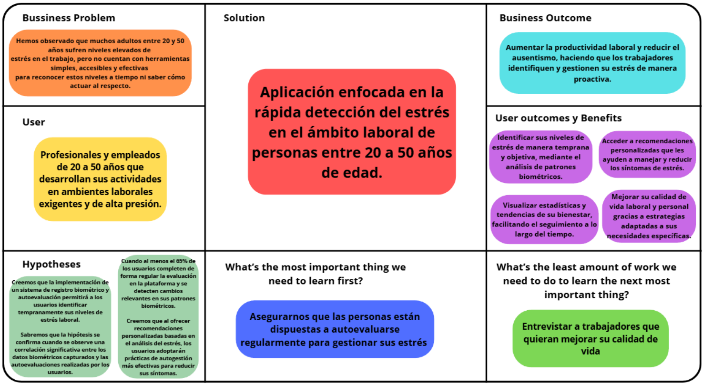</p>
</div>

## 1.3. Segmentos objetivo

#### Segmento objetivo #1: Trabajadores formales con jornadas extensas

Este segmento está compuesto por personas que cumplen horarios laborales prolongados, generalmente mayores a 8 horas diarias, y que enfrentan altos niveles de presión psicológica en su entorno profesional. La sobrecarga de trabajo y la falta de límites claros entre lo personal y lo laboral generan cuadros de estrés que afectan su rendimiento y calidad de vida. Según estudios realizados en distintos sectores, alrededor del 70% de los trabajadores presenta síntomas de estrés agudo en sus actividades cotidianas (Estudio LATAM, 2020). Este grupo constituye un eje clave para el éxito de la plataforma, al ser los principales beneficiarios de las capacidades que propone NeuroZen.

#### Segmento objetivo #2: Trabajadores informales o con horarios flexibles

Este segmento está compuesto por adultos que no necesariamente forman parte del empleo formal y cuyas actividades se desarrollan sin horarios fijos. A menudo, experimentan mayores niveles de estrés debido a la disponibilidad permanente que exige su trabajo, la inestabilidad económica y la dificultad para establecer límites entre la vida laboral y personal. Un estudio realizado a 250 trabajadores informales muestra que el 56% presenta un nivel medio de estrés, el 33.3% un nivel bajo y el 10.6% un nivel alto (Porcayo, 2022). Este grupo también se beneficiará de la plataforma, destacando su potencial para ampliar el alcance del producto en contextos laborales diversos y cada vez más comunes.

---

<div style="page-break-after: always;"></div>

# Capítulo II: Requirements Elicitation & Analysis

## 2.1. Competidores

En este apartado analizaremos las posibles competencias para nuestra página web,
viendo en ello sus descripciones y planes de negocios.

| Competidores | Características                                                                                                                                                                                                                                                                              | Diferencias                                                                                                                                                                                              | Limitaciones                                                                                                                                                          |
| ------------ | -------------------------------------------------------------------------------------------------------------------------------------------------------------------------------------------------------------------------------------------------------------------------------------------- | -------------------------------------------------------------------------------------------------------------------------------------------------------------------------------------------------------- | --------------------------------------------------------------------------------------------------------------------------------------------------------------------- |
| **Calm**     | - Contiene un ejercicio de respiración para reducir el estrés.<br>- Cursos de 10 minutos al día para reducir el estrés.<br>- Ejercicios físicos tipo meditaciones para relajar el cuerpo.<br>- Historias en audiolibro para dormir mejor.                                                    | - Enfoque multimedia de alta producción con audios narrados por celebridades y música profesional.<br>- Contenido especializado por necesidad (estrés, concentración, sueño).                            | - La mayoría del contenido requiere suscripción de pago.<br>- No tiene controles parentales para gestionar el uso infantil.                                           |
| **Wysa**     | - Chatbot de apoyo emocional impulsado por IA.<br>- Ejercicios como respiraciones guiadas, meditaciones y relajación muscular.<br>- Privacidad: no requiere nombre real y las conversaciones son anónimas.<br>- Versión de pago con acceso a terapeutas profesionales.                       | - Interfaz conversacional con IA (diferente a Calm con audio y Equoo con juegos).<br>- Incorpora técnicas de CBT y DBT guiadas.<br>- Modelo freemium claro (chatbot gratuito + coaching humano de pago). | - No puede atender emergencias de salud mental ni sustituir atención profesional.<br>- Limitaciones técnicas para comprender lenguaje complejo y matices emocionales. |
| **Equoo**    | - Usa Terapia Cognitiva Conductual y psicología positiva para enseñar habilidades emocionales.<br>- Juego con 52 niveles sobre neuroticismo, amabilidad y reciprocidad.<br>- Chatbot personalizado de apoyo.<br>- Estudios clínicos respaldan su eficacia para reducir ansiedad y depresión. | - Experiencia gamificada con misiones y recompensas.<br>- Orientación a jóvenes con narrativa adaptada.<br>- Progresión tipo “nivel” con estadísticas, ausente en Calm y Wysa.                           | - Variedad limitada de juegos emocionales, lo que puede volverse repetitivo.<br>- El enfoque gamificado puede no resonar con quienes prefieren métodos más directos.  |

### 2.1.1. Análisis competitivo

| Criterio                                          | Calm                                                                                                                                                                                                      | Wysa                                                                                                                                                                          | Equoo                                                                                                                             |
| :------------------------------------------------ | :-------------------------------------------------------------------------------------------------------------------------------------------------------------------------------------------------------- | :---------------------------------------------------------------------------------------------------------------------------------------------------------------------------- | :-------------------------------------------------------------------------------------------------------------------------------- |
| **Perfil: Descripción**                           | Aplicación de bienestar mental para relajarse, dormir mejor y reducir el estrés. Ofrece meditaciones guiadas, historias para dormir, música relajante, ejercicios de respiración y clases de mindfulness. | Asistente de bienestar emocional basado en IA que ofrece terapia cognitivo-conductual (CBT), terapia dialéctica conductual (DBT), journaling y meditaciones, disponible 24/7. | Plataforma gamificada que desarrolla inteligencia emocional mediante juegos interactivos basados en psicología.                   |
| **Ventaja Competitiva**                           | Diversidad de maneras para relajarse; efectivo para cualquier necesidad.                                                                                                                                  | Combina un chatbot accesible 24/7 con técnicas terapéuticas validadas, y la opción de coaching humano para apoyo más profundo.                                                | Combina entretenimiento con técnicas psicológicas efectivas, aumentando la adherencia y el compromiso en el desarrollo emocional. |
| **Perfil de Marketing: Mercado Objetivo**         | Adultos entre 30 y 35 años con ingresos medio-altos que puedan pagar una suscripción.                                                                                                                     | Adultos jóvenes (18-35) y empresas que buscan herramientas de salud mental accesibles 24/7.                                                                                   | Adultos jóvenes (18-35), profesionales estresados, empresas e instituciones educativas.                                           |
| **Perfil de Marketing: Estrategias de marketing** | Modelo freemium, marketing con celebridades y alianzas con empresas.                                                                                                                                      | Marketing de contenidos, alianzas B2B y ASO con campañas en Instagram y LinkedIn.                                                                                             | Contenido educativo, partnerships B2B, campañas en redes sociales y pruebas gratuitas.                                            |
| **Perfil de Producto: Productos & Servicios**     | Meditaciones guiadas, historias para dormir, música relajante, ejercicios de respiración, clases de movimientos.                                                                                          | Chatbot gratuito con CBT/DBT y "pathways" temáticos; sesiones premium con coaches humanos.                                                                                    | App de entrenamiento emocional, versión empresarial y evaluaciones personalizadas.                                                |
| **Perfil de Producto: Precios & Costos**          | **Freemium**; plan mensual **15 USD**, anual **70 USD**, familiar **100 USD**, de por vida **400 USD**.                                                                                                   | **Freemium**; plan mensual **12 USD**, anual **19 USD**; tarifas corporativas variables.                                                                                      | **Freemium**; plan individual **$5-10/mes**, planes corporativos por volumen.                                                     |
| **Perfil de Producto: Canales de Distribución**   | App móvil (iOS/Android); plataforma web para empresas y coaching.                                                                                                                                         | App móvil (iOS/Android); plataforma web para empresas y coaching.                                                                                                             | Apps móviles (iOS/Android); plataforma web; integración con sistemas corporativos.                                                |
| **Análisis SWOT: Fortalezas**                     | Disponible 24/7, diversidad de opciones en la aplicación.                                                                                                                                                 | Disponible 24/7, técnicas terapéuticas validadas e interfaz intuitiva.                                                                                                        | Base científica sólida, formato atractivo, enfoque preventivo.                                                                    |
| **Análisis SWOT: Debilidades**                    | Precio elevado, no ofrece sesiones en vivo, enfoque principal para angloparlantes.                                                                                                                        | No reemplaza terapia presencial, contenido gratuito limitado, calidad dependiente de la IA.                                                                                   | Alta competencia, creación continua de contenido, percepción de ser una solución "ligera".                                        |
| **Análisis SWOT: Oportunidades**                  | Expansión internacional, integración con servicios de salud mental profesional.                                                                                                                           | Expansión en nuevos mercados, alianzas con telemedicina y wearables, localización cultural.                                                                                   | Creciente interés en salud mental, expansión internacional, integraciones tecnológicas.                                           |
| **Análisis SWOT: Amenazas**                       | Competencia intensa, precios más asequibles en otras apps.                                                                                                                                                | Competencia intensa, regulaciones de salud digital, preocupaciones por privacidad de datos.                                                                                   | Saturación del mercado, cambios en políticas de privacidad, escepticismo sobre la eficacia digital.                               |


### 2.1.2. Estrategias y tácticas frente a competidores

**FODA de nuestra empresa: "NeuroZen"**

F: Sistema de detección rápida de estrés laboral con test personalizados y conexión directa a
profesionales de salud mental.

O: Creciente conciencia sobre salud mental en empresas y mayor disposición a invertir en bienestar
laboral.

D: Posible resistencia de los usuarios a reconocer problemas de estrés y dependencia de la honestidad
en las respuestas al test.

A: Aparición de soluciones similares en el mercado y preocupaciones sobre confidencialidad de datos
sensibles de salud mental.

Para aprovechar las fortalezas y oportunidades de "NeuroZen", y al mismo tiempo enfrentar las
debilidades y contrarrestar las amenazas del entorno competitivo, podemos considerar las siguientes
estrategias y tácticas:

● Desarrollar programas de implementación corporativa que incluyan talleres de sensibilización
sobre la importancia de la salud mental.

● Establecer alianzas con empresas de seguros médicos para ofrecer descuentos a
organizaciones que implementen nuestro sistema preventivo.

● Implementar tecnología de análisis de comportamiento que complemente las respuestas
subjetivas del test con indicadores objetivos.

● Crear un sólido programa de certificación en privacidad de datos y comunicarlo claramente a
usuarios y empresas clientes.

● Generar reportes anónimos agregados para departamentos de RR.HH. que muestren el ROI en
términos de reducción de ausentismo y mejora de productividad.

## 2.2. Entrevistas

### 2.2.1. Diseño de entrevistas

**Segmento: Personas activas en el ámbito laboral con jornadas extendidas**

Para evaluar las necesidades y experiencias de profesionales con horarios laborales extensos que
enfrentan altos niveles de estrés, hemos desarrollado una serie de preguntas enfocadas en comprender
su rutina diaria, factores estresantes, y estrategias actuales para manejar la presión laboral. Esta
información nos permitirá identificar oportunidades para que nuestra plataforma ofrezca soluciones
efectivas que mejoren su calidad de vida y rendimiento profesional.

Introducción:

Buenos días/tardes, soy [...], representante de [Nombre del Proyecto]. Estamos
desarrollando una plataforma destinada a ayudar a profesionales con horarios laborales extensos a
manejar mejor el estrés y mejorar su calidad de vida. Nos gustaría conocer más sobre tu experiencia
laboral y los desafíos que enfrentas en tu día a día. Tu perspectiva será muy valiosa para desarrollar
una solución que realmente responda a las necesidades de personas como tú.

Preguntas:

1. Para comenzar, ¿podrías presentarte y contarnos brevemente sobre tu profesión y el sector en
   el que trabajas?
2. ¿Cómo describirías una jornada laboral típica para ti? ¿Cuántas horas trabajas habitualmente?
3. ¿Qué aspectos de tu trabajo consideras que generan mayor presión o estrés?
4. ¿Has notado cambios en tu salud física o mental que atribuyas al estrés laboral?
5. ¿Cómo suele afectar el estrés laboral a tu rendimiento en el trabajo y a tu vida personal?
6. ¿Qué estrategias utilizas actualmente para manejar el estrés relacionado con tu trabajo?
7. ¿Tu empresa o lugar de trabajo ofrece algún programa o recurso para ayudar a los empleados
   a manejar el estrés?
8. En los momentos de mayor presión laboral, ¿qué tipo de apoyo o herramientas te resultarían
   más útiles?
9. ¿Utilizas actualmente alguna aplicación o plataforma digital para gestionar el estrés o mejorar
   tu bienestar? Si es así, ¿cuál y qué te parece?
10. ¿Qué características o funcionalidades consideras importantes en una plataforma diseñada
    para ayudar a reducir el estrés laboral?

**Segmento: Adultos entre 20 y 50 años con trabajo informal o sin horarios definidos**

Para evaluar las necesidades y experiencias de adultos que trabajan en el sector informal o con
horarios no definidos, hemos desarrollado preguntas orientadas a comprender cómo manejan sus
tiempos, los factores estresantes específicos de su situación laboral y sus mecanismos actuales para
gestionar el estrés. Esta información nos permitirá adaptar nuestra plataforma para ofrecer soluciones
que respondan a las características particulares de este segmento, que según estudios, experimenta
niveles variables de estrés debido a la naturaleza omnipresente de su trabajo.

Introducción:

Buenos días/tardes, soy [...], representante de NeuroZen. Estamos desarrollando una
plataforma para ayudar a personas que trabajan sin horarios fijos o en el sector informal a manejar
mejor el estrés y mejorar su calidad de vida. Nos interesa conocer tu experiencia para crear una
solución que realmente funcione para personas como tú. Agradecemos mucho tu tiempo y sinceridad
en esta conversación.

Preguntas:

1. Para empezar, ¿podrías contarnos a qué te dedicas y cómo es tu rutina de trabajo habitual?
2. ¿Cómo organizas tu tiempo entre el trabajo y otras actividades? ¿Tienes algún método para
   establecer límites?
3. ¿Sientes que tu trabajo "te sigue a todas partes"? ¿Puedes describir cómo es esa experiencia?
4. ¿Cuáles son los principales factores que te generan estrés en tu trabajo?
5. ¿Cómo describirías el nivel de estrés que experimentas habitualmente (bajo, medio, alto)?
   ¿Varía mucho dependiendo de las temporadas o circunstancias?
6. ¿De qué manera crees que el no tener un horario fijo afecta tu nivel de estrés, en comparación
   con trabajos formales con horarios establecidos?
7. ¿Has notado algún impacto en tu salud física o mental debido al estrés relacionado con tu
   trabajo?
8. ¿Qué estrategias o métodos utilizas actualmente para manejar el estrés cuando sientes que el
   trabajo invade todos los aspectos de tu vida?
9. ¿Utilizas alguna aplicación, plataforma o recurso digital para ayudarte a organizar tu trabajo o
   manejar el estrés? ¿Cuál ha sido tu experiencia?
10. ¿Qué momentos del día considerarías más apropiados para dedicar tiempo a actividades para
    reducir el estrés?

### 2.2.2. Registro de entrevistas

**Segmento 1: Personas activas en el ámbito laboral con jornadas extendidas**

Entrevista N°1

● Nombre: Enzo Joaquín Alatrista Amaya.

● Sexo: Masculino.

● Edad: 25.

● Estado Civil: Soltero.

● Labor: Ingeniero de Sistemas.

Detalles de la entrevista:

● Duración: 03:26

[● Link: https://drive.google.com/file/d/13V0bp8f4mNgHBX6nU5c74mhhuCYzXYmT/view?usp=sharing](https://drive.google.com/file/d/13V0bp8f4mNgHBX6nU5c74mhhuCYzXYmT/view?usp=sharing)

Resumen de los puntos clave en la entrevista:

La entrevista con Enzo, ingeniero de sistemas de 25 años, revela el alto nivel de presión en el
sector tecnológico. Sus jornadas laborales de hasta 11 horas, sumadas a la disponibilidad
constante y los cambios de último minuto, han afectado su salud con insomnio, dolores de
cabeza e irritabilidad. Esto impacta su productividad y vida personal, generando agotamiento
emocional. Aunque intenta manejar el estrés con caminatas y ejercicios de respiración, su
rutina no le permite ser constante. Su empresa no ofrece apoyo real para el manejo del estrés,
más allá de charlas esporádicas. Enzo valora herramientas simples y accesibles, con
recordatorios para pausas, ejercicios rápidos y la opción de contactar a un profesional desde
la misma app.

Entrevista N°2

● Nombre: Andrés Luján Carrión

● Sexo: Masculino

● Edad: 40

● Estado Civil: Soltero

● Labor: Rector(USL)

Detalles de la entrevista:

● Duración: 4min11seg

[● Link: https://drive.google.com/file/d/1aePzhaW86rM-1leKeeb1c65SbWk9Y0yZ/view?usp=sharing](https://drive.google.com/file/d/1aePzhaW86rM-1leKeeb1c65SbWk9Y0yZ/view?usp=sharing)

Resumen de los puntos clave en la entrevista:

- El entrevistado trabaja entre 10 y 12 horas diarias.
- Su principal fuente de estrés son la necesidad de resultados rápidos frente a cambios que
  requieren tiempo.
- Ha notado fatiga mental, insomnio y tensión muscular.
- Le parecerían útiles herramientas como coaching personalizado y plataformas digitales.
- Le gustaría que la aplicación contase con coaching emocional, seguimiento de estrés y una
  comunidad de apoyo.

  Entrevista N°3

● Nombre: Valentina Flores.

● Sexo: Femenino.

● Edad: 24 años.

● Estado Civil: Soltera.

● Labor: Analista de Recursos Humanos.

Detalles de la entrevista:

● Duración: 02:25

[● Link: https://drive.google.com/file/d/10gpZrHKXRZATb-VCJ6RAm-Zu81CONRbT/view?usp=sharing](https://drive.google.com/file/d/10gpZrHKXRZATb-VCJ6RAm-Zu81CONRbT/view?usp=sharing)

Resumen de los puntos clave en la entrevista:

La entrevista con Valentina Flores (24 años), analista de Recursos Humanos, evidencia cómo las
jornadas extensas y la alta carga laboral generan estrés, insomnio y agotamiento emocional.
El estrés afecta su concentración, estado de ánimo y vida personal. Aunque intenta aliviarlo con
pausas o caminatas, la falta de tiempo y apoyo institucional limita sus esfuerzos. Valentina
considera útil una app con ejercicios guiados, recordatorios y seguimiento emocional, que le
ayude a equilibrar su bienestar en el entorno laboral.

**Segmento 2: Adultos entre 20 y 50 años con trabajo informal o sin horarios definidos**

Entrevista N°4

● Nombre: Cristofer Pablo Paucar

● Sexo: Masculino

● Edad: 21

● Estado Civil: Soltero

● Labor: Repartidor

Detalles de la entrevista:

● Duración: 6:27

[● Link: https://drive.google.com/file/d/1SRe3Ilrde37SMS8YGALvpk9OqU4jpwh0/view?usp=sharing](https://drive.google.com/file/d/1SRe3Ilrde37SMS8YGALvpk9OqU4jpwh0/view?usp=sharing)

Resumen de los puntos clave en la entrevista:

La entrevista con Cristofer Paucar, un repartidor delivery de 21 años que trabaja sin un
horario fijo. Organiza su jornada en función de la demanda y necesidades económicas, lo que
implica horarios variables que a menudo se extienden hasta la noche. Reconoce que tiene
dificultades para establecer límites entre su vida personal y laboral, ya que su trabajo "lo
sigue a todas partes" debido a la constante atención al celular.
Los principales factores de estrés que enfrenta son la inestabilidad laboral, la incertidumbre
económica, fallas en las aplicaciones de reparto, el tráfico, clientes exigentes y el desgaste
físico. Califica su nivel de estrés como medio, aunque se eleva en situaciones específicas
como fines de mes o días lluviosos.

Cristofer considera que la falta de un horario fijo agrava el estrés al dificultar la separación
entre el trabajo y la vida personal. Ha notado efectos negativos en su salud física y mental,
incluyendo dolores corporales, cansancio, insomnio e irritabilidad. Para manejar el estrés,
intenta desconectarse ocasionalmente, escuchar música o realizar actividades recreativas,
aunque no siempre lo logra. Si bien usa aplicaciones básicas para organizar su vida personal,
no emplea herramientas específicas para el manejo del estrés, pero le gustaría explorar
alguna. Identifica la mañana y la noche como los momentos más adecuados para realizar
actividades relajantes, aunque muchas veces depende del flujo de trabajo diario.

Entrevista N°5

● Nombre: Laura Méndez

● Sexo: Mujer

● Edad: 24 años

● Estado Civil: Soltera

● Labor: Freelancer diseñadora gráfica y fotógrafa de eventos

Detalles de la entrevista:

● Duración: 8 minutos con 39 segundos

[● Link: https://drive.google.com/file/d/1qmh7C8VD0SDWj4DvPe7hUj3HFCdga7o5/view?usp=sharing](https://drive.google.com/file/d/1qmh7C8VD0SDWj4DvPe7hUj3HFCdga7o5/view?usp=sharing)

Resumen de los puntos clave en la entrevista:

La entrevista con Laura Méndez, una diseñadora gráfica freelance y fotógrafa de 24 años,
revela los desafíos únicos que enfrenta como trabajadora con horarios irregulares. Su
situación laboral se caracteriza por la ausencia de límites entre vida personal y profesional,
con un teléfono que funciona como "oficina móvil" y clientes que esperan disponibilidad
constante. Los principales factores de estrés identificados incluyen la inestabilidad económica
que la lleva a sobrecargarse de trabajo, las expectativas poco realistas de los clientes, y la
imposibilidad de desconectar completamente, resultando en un nivel de estrés medio-alto con
picos que afectan su salud física y creatividad. Aunque intenta implementar estrategias como
yoga o ejercicio, estas prácticas son inconsistentes debido a su carga laboral, por lo que
necesita soluciones flexibles que se adapten a su ritmo caótico: herramientas rápidas
accesibles desde el móvil, técnicas para establecer límites sin perder clientes y métodos
efectivos para "apagar" su mente al finalizar la jornada.

Entrevista N°6

● Nombre: Jose Feliciano

● Sexo: Hombre

● Edad: 56 años

● Estado Civil: Casado

● Labor: Trabajador independiente en Software.

Detalles de la entrevista:

● Duración: 2 minutos con 50 segundos

[● Link:https://drive.google.com/file/d/1x6wdR-u7jdTX1J-8nMbbKf8xzeWVYhVH/view](https://drive.google.com/file/d/1x6wdR-u7jdTX1J-8nMbbKf8xzeWVYhVH/view)

Resumen de los puntos clave en la entrevista:

La entrevista con José Feliciano, un trabajador independiente en software de 56 años, muestra las dificultades de mantener equilibrio entre la vida laboral y personal cuando se trabaja por cuenta propia. Su rutina varía constantemente, sin horarios fijos, lo que le genera complicaciones para desconectarse del trabajo. José comenta que su celular y laptop son herramientas esenciales pero también fuentes de distracción y presión constante. Entre los principales factores de estrés menciona los plazos ajustados, los cambios imprevistos y la falta de pausas reales durante el día. Describe su nivel de estrés como medio, con aumentos en épocas de alta carga laboral. Este estilo de trabajo flexible le otorga libertad, pero también incrementa su dificultad para descansar y cuidar su salud, notando síntomas como dolores de cabeza y cansancio. Para manejar el estrés recurre a caminatas, música y pausas cortas, además de apoyarse en herramientas digitales como Google Calendar y Notion. Considera que los mejores momentos para relajarse son las noches o las mañanas antes de empezar la jornada.


### 2.2.3. Análisis de entrevistas

**Segmento 1: Personas activas en el ámbito laboral con jornadas extendidas**

Hallazgos:

● Los profesionales experimentan jornadas laborales extendidas de 10-12 horas diarias,
sin límites claros entre vida laboral y personal.

● Enfrentan presión constante por resultados inmediatos ante cambios que requieren
tiempo.

● Presentan síntomas físicos y emocionales similares: fatiga mental, insomnio, tensión
muscular, irritabilidad y dolores de cabeza.

● Las empresas ofrecen poco o nulo apoyo real para el manejo del estrés laboral.

● Aunque intentan implementar técnicas de manejo del estrés, la carga laboral impide
ser constantes.

● Valoran soluciones digitales accesibles, rápidas y adaptables a sus horarios saturados.

Conclusión:

Los profesionales con jornadas extendidas constituyen un segmento vulnerable al estrés
crónico debido a la combinación de largas horas de trabajo, disponibilidad permanente y
presión por resultados inmediatos. Sus intentos individuales de manejar el estrés mediante
técnicas convencionales resultan insuficientes ante la falta de límites laborales claros y apoyo
institucional. Este grupo necesita soluciones tecnológicas personalizadas que se integren
fácilmente a su rutina, ofrezcan intervenciones breves pero efectivas, y proporcionen tanto
seguimiento automatizado como acceso a apoyo profesional cuando sea necesario. La
aplicación debe enfocarse en crear micro hábitos de bienestar que puedan sostenerse incluso
en entornos laborales exigentes, permitiéndoles recuperar el equilibrio sin comprometer su
desempeño profesional.

**Segmento 2: Adultos entre 20 y 50 años con trabajo informal o sin horarios definidos**

Hallazgos:

● Ausencia de límites trabajo-vida personal: Ambos experimentan una fusión entre su
vida laboral y personal, con el teléfono móvil como vínculo constante al trabajo.

● Horarios irregulares: Ninguno tiene un horario fijo, organizándose según demanda y
necesidades económicas.

● Principales factores de estrés: Comparten preocupaciones por la inestabilidad
económica, las expectativas de disponibilidad constante y la dificultad para
desconectar.

● Impacto en la salud: Ambos reportan efectos negativos como dolores físicos,
cansancio e irritabilidad.

● Estrategias de afrontamiento inconsistentes: Aunque intentan aplicar métodos para
manejar el estrés (música, ejercicio, yoga), no logran mantenerlos de forma regular.

● Necesidad de herramientas adaptables: Los dos expresan interés en explorar
soluciones que se ajusten a sus horarios variables.

Conclusión:

Los testimonios de Cristofer y Laura revelan una realidad laboral cada vez más común:
trabajadores con horarios flexibles que enfrentan una constante disponibilidad laboral
mediada por dispositivos móviles, generando una difuminación de límites entre trabajo y vida
personal que impacta negativamente su bienestar. Esta situación crea un ciclo donde la
inestabilidad económica los impulsa a aceptar más trabajo, intensificando el estrés y
deteriorando su salud física y mental. Sus casos evidencian la necesidad urgente de
desarrollar herramientas y estrategias específicamente diseñadas para trabajadores con
horarios irregulares, que sean accesibles desde dispositivos móviles, requieran poco tiempo
de implementación y ayuden efectivamente a establecer límites saludables sin comprometer
su sustento económico.

## 2.3. Needfinding

Al recopilar toda la información de los segmentos objetivo y realizar las entrevistas se hará
un análisis de estos mismos haciendo uso de User Persona, Task Matrix, Journey Mapping,
Empathy Mapping y As-Is Scenario Mapping.

### 2.3.1. User Personas

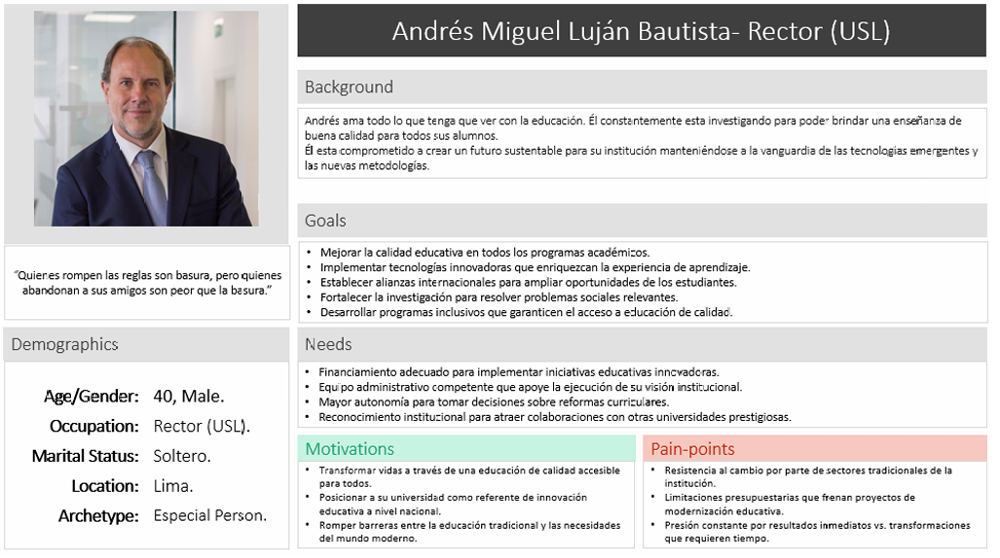<br>

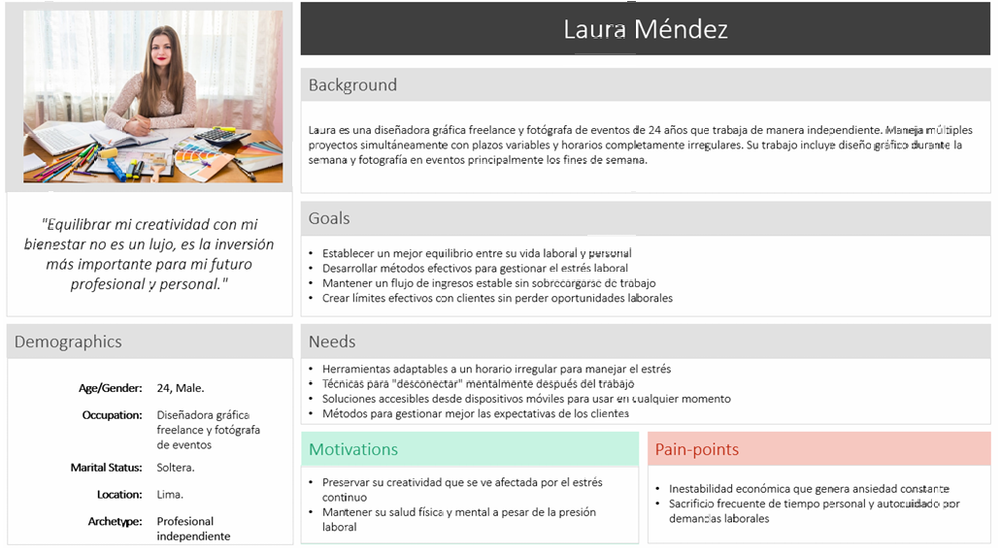<br>

### 2.3.2. User Task Matrix

| Tareas                                                 | Laura Frecuencia | Laura Importancia | Andrés Frecuencia | Andrés Importancia |
| ------------------------------------------------------ | ---------------- | ----------------- | ----------------- | ------------------ |
| Registrar señales corporales de estrés                 | Media            | Media             | Alta              | Alta               |
| Completar autoevaluación de niveles de estrés          | Media            | Alta              | Alta              | Media              |
| Consultar análisis de patrones de estrés               | Alta             | Media             | Media             | Alta               |
| Acceder a recomendaciones personalizadas               | Media            | Alta              | Alta              | Alta               |
| Registrar seguimiento de implementación de estrategias | Media            | Alta              | Alta              | Alta               |

### 2.3.3. User Journey Mapping

#### User Journey Mapping – Andrés Luján

**Figura 2.3.3.1. Journey Map de Andrés Luján – Parte 1**  
<div>
  <p align="center">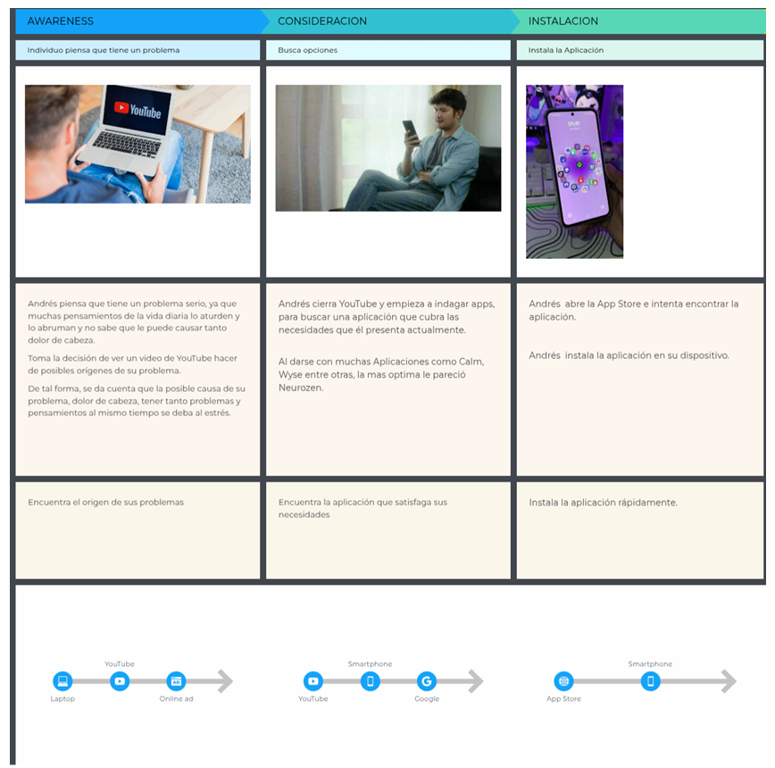</p>
</div>

**Figura 2.3.3.2. Journey Map de Andrés Luján – Parte 2**  
<div>
  <p align="center">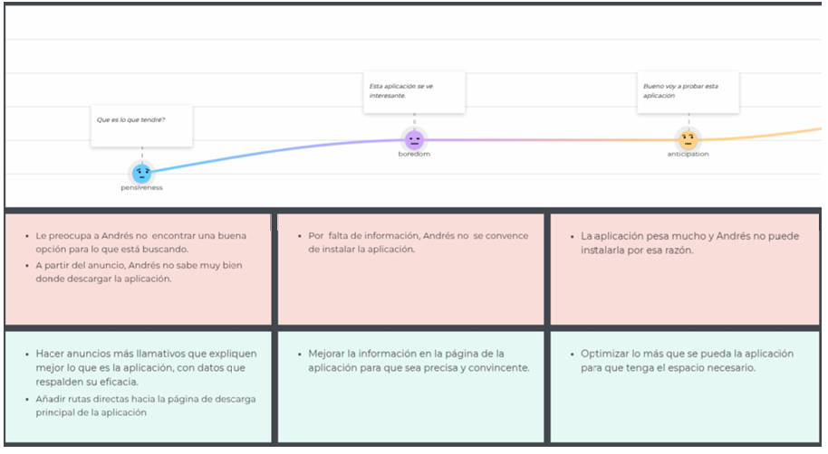</p>
</div>

**Figura 2.3.3.3. Journey Map de Andrés Luján – Parte 3**  
<div>
  <p align="center">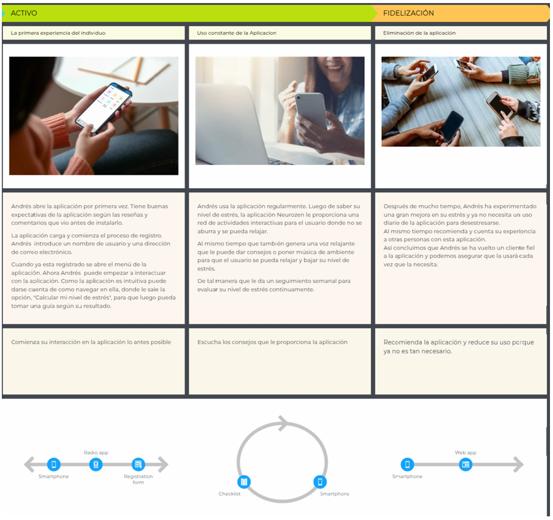</p>
</div>

**Figura 2.3.3.4. Journey Map de Andrés Luján – Parte 4**  
<div>
  <p align="center">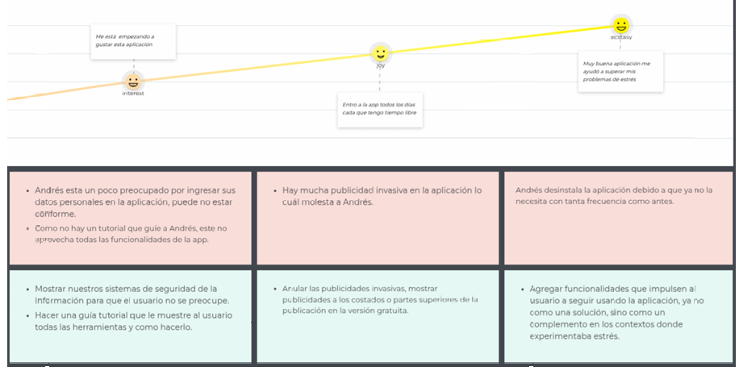</p>
</div>

#### User Journey Mapping – Laura Méndez

**Figura 2.3.3.5. Journey Map de Laura Méndez – Parte 1**  
<div>
  <p align="center">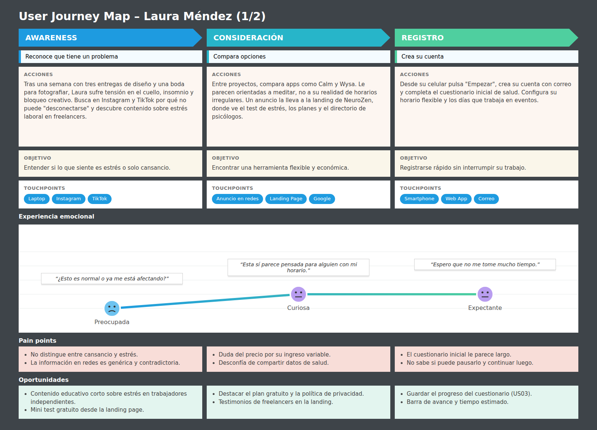</p>
</div>

**Figura 2.3.3.6. Journey Map de Laura Méndez – Parte 2**  
<div>
  <p align="center">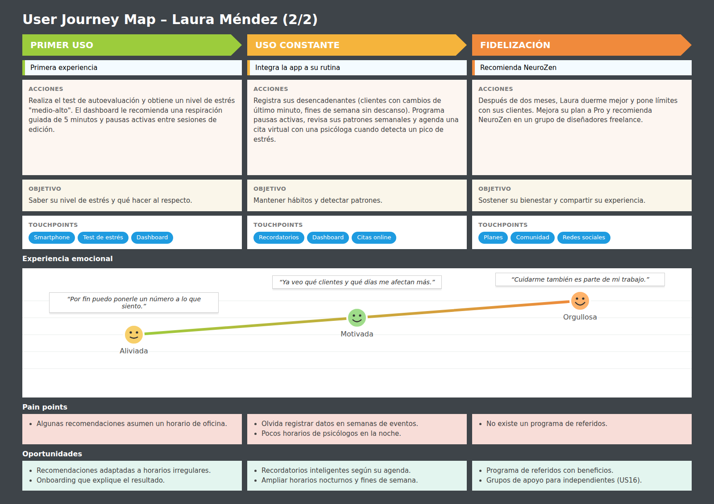</p>
</div>

### 2.3.4. Empathy Mapping

<div>
  <p align="center">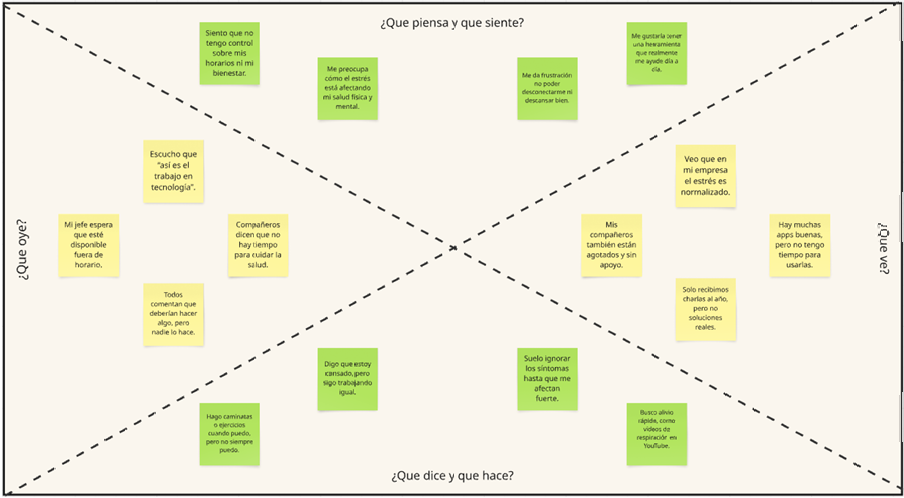</p>
</div>

<div>
  <p align="center">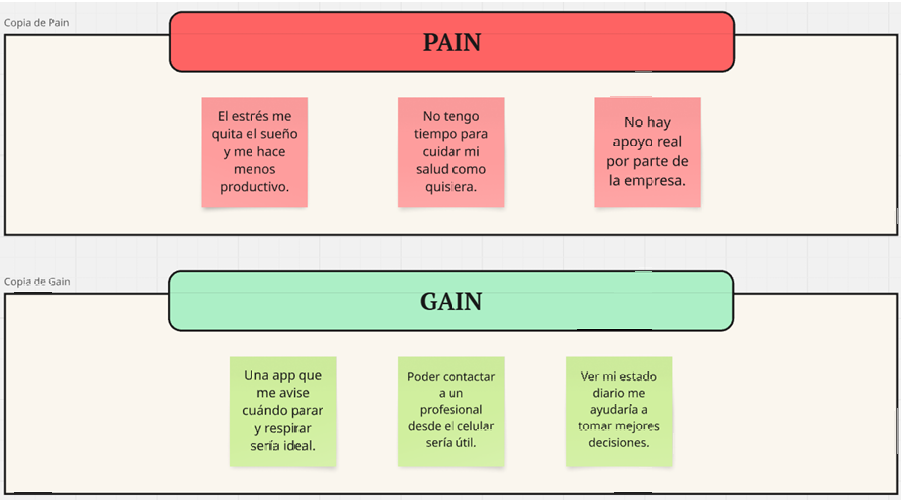</p>
</div>

<div>
  <p align="center">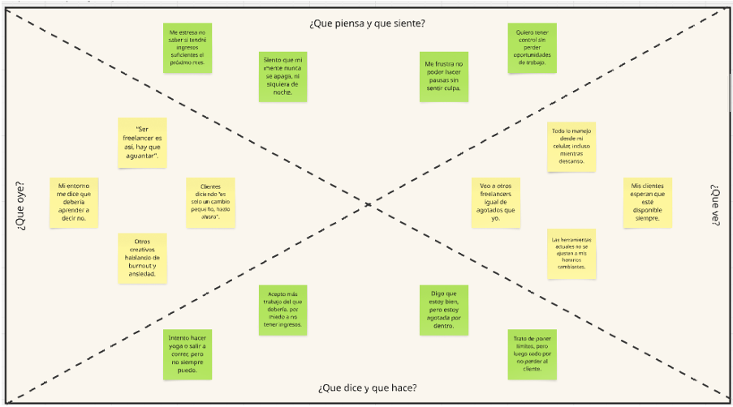</p>
</div>

<div>
  <p align="center">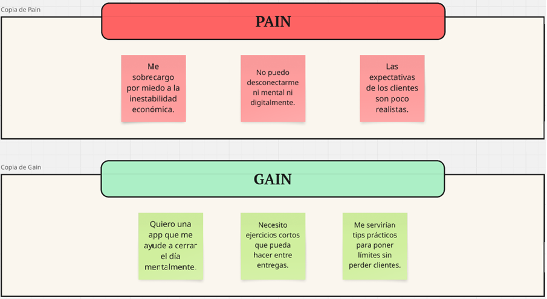</p>
</div>

### 2.3.5. As-is Scenario Mapping

**As-is Scenario Mapping de Laura Méndez**

| Phases       | Registrar señales corporales de estrés                | Completar autoevaluación de niveles de estrés   | Consultar análisis de patrones de estrés            | Acceder a recomendaciones personalizadas                         | Registrar seguimiento de implementación de estrategias                |
| :----------- | :---------------------------------------------------- | :---------------------------------------------- | :-------------------------------------------------- | :--------------------------------------------------------------- | :-------------------------------------------------------------------- |
| **Doing**    | Toma fotos de su postura durante horas de trabajo.    | Completa cuestionarios rápidos entre proyectos. | Revisa los gráficos semanales de estrés.            | Accede a recomendaciones desde su teléfono móvil.                | Registra la efectividad de las técnicas implementadas.                |
| **Thinking** | Duda si está estresada o solo cansada.                | Evalúa si está aceptando demasiados proyectos.  | Busca patrones relacionados con ciertos clientes.   | Cuestiona si las recomendaciones se adaptan a su estilo de vida. | Se pregunta si está siendo constante con las técnicas.                |
| **Feeling**  | Se siente abrumada al notar signos físicos de estrés. | Siente alivio al cuantificar su estrés.         | Muestra curiosidad al descubrir patrones de estrés. | Experimenta esperanza al recibir nuevas estrategias.             | Siente orgullo cuando logra implementar estrategias consistentemente. |

**As-is Scenario Mapping de Andrés Luján**

| Phases       | Registrar señales corporales de estrés                          | Completar autoevaluación de niveles de estrés                            | Consultar análisis de patrones de estrés                                | Acceder a recomendaciones personalizadas                                   | Registrar seguimiento de implementación de estrategias                   |
| :----------- | :-------------------------------------------------------------- | :----------------------------------------------------------------------- | :---------------------------------------------------------------------- | :------------------------------------------------------------------------- | :----------------------------------------------------------------------- |
| **Doing**    | Documenta su tensión muscular después de reuniones prolongadas. | Realiza evaluaciones al final de su jornada laboral.                     | Analiza tendencias de estrés durante diferentes períodos académicos.    | Revisa el coaching emocional personalizado entre reuniones.                | Registra diariamente la efectividad de las estrategias implementadas.    |
| **Thinking** | Se pregunta si su fatiga es visible para su equipo.             | Considera cómo los cambios institucionales afectan su nivel de estrés.   | Reflexiona sobre la relación entre sus horas de trabajo y su bienestar. | Evalúa qué recomendaciones son viables con su apretada agenda.             | Analiza qué técnicas funcionan mejor durante temporadas de alta presión. |
| **Feeling**  | Se siente frustrado al reconocer signos físicos de agotamiento. | Experimenta preocupación al constatar altos niveles de estrés sostenido. | Siente determinación al identificar patrones problemáticos.             | Muestra optimismo al encontrar soluciones adaptadas a su rol de liderazgo. | Siente satisfacción cuando logra incorporar nuevos hábitos a su rutina.  |

## 2.4. Ubiquitous Language

Este glosario define los términos clave que usamos en el proyecto para mantener un lenguaje común entre el equipo de desarrollo y los expertos en salud mental.

| Término                            | Definición                                                                                                                     |
| ---------------------------------- | ------------------------------------------------------------------------------------------------------------------------------ |
| **Usuario**                        | Persona adulta (20–50 años) que utiliza la app para evaluar, monitorear y gestionar su estrés laboral.                         |
| **Perfil biométrico**              | Conjunto de datos físicos iniciales del usuario (postura, rostro, respiración) que sirven como línea base.                     |
| **Test de autoevaluación**         | Cuestionario digital que mide síntomas y sensaciones de estrés percibidas por el usuario.                                      |
| **Análisis biométrico**            | Proceso de escaneo mediante la cámara/sensores para detectar señales físicas de estrés.                                        |
| **Síntomas físicos**               | Manifestaciones registradas por el usuario, como dolores de cabeza, insomnio, tensión muscular.                                |
| **Nivel de estrés**                | Clasificación automática (bajo, medio, alto) que combina datos de tests y biometría.                                           |
| **Recomendaciones personalizadas** | Consejos, ejercicios o pausas sugeridas por la app en base al estado actual del usuario.                                       |
| **Ejercicios de respiración**      | Actividad guiada por la app para reducir la tensión y ansiedad en pocos minutos.                                               |
| **Pausas activas**                 | Recordatorios programados que invitan al usuario a descansar o hacer micro ejercicios durante la jornada laboral.              |
| **Dashboard personal**             | Panel con estadísticas, tendencias y patrones de estrés en el tiempo.                                                          |
| **Desencadenante de estrés**       | Evento o situación registrada por el usuario que provoca incremento de su estrés (ej. exceso de trabajo, conflictos, tráfico). |
| **Informe de progreso**            | Documento generado con evolución de estrés y hábitos del usuario, que puede compartirse con un psicólogo.                      |
| **Especialista en salud mental**   | Psicólogo disponible en la plataforma para consultas y tratamiento profesional.                                                |
| **Cita**                           | Programación de una sesión con un especialista, virtual o presencial.                                                      |
| **Grupo de apoyo**                 | Comunidad virtual de usuarios que comparten experiencias y consejos sobre el manejo del estrés.                                |
| **Biblioteca de recursos**         | Colección digital de artículos, videos o guías relacionadas al bienestar laboral y manejo del estrés.                          |

<div style="page-break-after: always;"></div>

# Capítulo III: Requirements Specification

## 3.1. To-Be Scenario Mapping

**User Journey Mapping – Laura Méndez**

| Fases                                         | Doing                                                    | Thinking                                                                | Feeling                                             |
| --------------------------------------------- | -------------------------------------------------------- | ----------------------------------------------------------------------- | --------------------------------------------------- |
| Registrar señales corporales de estrés        | La app detecta automáticamente postura y signos faciales | “Es útil que el sistema registre señales sin que yo tenga que hacerlo.” | Tranquilidad por el monitoreo pasivo                |
| Completar autoevaluación de niveles de estrés | Recibe notificaciones de autoevaluación guiada con IA    | “Ahora sé si lo que siento es estrés o solo cansancio.”                 | Alivio por entender rápidamente su estado emocional |
| Consultar análisis de patrones de estrés      | Visualiza resúmenes visuales con predicción de picos     | “Ya puedo ver cómo ciertos clientes o días afectan mi bienestar.”       | Curiosidad y sensación de control                   |
| Acceder a recomendaciones personalizadas      | Recibe sugerencias integradas a su rutina diaria         | “Esto se adapta a mí y no interrumpe mi día.”                           | Esperanza al ver opciones viables                   |
| Registrar seguimiento de estrategias          | Ve sus avances con ayuda de recordatorios motivacionales | “Estoy logrando mantener el hábito, y se nota en mi bienestar.”         | Orgullo y motivación al ver progresos               |

**User Journey Mapping – Andrés Luján**

| Fases                                         | Doing                                                  | Thinking                                                   | Feeling                                      |
| --------------------------------------------- | ------------------------------------------------------ | ---------------------------------------------------------- | -------------------------------------------- |
| Registrar señales corporales de estrés        | El sistema registra tensión y postura automáticamente  | “El sistema me ayuda a notar lo que mi cuerpo expresa.”    | Alivio al no depender solo de su percepción  |
| Completar autoevaluación de niveles de estrés | Usa voz o toques rápidos para autoevaluarse            | “Esta evaluación se adapta a mis tiempos.”                 | Comodidad y sensación de autonomía           |
| Consultar análisis de patrones de estrés      | El sistema anticipa picos de estrés según su agenda    | “Puedo prever cuándo debo cuidarme más o delegar.”         | Seguridad al planificar estratégicamente     |
| Acceder a recomendaciones personalizadas      | Recibe recomendaciones justo después de momentos clave | “Estas estrategias están hechas para mi rol de liderazgo.” | Optimismo por la personalización del sistema |
| Registrar seguimiento de estrategias          | Revisa un resumen mensual con IA                       | “Sé qué funcionó y qué debo ajustar para el próximo mes.”  | Satisfacción por tener una guía continua     |


## 3.2. User Stories

| **Epic ID** | **Nombre del Epic**                                | **Descripción**                                                                                                                                                                                                  |
| ----------- | -------------------------------------------------- | ---------------------------------------------------------------------------------------------------------------------------------------------------------------------------------------------------------------- |
| EP01        | Registro y Configuración de Cuenta                 | Como usuario nuevo, quiero registrarme, configurar mi perfil biométrico y completar un cuestionario inicial de salud, para acceder a la plataforma con un perfil personalizado y preciso.                        |
| EP02        | Detección y Evaluación del Estrés                  | Como usuario, quiero evaluar mi nivel de estrés mediante autoevaluaciones, análisis biométricos y registro de síntomas, para obtener un diagnóstico completo de mi estado actual.                                |
| EP03        | Recomendaciones y Gestión del Estrés               | Como usuario diagnosticado con estrés, quiero recibir recomendaciones personalizadas, acceder a ejercicios de respiración y programar pausas activas, para reducir mis niveles de estrés y mejorar mi bienestar. |
| EP04        | Seguimiento y Análisis del Progreso                | Como usuario, quiero visualizar un dashboard personal, generar informes de progreso y registrar desencadenantes de estrés, para dar seguimiento a mi evolución y entender mis patrones de estrés.                |
| EP05        | Conexión con Especialistas en Salud Mental         | Como usuario con necesidad de apoyo profesional, quiero buscar psicólogos, programar citas y compartir informes, para recibir tratamiento especializado dentro de la plataforma.                                   |
| EP06        | Comunidad y Soporte Social                         | Como usuario, quiero participar en grupos de apoyo, acceder a una biblioteca de recursos y unirme a desafíos antiestrés, para sentir acompañamiento social y mantener la motivación en la gestión de mi estrés.  |
| EP07        | Integración con Entorno Laboral                    | Como trabajador, quiero analizar mi carga laboral y recibir recordatorios de ergonomía, para prevenir sobrecarga y mejorar mi productividad sin comprometer mi bienestar.                                        |

| ID Épica | Épica                              | ID HU | Título HU                               | Descripción HU                                                                                                                     | Criterios de Aceptación                                                                                                                                                                                                                                                                                                                                                                                                                                                                                                                                                                                                                                 |
| -------- | ---------------------------------- | ----- | --------------------------------------- | ---------------------------------------------------------------------------------------------------------------------------------- | ------------------------------------------------------------------------------------------------------------------------------------------------------------------------------------------------------------------------------------------------------------------------------------------------------------------------------------------------------------------------------------------------------------------------------------------------------------------------------------------------------------------------------------------------------------------------------------------------------------------------------------------------------- |
| EP01     | Registro y Configuración de Cuenta | US01  | Registrar cuenta de usuario             | Como nuevo usuario, quiero registrar una cuenta con mi correo o número de teléfono, para acceder a las funciones de la aplicación. | **Scenario 1: Successful registration**<ul><li>**Given** the user does not have an account</li><li>**When** the user enters mandatory data and accepts the terms</li><li>**Then** the system creates the account</li><li>**And** sends a verification message</li></ul>**Scenario 2: Failed registration**<ul><li>**Given** the user enters invalid data</li><li>**When** the user attempts to register</li><li>**Then** the system displays an error message</li><li>**And** does not create the account</li></ul>                                                                                                                                   |
| EP01     | Registro y Configuración de Cuenta | US02  | Configurar perfil biométrico            | Como usuario, quiero registrar mis datos biométricos para personalizar el análisis de estrés.                                      | **Scenario 1: Initial configuration**<ul><li>**Given** the user has an active account</li><li>**When** the user registers or synchronizes biometric data</li><li>**Then** the system saves the data</li><li>**And** uses it in future analyses</li></ul>**Scenario 2: Synchronization error**<ul><li>**Given** the user connects a device</li><li>**When** an error occurs</li><li>**Then** the system displays a warning</li><li>**And** allows the user to retry</li></ul>                                                                                                                                                                          |
| EP01     | Registro y Configuración de Cuenta | US03  | Completar cuestionario inicial de salud | Como usuario nuevo, quiero completar un cuestionario de salud para generar mi plan inicial.                                        | **Scenario 1: Completed questionnaire**<ul><li>**Given** the user accesses the initial questionnaire</li><li>**When** the user answers all questions</li><li>**Then** the system saves the responses</li><li>**And** generates an initial profile</li></ul>**Scenario 2: Incomplete questionnaire**<ul><li>**Given** the user abandons the questionnaire</li><li>**When** the user returns</li><li>**Then** the system allows resuming from the saved progress</li></ul>                                                                                                                                                                              |

| ID Épica | Épica                             | ID HU | Título HU                                 | Descripción HU                                                                                      | Criterios de Aceptación                                                                                                                                                                                                                                                                                                                                                                                                                                                                                     |
| -------- | --------------------------------- | ----- | ----------------------------------------- | --------------------------------------------------------------------------------------------------- | ----------------------------------------------------------------------------------------------------------------------------------------------------------------------------------------------------------------------------------------------------------------------------------------------------------------------------------------------------------------------------------------------------------------------------------------------------------------------------------------------------------- |
| EP02     | Detección y Evaluación del Estrés | US04  | Realizar test de autoevaluación de estrés | Como usuario, quiero realizar un test de estrés para conocer mi nivel actual.                       | **Scenario 1: Completed test**<ul><li>**Given** the user accesses the test</li><li>**When** the user answers all questions</li><li>**Then** the system displays the immediate result</li></ul>**Scenario 2: Incomplete test**<ul><li>**Given** the user abandons the test</li><li>**When** the user returns</li><li>**Then** the system saves the progress</li><li>**And** allows the user to resume it</li></ul>                                                                                           |
| EP02     | Detección y Evaluación del Estrés | US05  | Análisis biométrico de señales de estrés  | Como usuario, quiero que la app analice mis datos biométricos para detectar estrés automáticamente. | **Scenario 1: Successful analysis**<ul><li>**Given** the user synchronized their device</li><li>**When** the data is received</li><li>**Then** the system calculates the stress level</li></ul>**Scenario 2: Insufficient data**<ul><li>**Given** there is missing data</li><li>**When** the system attempts to analyze</li><li>**Then** the system notifies the user</li></ul>                                                                                                                             |
| EP02     | Detección y Evaluación del Estrés | US06  | Registro de síntomas físicos              | Como usuario, quiero registrar manualmente mis síntomas físicos para complementar el análisis.      | **Scenario 1: Successful record**<ul><li>**Given** the user accesses the "Symptoms" section</li><li>**When** the user enters information</li><li>**Then** the system saves the data</li></ul>**Scenario 2: Validation error**<ul><li>**Given** the user omits a mandatory field</li><li>**When** the user attempts to save</li><li>**Then** the system requests to complete the field</li></ul>                                                                                                             |

| ID Épica | Épica                                | ID HU | Título HU                                  | Descripción HU                                                                | Criterios de Aceptación                                                                                                                                                                                                                                                                                                                                                                                                                                                                                                                                           |
| -------- | ------------------------------------ | ----- | ------------------------------------------ | ----------------------------------------------------------------------------- | ----------------------------------------------------------------------------------------------------------------------------------------------------------------------------------------------------------------------------------------------------------------------------------------------------------------------------------------------------------------------------------------------------------------------------------------------------------------------------------------------------------------------------------------------------------------- |
| EP03     | Recomendaciones y Gestión del Estrés | US07  | Recibir recomendaciones personalizadas     | Como usuario, quiero recibir recomendaciones basadas en mi perfil de estrés.  | **Scenario 1: Recommendations generated**<ul><li>**Given** the user completed the questionnaire and biometrics</li><li>**When** the user accesses recommendations</li><li>**Then** the system displays personalized suggestions</li></ul>**Scenario 2: Missing data**<ul><li>**Given** the user did not complete their profile</li><li>**When** the user attempts to view recommendations</li><li>**Then** the system displays a message indicating missing data</li></ul>                                                                                          |
| EP03     | Recomendaciones y Gestión del Estrés | US08  | Realizar ejercicios de respiración guiados | Como usuario, quiero realizar ejercicios guiados para reducir el estrés.      | **Scenario 1: Completed exercise**<ul><li>**Given** the user selects an exercise</li><li>**When** the user finishes it</li><li>**Then** the system records the activity</li></ul>**Scenario 2: Interruption**<ul><li>**Given** the user abandons the exercise</li><li>**When** the user returns</li><li>**Then** the system allows restarting or continuing</li></ul>                                                                                                                                                                                             |
| EP03     | Recomendaciones y Gestión del Estrés | US09  | Programar pausas activas laborales         | Como usuario, quiero programar pausas para reducir mi carga laboral y estrés. | **Scenario 1: Scheduled pause**<ul><li>**Given** the user accesses the agenda</li><li>**When** the user schedules a pause</li><li>**Then** the system saves a reminder</li></ul>**Scenario 2: Notification**<ul><li>**Given** a scheduled pause is approaching</li><li>**When** the scheduled time arrives</li><li>**Then** the system sends a reminder</li></ul>                                                                                                                                                                                                  |

| ID Épica | Épica                               | ID HU | Título HU                               | Descripción HU                                                                     | Criterios de Aceptación                                                                                                                                                                                                                                                                                                                                                                                                                                                                                     |
| -------- | ----------------------------------- | ----- | --------------------------------------- | ---------------------------------------------------------------------------------- | ----------------------------------------------------------------------------------------------------------------------------------------------------------------------------------------------------------------------------------------------------------------------------------------------------------------------------------------------------------------------------------------------------------------------------------------------------------------------------------------------------------- |
| EP04     | Seguimiento y Análisis del Progreso | US10  | Visualizar dashboard personal de estrés | Como usuario, quiero ver mi estado actual de estrés en un dashboard.               | **Scenario 1: Dashboard with data**<ul><li>**Given** the user has records</li><li>**When** the user enters the dashboard</li><li>**Then** the system displays their metrics</li></ul>**Scenario 2: Without data**<ul><li>**Given** there are no records</li><li>**When** the user accesses the dashboard</li><li>**Then** the system indicates that there is no information yet</li></ul>                                                                                                                   |
| EP04     | Seguimiento y Análisis del Progreso | US11  | Generar informes de progreso            | Como usuario, quiero generar informes para evaluar mis avances.                    | **Scenario 1: Generated report**<ul><li>**Given** the user selects a period</li><li>**When** the user requests a report</li><li>**Then** the system generates a downloadable report</li></ul>**Scenario 2: Missing data**<ul><li>**Given** the user has no records</li><li>**When** the user attempts to generate a report</li><li>**Then** the system displays a warning</li></ul>                                                                                                                         |
| EP04     | Seguimiento y Análisis del Progreso | US12  | Registrar desencadenantes de estrés     | Como usuario, quiero registrar situaciones que detonan mi estrés para analizarlas. | **Scenario 1: Successful record**<ul><li>**Given** the user accesses "Triggers"</li><li>**When** the user enters information</li><li>**Then** the system saves the record</li></ul>**Scenario 2: Incomplete record**<ul><li>**Given** the user does not fill in mandatory fields</li><li>**When** the user attempts to save</li><li>**Then** the system requests completion</li></ul>                                                                                                                       |

| ID Épica | Épica                      | ID HU | Título HU                            | Descripción HU                                                                | Criterios de Aceptación                                                                                                                                                                                                                                                                                                                                                                                                                                                                                                                   |
| -------- | -------------------------- | ----- | ------------------------------------ | ----------------------------------------------------------------------------- | ----------------------------------------------------------------------------------------------------------------------------------------------------------------------------------------------------------------------------------------------------------------------------------------------------------------------------------------------------------------------------------------------------------------------------------------------------------------------------------------------------------------------------------------- |
| EP05     | Conexión con Especialistas | US13  | Buscar psicólogos especializados     | Como usuario, quiero buscar psicólogos según especialidad para recibir apoyo. | **Scenario 1: Successful search**<ul><li>**Given** the user accesses the search function</li><li>**When** the user enters criteria</li><li>**Then** the system displays available psychologists</li></ul>**Scenario 2: No results**<ul><li>**Given** there are no matches</li><li>**When** the user searches</li><li>**Then** the system displays a message indicating no psychologists were found</li></ul>                                                                                                                              |
| EP05     | Conexión con Especialistas | US14  | Reservar cita con psicólogo          | Como usuario, quiero reservar una cita en línea con un psicólogo.             | **Scenario 1: Scheduled appointment**<ul><li>**Given** the user selects a specialist and time</li><li>**When** the user confirms</li><li>**Then** the system saves the appointment</li></ul>**Scenario 2: Schedule conflict**<ul><li>**Given** an appointment already exists at that time</li><li>**When** the user attempts to book</li><li>**Then** the system displays an error</li><li>**And** requests another option</li></ul>                                                                                                      |
| EP05     | Conexión con Especialistas | US15  | Compartir informes con especialistas | Como usuario, quiero compartir mis informes de progreso con un psicólogo.     | **Scenario 1: Shared report**<ul><li>**Given** the user selects a report</li><li>**When** the user sends it</li><li>**Then** the specialist receives access</li></ul>**Scenario 2: Send error**<ul><li>**Given** a failure occurs</li><li>**When** the user attempts to share</li><li>**Then** the system displays an error message</li></ul>                                                                                                                                                                                             |

| ID Épica | Épica                      | ID HU | Título HU                         | Descripción HU                                                               | Criterios de Aceptación                                                                                                                                                                                                                                                                                                                                                                                                                                                                                        |
| -------- | -------------------------- | ----- | --------------------------------- | ---------------------------------------------------------------------------- | -------------------------------------------------------------------------------------------------------------------------------------------------------------------------------------------------------------------------------------------------------------------------------------------------------------------------------------------------------------------------------------------------------------------------------------------------------------------------------------------------------------- |
| EP06     | Comunidad y Soporte Social | US16  | Participar en grupos de apoyo     | Como usuario, quiero unirme a grupos de apoyo para compartir experiencias.   | **Scenario 1: Successful join**<ul><li>**Given** the user accesses groups</li><li>**When** the user selects one</li><li>**Then** the system adds them</li></ul>**Scenario 2: Closed group**<ul><li>**Given** the group requires approval</li><li>**When** the user requests to join</li><li>**Then** the system notifies them to wait for confirmation</li></ul>                                                                                                                                             |
| EP06     | Comunidad y Soporte Social | US17  | Acceder a biblioteca de recursos  | Como usuario, quiero acceder a artículos y videos sobre manejo del estrés.   | **Scenario 1: Successful access**<ul><li>**Given** the user accesses the library</li><li>**When** the user selects a resource</li><li>**Then** the system opens it</li></ul>**Scenario 2: Resource unavailable**<ul><li>**Given** a resource was removed</li><li>**When** the user selects it</li><li>**Then** the system notifies them of its unavailability</li></ul>                                                                                                                                       |
| EP06     | Comunidad y Soporte Social | US18  | Participar en desafíos antiestrés | Como usuario, quiero unirme a retos que me ayuden a mejorar mi salud mental. | **Scenario 1: Join challenge**<ul><li>**Given** the user accesses challenges</li><li>**When** the user selects one</li><li>**Then** the system registers them</li></ul>**Scenario 2: Finished challenge**<ul><li>**Given** the challenge has already concluded</li><li>**When** the user attempts to join</li><li>**Then** the system notifies them that it is not available</li></ul>                                                                                                                       |

| ID Épica | Épica                           | ID HU | Título HU                          | Descripción HU                                                                                | Criterios de Aceptación                                                                                                                                                                                                                                                                                                                                                                                                                                                                                      |
| -------- | ------------------------------- | ----- | ---------------------------------- | --------------------------------------------------------------------------------------------- | ------------------------------------------------------------------------------------------------------------------------------------------------------------------------------------------------------------------------------------------------------------------------------------------------------------------------------------------------------------------------------------------------------------------------------------------------------------------------------------------------------------ |
| EP07     | Integración con Entorno Laboral | US19  | Analizar carga laboral             | Como empleado, quiero registrar y analizar mi carga laboral para identificar estrés laboral.  | **Scenario 1: Successful record**<ul><li>**Given** the user enters worked hours</li><li>**When** the user saves the information</li><li>**Then** the system calculates the workload</li></ul>**Scenario 2: Validation error**<ul><li>**Given** the user omits required data</li><li>**When** the user attempts to save</li><li>**Then** the system requests them to be completed</li></ul>                                                                                                                     |
| EP07     | Integración con Entorno Laboral | US20  | Recibir recordatorios de ergonomía | Como usuario, quiero recibir recordatorios de ergonomía para cuidar mi postura en el trabajo. | **Scenario 1: Reminder sent**<ul><li>**Given** the user configured notifications</li><li>**When** the scheduled time arrives</li><li>**Then** the system sends a reminder</li></ul>**Scenario 2: Notifications disabled**<ul><li>**Given** the user deactivated reminders</li><li>**When** the scheduled time arrives</li><li>**Then** the system does not send a notification</li></ul>                                                                                                                         |

---

## 3.3. Product Backlog

_Orden de User Stories y Technical Stories_

| Orden | ID   | User Story / Technical Story               | Story Points | Bounded Context |
| ----- | ---- | ------------------------------------------ | ------------ | --------------- |
| 01    | US01 | Registrar cuenta de usuario                | 3            | IAM             |
| 02    | US02 | Configurar perfil biométrico               | 5            | Biometrics      |
| 03    | US03 | Completar cuestionario inicial de salud    | 3            | Assessments     |
| 04    | US04 | Realizar test de autoevaluación de estrés  | 5            | Assessments     |
| 05    | US05 | Análisis biométrico de señales de estrés   | 5            | Biometrics      |
| 06    | US06 | Registrar síntomas físicos                 | 3            | Health Tracking |
| 07    | US07 | Recibir recomendaciones personalizadas     | 5            | Recommendations |
| 08    | US08 | Realizar ejercicios de respiración guiados | 3            | Activities      |
| 09    | US09 | Programar pausas activas laborales         | 3            | Activities      |
| 10    | US10 | Visualizar dashboard personal de estrés    | 5            | Dashboard       |
| 11    | US11 | Generar informes de progreso               | 5            | Reports         |
| 12    | US12 | Registrar desencadenantes de estrés        | 3            | Health Tracking |
| 13    | US13 | Buscar psicólogos especializados           | 3            | Professionals   |
| 14    | US14 | Programar cita con psicólogo               | 5            | Appointments    |
| 15    | US15 | Compartir informes con especialistas       | 3            | Reports         |
| 16    | US16 | Participar en grupos de apoyo              | 3            | Community       |
| 17    | US17 | Acceder a biblioteca de recursos           | 2            | Resources       |
| 18    | US18 | Participar en desafíos antiestrés          | 3            | Community       |
| 19    | US19 | Analizar carga laboral                     | 5            | Analytics       |
| 20    | US20 | Recibir recordatorios de ergonomía         | 2            | Notifications   |

## 3.4. Impact Mapping

Impact Mapping - Segmento 1

<div>
  <p align="center">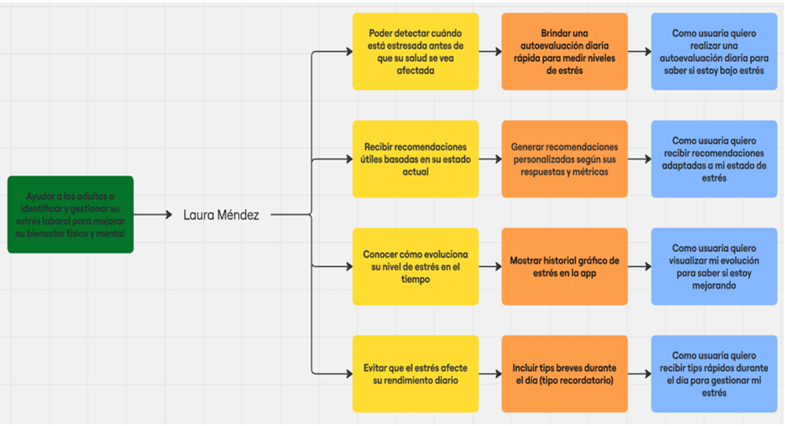</p>
</div>

Impact Mapping - Segmento 2

<div>
  <p align="center">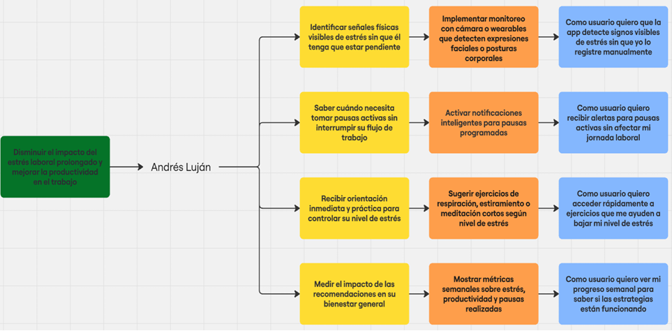</p>
</div>

---

<div style="page-break-after: always;"></div>

# Capítulo IV: Product Design

## 4.1. Style Guidelines

NeuroDraw, dedicado a la detección rápida y manejo del estrés laboral, transmite calma, confianza y profesionalismo. Nuestra identidad visual combina tonos azules y verdes para evocar tranquilidad, con tipografía clara y espacios limpios. Comunicamos con un lenguaje accesible pero riguroso, transformando conceptos complejos de neurociencia en soluciones prácticas para el bienestar laboral.

### 4.1.1. General Style Guidelines

Logo: El logo de NeuroZen fusiona elementos neurológicos y serenidad en un diseño significativo. La silueta de perfil humano en Verde Bosque muestra circuitos cerebrales que simbolizan cómo nuestra plataforma conecta ciencia y bienestar mental.

<div>
  <p align="center">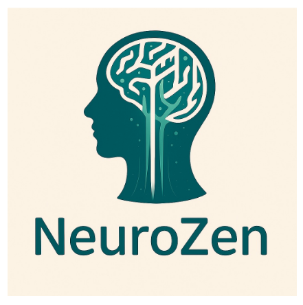</p>
</div>

Tipografía:

La tipografía de la página debe ser fácil de leer, adaptándose al dispositivo en el que se encuentre. Para ello, se emplearán dos fuentes sans-serif (sin remates decorativos) porque son más legibles y claras. Además, el contenido mostrado debe de resaltar.

Color Guide:

1. Verde Bosque (#2D5A4A)
Representación: El verde bosque simboliza estabilidad, crecimiento y conexión con la naturaleza. En el contexto de NeuroZen, este color representa la base sólida que ofrece la plataforma para ayudar a los usuarios a manejar su estrés. Se utiliza en elementos principales como el logotipo y encabezados, transmitiendo confianza y un ambiente relajante que invita a la calma mental.
<div>
  <p align="center">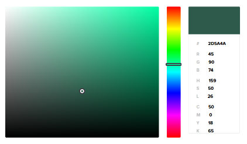</p>
</div>

2. Verde Menta (#A2C4B5)
Representación: El verde menta evoca frescura, renovación y claridad mental. Este color más suave complementa al verde bosque y se utiliza en áreas secundarias de la plataforma. Representa la sensación refrescante que experimentan los usuarios al reducir su estrés mediante las técnicas proporcionadas por NeuroZen, creando un ambiente digital que respira tranquilidad.
<div>
  <p align="center">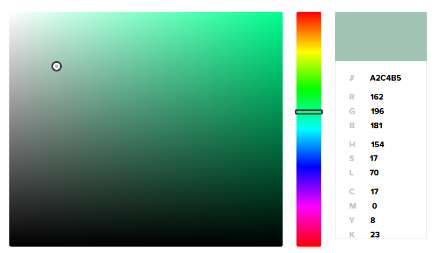</p>
</div>

3. Beige Cálido (#F1E9D4)
Representación: El beige cálido transmite neutralidad, confort y serenidad. En NeuroZen, este color se utiliza para fondos y espacios de descanso visual, proporcionando un ambiente acogedor que reduce la fatiga visual durante las sesiones de meditación o ejercicios anti-estrés. El beige crea un entorno digital que se siente como un refugio seguro.
<div>
  <p align="center">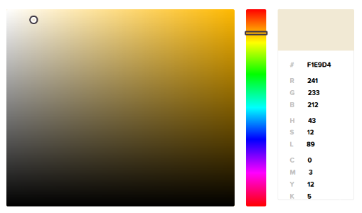</p>
</div>

4. Turquesa Profundo (#1A6F78)
Representación: El turquesa profundo simboliza la profundidad emocional, la comunicación y la sabiduría. Este color representa el componente científico y psicológico de NeuroZen, destacando las herramientas basadas en evidencia para el manejo del estrés. Se utiliza en elementos interactivos y botones de acción, invitando a los usuarios a explorar soluciones más profundas.
<div>
  <p align="center">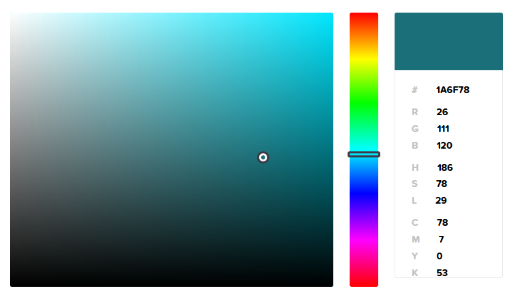</p>
</div>

5. Gris Piedra (#8C9893)
Representación: El gris piedra evoca neutralidad, equilibrio y estabilidad. En NeuroZen, este color funciona como un ancla visual que equilibra los verdes y turquesas más expresivos. Se utiliza para texto secundario y elementos de interfaz sutiles, aportando sofisticación sin competir con los colores principales que transmiten calma y bienestar.
<div>
  <p align="center">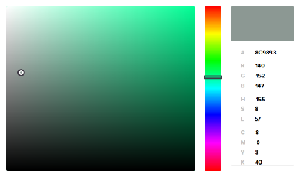</p>
</div>

La paleta de colores de NeuroZen combina verdes y turquesas para transmitir naturaleza y tecnología, beige para crear un entorno acogedor y gris piedra para aportar profesionalismo. En conjunto, el diseño busca generar una experiencia visual relajante y coherente con la misión de reducir el estrés del usuario.

Buttons:

La plataforma NeuroZen para control del estrés presenta una interfaz intuitiva con botones fácilmente identificables en toda la experiencia. Los botones principales utilizan Verde Bosque (#2D5A4A) para acciones importantes como iniciar meditaciones, mientras que los secundarios aparecen en Verde Menta (#A2C4B5), creando jerarquía visual. El fondo en Beige Cálido (#F1E9D4) proporciona un ambiente relajante, complementado por elementos interactivos en Turquesa Profundo (#1A6F78) para funciones especiales y Gris Piedra (#8C9893) para textos y detalles sutiles. Todos los botones tienen formas redondeadas y tamaños generosos, facilitando su uso incluso en momentos de estrés, mientras que los estados de hover y feedback ofrecen respuestas visuales claras que refuerzan la sensación de calma y control que define la experiencia de NeuroZen.

Variaciones del logo en diferentes representaciones:

<div>
  <p align="center">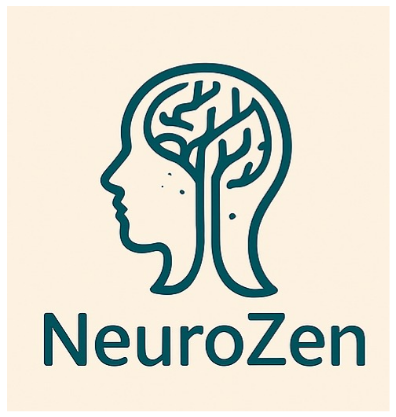</p>
</div>
-Una opción minimalista, sin muchos detalles y relajante a la vista.
<div>
  <p align="center">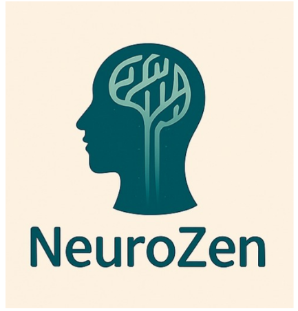</p>
</div>
-Una opción con mejor detalle y uso de colores.
<div>
  <p align="center">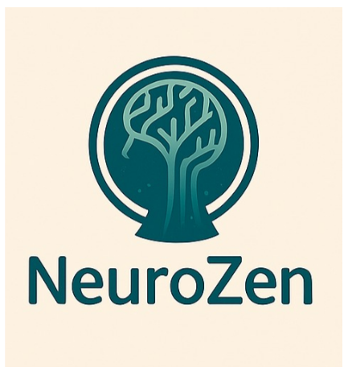</p>
</div>
-Una representación más abstracta que inspira relajación.
<div>
  <p align="center">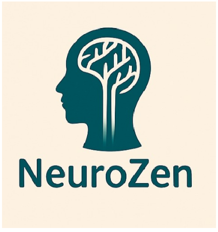</p>
</div>
-Una opción que combina las dos primeras ideas.

---

### 4.1.2. Web Style Guidelines

Para NeuroZen, estamos desarrollando una plataforma web y una landing page enfocada en el bienestar laboral. Por ello, implementaremos un diseño adaptable (Web Responsive Design) que optimice la presentación de la información en cualquier dispositivo, ya sea computadora, tablet o smartphone. Esto garantizará que el contenido sea accesible y claro en todo momento, mejorando la experiencia de los usuarios.

Como equipo, hemos decidido incorporar el patrón de diseño en forma de Z para la página principal. Esta técnica es ideal para dirigir la atención de los visitantes hacia los elementos más importantes de NeuroZen, como el objetivo del proyecto, el acceso al test de estrés y los beneficios de la plataforma. Colocaremos el logotipo de NeuroZen en la esquina superior izquierda para reforzar el reconocimiento de marca, mientras que en la esquina superior derecha estará la barra de navegación y un botón de llamado a la acción destacado que invite a registrarse o probar el test inicial.

---

### 4.1.3. Mobile Style Guidelines

---

#### 4.1.3.1. iOS Mobile Style Guidelines

Para el entorno de iOS, la interfaz de NeuroZen se regirá bajo las Human Interface Guidelines (HIG) de Apple para garantizar una experiencia nativa y fluida. Se priorizará el uso de la tipografía del sistema (San Francisco) y el estricto respeto por los márgenes de seguridad (Safe Areas) para evitar que la interfaz choque con el hardware (como el notch o la Dynamic Island). La navegación principal se gestionará mediante un Bottom Tab Bar translúcido e incluirá el gesto nativo de retroceso lateral (swipe-to-go-back). Además, se integrarán componentes visuales característicos del ecosistema Apple, como selectores de fecha tipo rodillo (Cupertino) para el agendamiento de citas y desenfoques de fondo (blur) en los modales superpuestos.

---

#### 4.1.3.2. Android Mobile Style Guidelines

Para los dispositivos Android, el diseño visual y funcional de la aplicación se basará en los principios de Material Design 3 de Google. Se utilizará la tipografía Roboto estructurada bajo jerarquías claras, y se aplicará un sistema visual de profundidad mediante sombras y diferentes niveles de elevación para destacar las tarjetas de los psicólogos y los elementos del Dashboard. Toda interacción del usuario generará una respuesta táctil inmediata a través del efecto Ripple (onda de color) en los componentes interactivos. Finalmente, las acciones clave del paciente se centralizarán a través de un Botón Flotante de Acción (FAB) persistente, diseñado con los tonos verdes de la marca para invocar rápidamente al asistente Zenbot.

---

## 4.2. Information Architecture

NeuroZen detecta el estrés laboral combinando datos biométricos (postura, tensión facial, respiración) con autoevaluaciones emocionales para generar un perfil de estrés personalizado. La app ofrece recomendaciones y ejercicios para reducir los síntomas, envía notificaciones en tiempo real ante aumentos de estrés y permite revisar un historial de tendencias para identificar patrones.

A futuro, se integrará con psicólogos y programas de bienestar laboral para empresas, convirtiéndose en una herramienta completa de prevención y gestión del estrés.

---

### 4.2.1. Organization Systems

La información se organiza de forma lógica para que el usuario encuentre rápido lo que necesita:

Estructura basada en módulos claros: inicio, autoevaluación, recomendaciones, profesionales, comunidad y recursos.

Jerarquización de contenidos: lo más usado (tests y recomendaciones) aparece en posiciones destacadas.

---

### 4.2.2. Labeling Systems

El etiquetado debe ser claro, breve y familiar para los usuarios:

Uso de términos simples como: Inicio, Test de Estrés, Recomendaciones, Comunidad, Psicólogos, Recursos.

Evitar tecnicismos clínicos, priorizando un lenguaje cotidiano.

Consistencia en los nombres en toda la app y web.

---

### 4.2.3. SEO Tags and Meta Tags

Meta títulos: deben incluir palabras clave relacionadas con salud mental, estrés laboral y bienestar.

Meta descripciones: claras, con llamado a la acción (ejemplo: “Evalúa tu nivel de estrés y recibe recomendaciones personalizadas”).

Etiquetas alt en imágenes con descripciones concisas.

Uso de headings (H1, H2, H3) para mejorar la indexación en buscadores.

---

### 4.2.4. Searching Systems

Búsqueda interna intuitiva, con autocompletado y sugerencias rápidas.

Posibilidad de filtrar resultados (ejemplo: artículos, psicólogos, recursos, ejercicios).

Optimización para resultados relevantes según la necesidad del usuario.

---

### 4.2.5. Navigation Systems

Menú principal: siempre visible, con las secciones clave (Inicio, Autoevaluación, Recomendaciones, Comunidad, Contacto).

Breadcrumbs para indicar dónde se encuentra el usuario.

CTA (Call To Action) claros y visibles, guiando al usuario hacia las acciones más importantes (hacer test, contactar especialista, unirse a un grupo).

Compatibilidad responsive, manteniendo la navegación fluida en móviles y escritorio.

---

## 4.3. Landing Page UI Design

El diseño de la interfaz de usuario para la landing page de NeuroZen será un elemento clave, ya que representará la primera impresión que recibirán los usuarios sobre la aplicación. Su objetivo es ofrecer una experiencia visual atractiva y fácil de usar que despierte el interés de los visitantes y los motive a conocer más sobre las funciones de la plataforma.

---

### 4.3.1. Landing Page Wireframe

Los Wireframes de la página son una versión simplificada de la manera en la que se organizará la información. Se hace una organización de la estructura visual de todos los componentes previo a centrarse en la parte visual de la página. Gracias a esto, podemos observar que cosas se necesitan cambiar si fuera necesario, agilizando el tiempo de organizar los datos.

<div>
  <p align="center">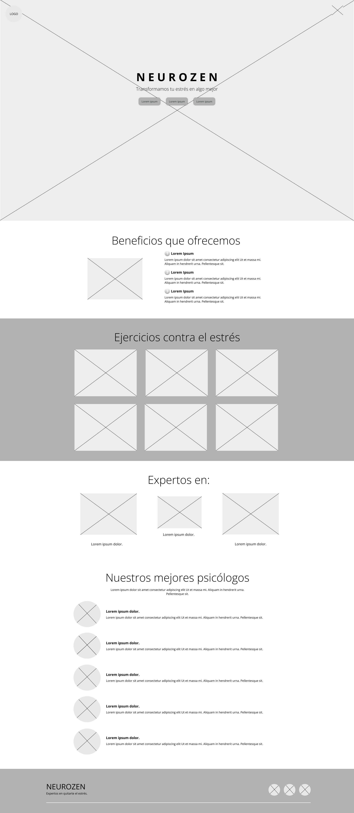</p>
</div>

<div>
  <p align="center">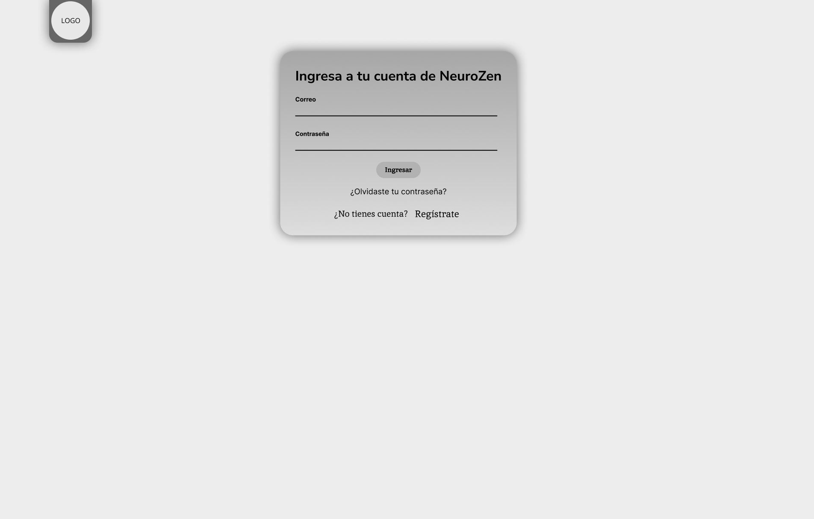</p>
</div>

<div>
  <p align="center">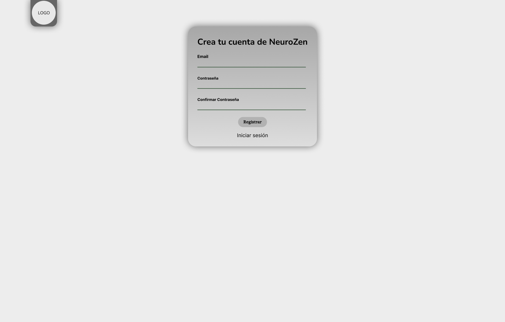</p>
</div>

<div>
  <p align="center">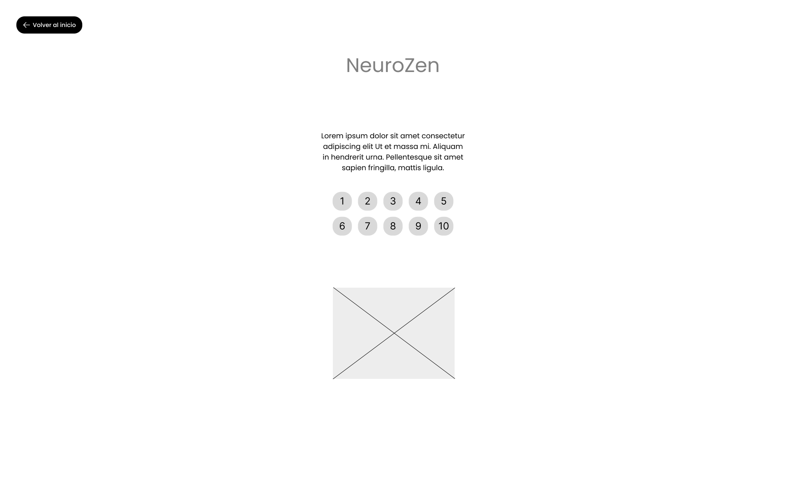</p>
</div>

---

### 4.3.2. Landing Page Mock-up

Un mockup es una representación visual de un producto que muestra cómo lucirá, a diferencia de un wireframe, que se enfoca en la estructura. Aunque no es interactivo, puede ser de media o alta fidelidad y ayuda a tomar decisiones finales sobre aspectos como esquemas de colores, estilo visual y tipografía. Es una herramienta valiosa en el proceso de diseño para alinear expectativas y obtener retroalimentación antes de la implementación.

<div>
  <p align="center">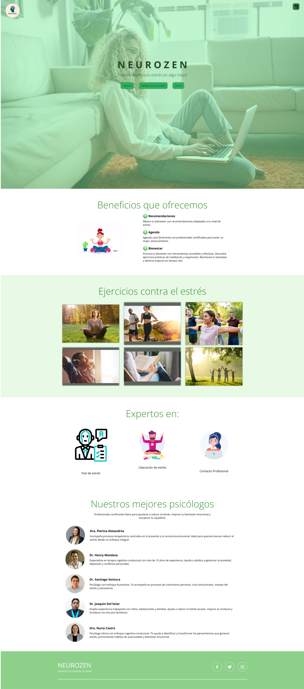</p>
</div>

<div>
  <p align="center"></p>
</div>

<div>
  <p align="center">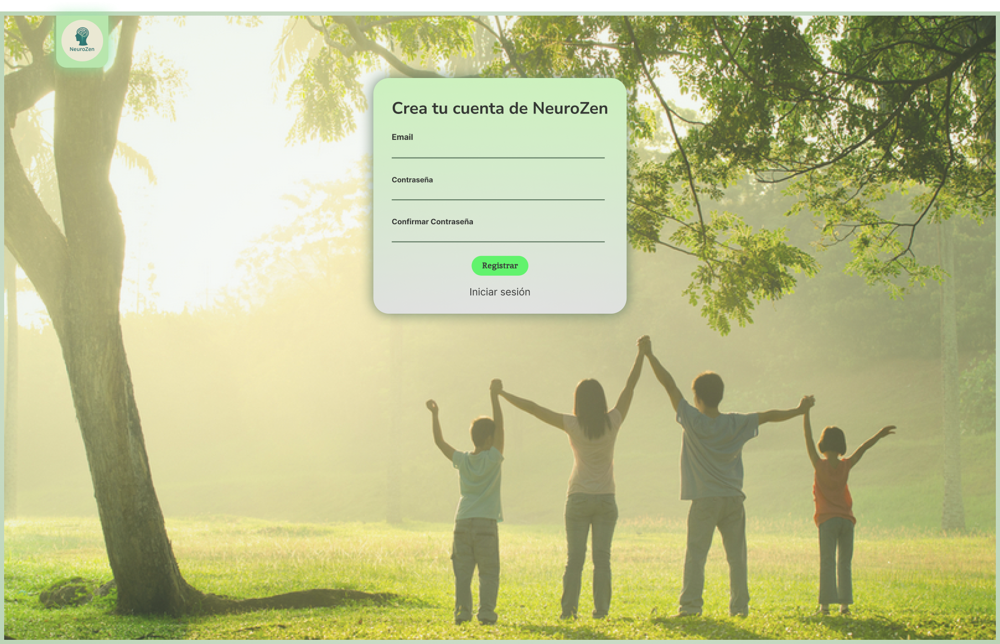</p>
</div>

<div>
  <p align="center">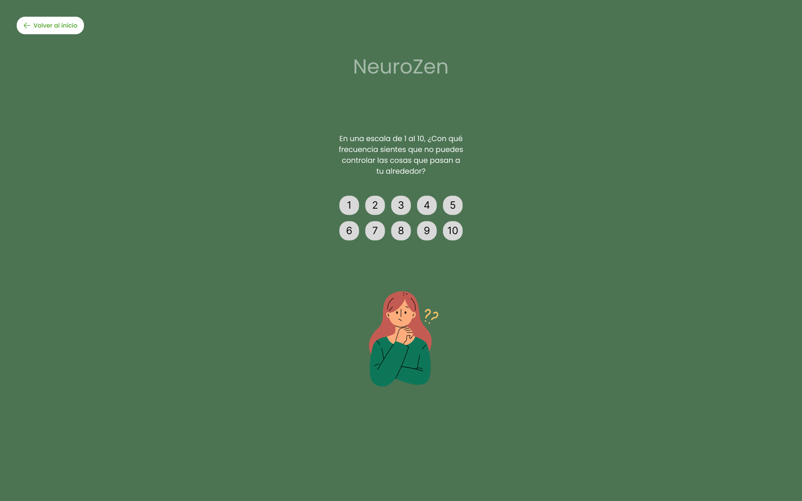</p>
</div>

Nuestro Landing Page:

## [● Link: [https://neurozen-landing.netlify.app/en/)]


---

## 4.4. Mobile Applications UX/UI Design

El diseño de experiencia de usuario (UX) y de interfaz de usuario (UI) busca ofrecer una interacción digital clara, sencilla y motivadora. La UX se enfoca en entender las necesidades de las personas que buscan manejar su estrés y en crear flujos que les permitan registrar sus datos, evaluar su estado y recibir recomendaciones de forma rápida. La UI complementa esta experiencia con un diseño visual relajante y ordenado, usando colores, íconos y botones que transmiten calma y profesionalismo. Al combinar funcionalidad intuitiva con una estética agradable, se logra que el usuario se sienta acompañado y en control de su bienestar.

---

### 4.4.1. Mobile Applications Wireframes

Los wireframes representan la estructura básica de las pantallas clave de la aplicación web, evidenciando la aplicación de principios de simplicidad, consistencia visual y accesibilidad.

**Boarding**

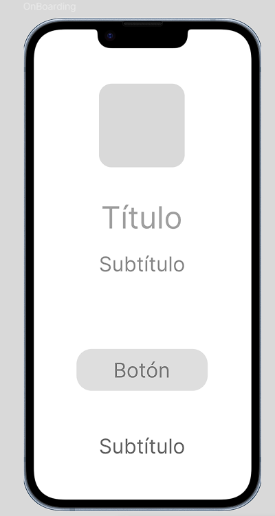 

**Login / Registro**

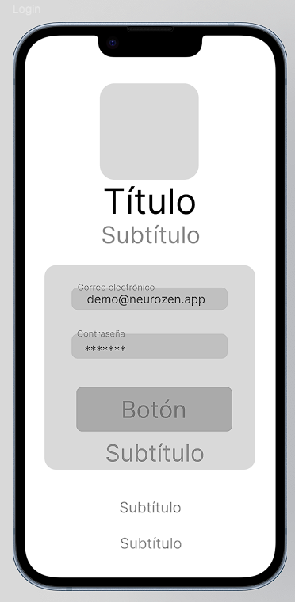

**Home**

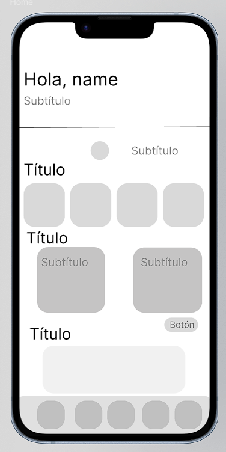

**Sessions**

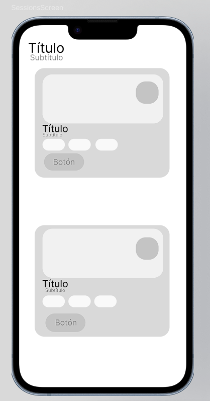

**Breathing**

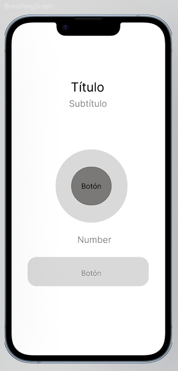

**Profile**

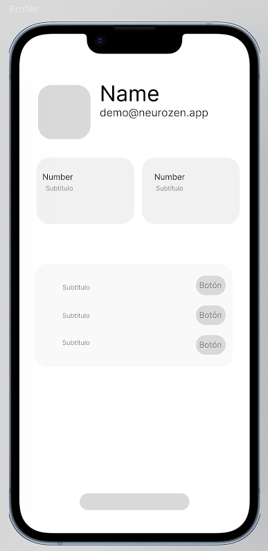

**Product Detail**

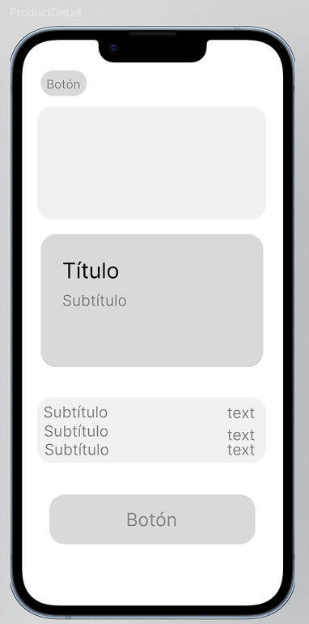


---

### 4.4.2. Mobile Applications Wireflow Diagrams

Los wireflows ilustran cómo se enlazan los wireframes a través de interacciones típicas de los usuarios (User Goals).

**Wireflow 1: Boarding e inicio de sesión**

Este wireflow representa el proceso inicial de acceso a la aplicación. El usuario comienza visualizando la pantalla de bienvenida (Boarding), donde conoce las principales funcionalidades y beneficios de la plataforma. Desde esta ventana puede continuar hacia la pantalla de Login para autenticarse y acceder a una experiencia personalizada dentro de la aplicación.

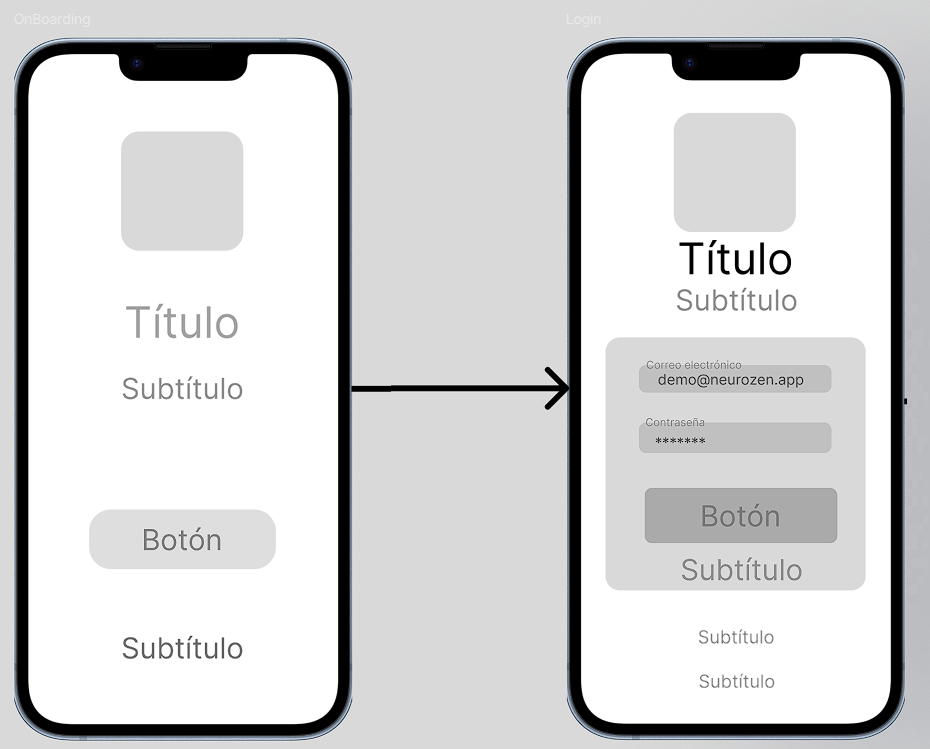

**Wireflow 2: Inicio de sesión y acceso al Home**

Este wireflow muestra el proceso mediante el cual el usuario inicia sesión dentro de la aplicación y accede a la pantalla principal Home. Una vez autenticado, el usuario puede visualizar las principales funcionalidades y navegar hacia sesiones, ejercicios de respiración, perfil y recursos disponibles dentro de la plataforma.

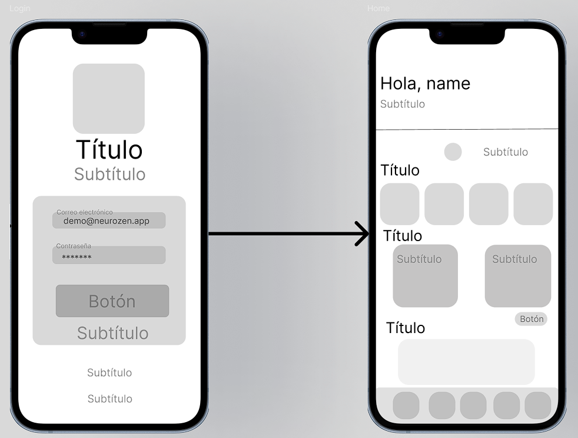


**Wireflow 3: Navegación hacia sesiones y ejercicios de respiración**

Este wireflow representa la navegación principal desde la pantalla Home hacia las funcionalidades de sesiones guiadas y ejercicios de respiración. El usuario puede acceder rápidamente a herramientas enfocadas en el bienestar, relajación y seguimiento de actividades de mindfulness dentro de la aplicación.

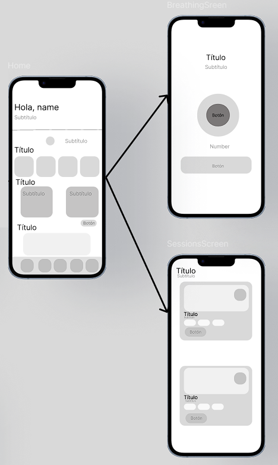

**Wireflow 4: Acceso al perfil de usuario**

Este wireflow muestra el recorrido del usuario desde la pantalla Home hacia la sección Profile. Dentro de esta ventana, el usuario puede visualizar y administrar su información personal, configuraciones, preferencias y progreso registrado dentro de la plataforma.

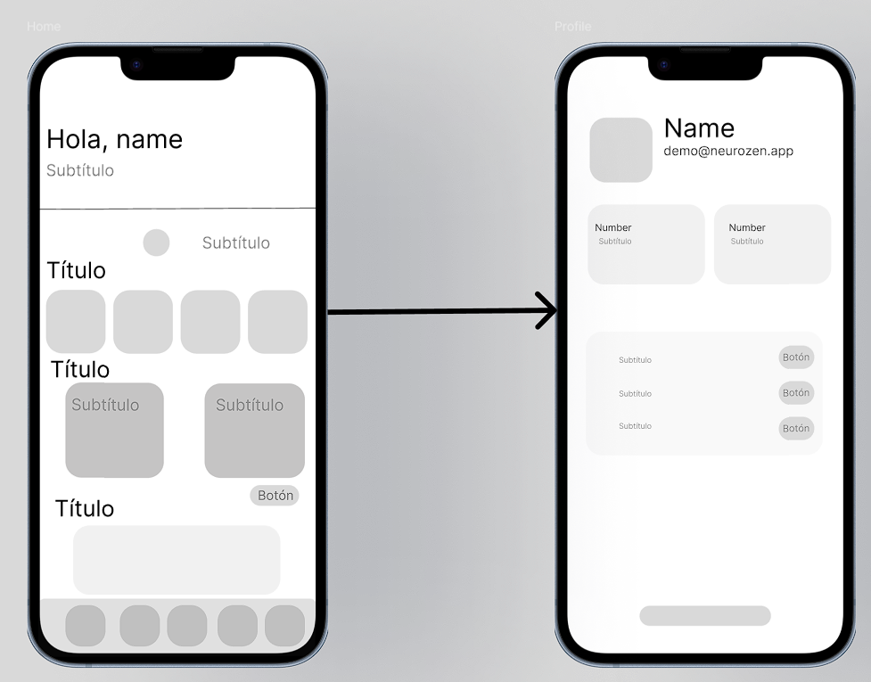


**Wireflow 5: Visualización de detalle de producto o recurso**

Este wireflow representa el flujo de navegación desde la pantalla Home hacia la visualización detallada de un producto, recurso o contenido específico de la aplicación. El usuario puede revisar información relevante y explorar contenido relacionado antes de interactuar con el recurso seleccionado.

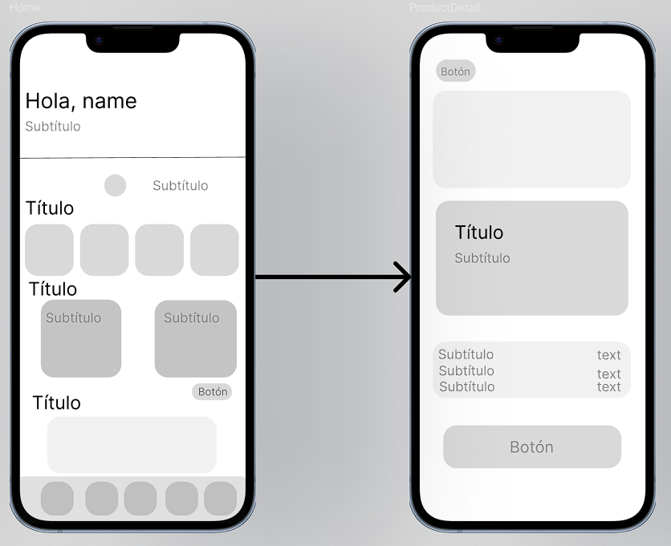


### 4.4.3. Mobile Applications Mock-ups

Los mock-ups muestran la versión visual detallada de las pantallas, aplicando la identidad visual de NeuroZen (colores, tipografías y estilos inclusivos). Aquí se evidencian las decisiones finales de diseño.

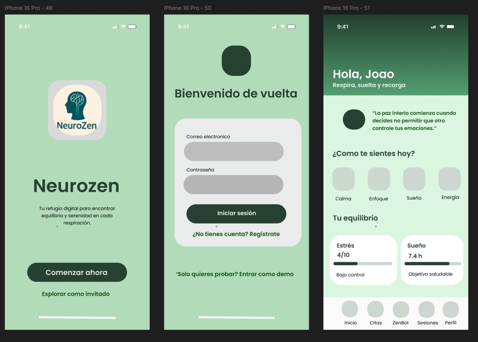

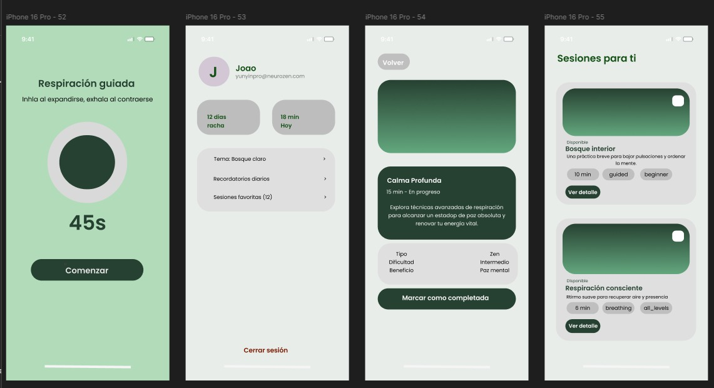

### 4.4.4. Mobile Applications User Flow Diagrams

Los **User Flow Diagrams** representan los caminos que siguen los usuarios dentro de la aplicación para cumplir sus objetivos.  
Estos flujos integran los **mock-ups** y los **wireflows**, mostrando tanto la ruta esperada (**happy path**) como las rutas alternativas en caso de error (**unhappy path**).

A continuación, presentamos los principales **User Goals** identificados y sus respectivos flujos:

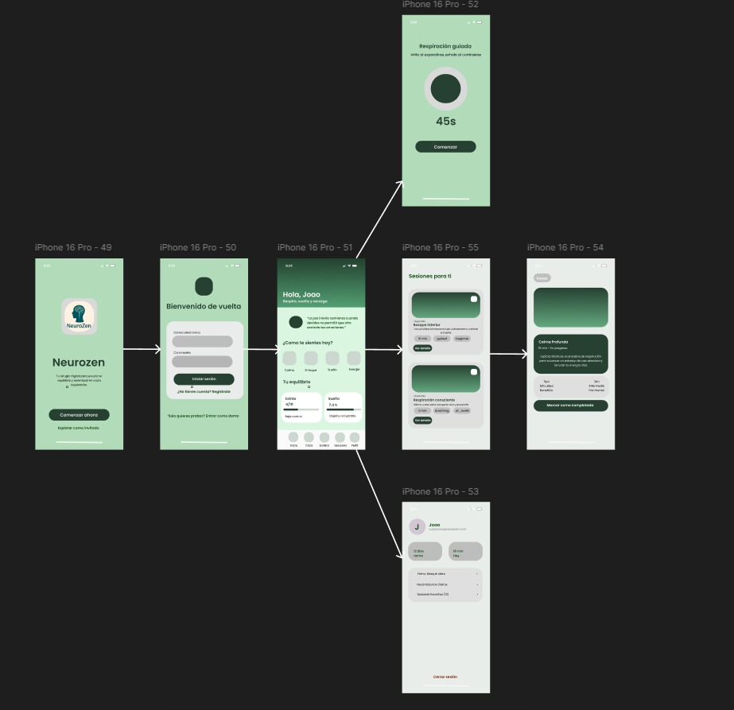
---

## 4.5. Mobile Applications Prototyping

##### Introducción

En esta sección se presentan los prototipos interactivos de la aplicación **NeuroZen**.  
Estos prototipos simulan la navegación y los principales flujos de interacción, basados en los **User Flow Diagrams** previamente definidos.

---

<div style="page-break-after: always;"></div>

---

### 4.5.1. Android Mobile Applications Prototyping

En esta sección se expone el prototipo interactivo de alta fidelidad orientado al sistema operativo Android. Este modelo funcional materializa los flujos de usuario (User Flows) definidos en etapas previas, integrando la identidad visual del proyecto y los componentes basados en los lineamientos de Material Design 3. El objetivo de este prototipo es simular la experiencia de usuario final, permitiendo la validación de la navegación, la legibilidad de la información biométrica y la correcta respuesta de los elementos interactivos (formularios, botones flotantes y barras de navegación) en un entorno que emula las dimensiones y el comportamiento de un dispositivo Android.

**Enlace de simulación interactiva:**
[Prototipo Interactivo Android - NeuroZen (Figma)](https://www.figma.com/proto/3qSFFC8I2yfjeDz3pt3k2Y/Neurozen?node-id=1-2&p=f&t=vDeMhU3mg5UDftzt-1&scaling=scale-down&content-scaling=fixed&page-id=0%3A1&starting-point-node-id=1%3A2)

---

### 4.5.2. iOS Mobile Applications Prototyping

En este apartado se presenta el prototipo interactivo correspondiente al ecosistema iOS. El diseño ha sido validado considerando los principios de las Human Interface Guidelines (HIG) de Apple, asegurando que la distribución espacial de los componentes respete los márgenes de seguridad (Safe Areas) y la integración de elementos de hardware específicos de la marca. A través de este entorno de simulación, es posible evaluar la adaptabilidad transversal de la interfaz gráfica, el comportamiento de las jerarquías de navegación y la coherencia visual de la aplicación multiplataforma dentro de los estándares exigidos para dispositivos iPhone.

**Enlace de simulación interactiva:**
[Prototipo Interactivo iOS - NeuroZen (Figma)](https://www.figma.com/proto/3qSFFC8I2yfjeDz3pt3k2Y/Neurozen?node-id=1-2&p=f&t=vDeMhU3mg5UDftzt-1&scaling=scale-down&content-scaling=fixed&page-id=0%3A1&starting-point-node-id=1%3A2)

---

## 4.6. Web Applications UX/UI Design

El diseño de experiencia de usuario (UX) y de interfaz de usuario (UI) busca ofrecer una interacción digital clara, sencilla y motivadora. La UX se enfoca en entender las necesidades de las personas que buscan manejar su estrés y en crear flujos que les permitan registrar sus datos, evaluar su estado y recibir recomendaciones de forma rápida. La UI complementa esta experiencia con un diseño visual relajante y ordenado, usando colores, íconos y botones que transmiten calma y profesionalismo. Al combinar funcionalidad intuitiva con una estética agradable, se logra que el usuario se sienta acompañado y en control de su bienestar.

---

### 4.6.1. Web Applications Wireframes

Los wireframes representan la estructura básica de las pantallas clave de la aplicación web, evidenciando la aplicación de principios de simplicidad, consistencia visual y accesibilidad.

- **Wireframe – Login**
<p align="center"></p>

- **Wireframe – Register**
<p align="center"></p>

- **Wireframe – Landing Page**
<p align="center"></p>

<p align="center"></p>

- **Wireframe – Test**
<p align="center"></p>

- **Wireframe – Menú**
<p align="center"></p>

- **Wireframe – Recommended Activity**
<p align="center"></p>

- **Wireframe – Professional Contact**
<p align="center"></p>

- **Wireframe – Profile**
<p align="center"></p>

- **Wireframe – Zen IA**
<p align="center"></p>

- **Wireframe – Selected Activity**
<p align="center"></p>

- **Wireframe – Favorites**
<p align="center"></p>

- **Wireframe – Planes**
<p align="center"></p>

---

### 4.6.2. Web Applications Wireflow Diagrams

Los wireflows ilustran cómo se enlazan los wireframes a través de interacciones típicas de los usuarios (User Goals). En este caso, el flujo refleja el proceso de acceso al landing page → registro → inicio de sesión → acceso al menú → entrada a las funcionalidades de NeuroZen.

<p align="center"></p>

---

### 4.6.3. Web Applications Mock-ups

Los mock-ups muestran la versión visual detallada de las pantallas, aplicando la identidad visual de NeuroZen (colores, tipografías y estilos inclusivos). Aquí se evidencian las decisiones finales de diseño.

- **Wireframe – Login**
<p align="center"></p>

- **Wireframe – Register**
<p align="center"></p>

- **Wireframe – Landing Page**
<p align="center"></p>

<p align="center"></p>

- **Wireframe – Test**
<p align="center"></p>

- **Wireframe – Menú**
<p align="center"></p>
<p align="center"></p>

- **Wireframe – Recommended Activity**
<p align="center"></p>

- **Wireframe – Professional Contact**
<p align="center"></p>

- **Wireframe – Profile**
<p align="center"></p>

- **Wireframe – Zen IA**
<p align="center"></p>

- **Wireframe – Selected Activity**
<p align="center"></p>

- **Wireframe – Favorites**
<p align="center"></p>

- **Wireframe – Planes**
<p align="center"></p>

---

### 4.6.4. Web Applications User Flow Diagrams

Los **User Flow Diagrams** representan los caminos que siguen los usuarios dentro de la aplicación para cumplir sus objetivos.  
Estos flujos integran los **mock-ups** y los **wireflows**, mostrando tanto la ruta esperada (**happy path**) como las rutas alternativas en caso de error (**unhappy path**).

A continuación, presentamos los principales **User Goals** identificados y sus respectivos flujos:

---

#### User Flow 1: Registro de nuevo usuario

| **Elemento**               | **Descripción**                                                                                                                       |
| -------------------------- | ------------------------------------------------------------------------------------------------------------------------------------- |
| **User Goal**              | Crear una cuenta en la plataforma para acceder a las funcionalidades de NeuroZen.                                                     |
| **Happy Path**             | El usuario ingresa su correo, contraseña y confirmación → Presiona **Registrarse** → Recibe confirmación → Redirige al **login**.     |
| **Unhappy Path**           | El usuario deja campos vacíos o ingresa una contraseña inválida → El sistema muestra mensajes de error sin avanzar al siguiente paso. |
| **Pantallas involucradas** | Wireframe **Register** → **Login**.                                                                                                   |
| **Usuario Destinado**      | Usuario nuevo.                                                                                                                        |

---

#### User Flow 2: Inicio de sesión

| **Elemento**               | **Descripción**                                                                                              |
| -------------------------- | ------------------------------------------------------------------------------------------------------------ |
| **User Goal**              | Acceder a la plataforma con credenciales válidas para usar las herramientas.                                 |
| **Happy Path**             | El usuario ingresa correo y contraseña válidos → Presiona **Iniciar Sesión** → Accede a la **Landing Page**. |
| **Unhappy Path**           | Contraseña incorrecta o email inválido → Se muestra error y se mantiene en la misma pantalla.                |
| **Pantallas involucradas** | Wireframe **Login** → **Landing Page**.                                                                      |
| **Usuario Destinado**      | Usuario recurrente.                                                                                          |

---

#### User Flow 3: Exploración de la Landing Page

| **Elemento**               | **Descripción**                                                                                                                    |
| -------------------------- | ---------------------------------------------------------------------------------------------------------------------------------- |
| **User Goal**              | Navegar por los beneficios, ejercicios y lista de psicólogos ofrecidos por NeuroZen.                                               |
| **Happy Path**             | Desde la **Landing Page** el usuario accede a secciones: **Beneficios**, **Ejercicios contra el estrés**, **Nuestros psicólogos**. |
| **Unhappy Path**           | El usuario no logra encontrar la sección buscada → Recurre al menú principal para reorientarse.                                    |
| **Pantallas involucradas** | **Landing Page** (mock-up).                                                                                                        |
| **Usuario Destinado**      | Usuarios registrados y no registrados.                                                                                             |

---

#### User Flow 4: Contacto con psicólogos

| **Elemento**               | **Descripción**                                                                                               |
| -------------------------- | ------------------------------------------------------------------------------------------------------------- |
| **User Goal**              | Conectarse con un psicólogo desde la sección “Nuestros mejores psicólogos”.                                   |
| **Happy Path**             | El usuario selecciona un psicólogo → Accede a la ficha → Obtiene información de contacto o agenda una sesión. |
| **Unhappy Path**           | El sistema no carga la información del psicólogo → El usuario recibe un mensaje de error.                     |
| **Pantallas involucradas** | **Landing Page** → **Sección Psicólogos**.                                                                    |
| **Usuario Destinado**      | Usuarios interesados en asesoría profesional.                                                                 |

---


## 4.7. Web Applications Prototyping
En esta sección se presenta el prototipo interactivo de alta fidelidad para la aplicación web de NeuroZen, desarrollado en la herramienta Figma. El objetivo principal de este prototipo es simular la navegación y las interacciones clave del usuario, permitiendo validar la arquitectura de información y la experiencia de usuario (UX) antes de la implementación final.

##### Criterios de Interacción y Navegación

Las decisiones de interacción se basaron en la necesidad de ofrecer una experiencia fluida, intuitiva y libre de fricciones para los trabajadores que buscan gestionar su estrés. Se optó por un diseño responsive que se adapta a navegadores de escritorio y móviles. La interacción principal se da a través de clics y toques (tap), representados en el diagrama mediante flechas que conectan cada pantalla. El sistema de navegación se centraliza en un **Menú principal** (Hub de navegación), desde el cual el usuario puede acceder a los módulos funcionales de manera rápida y sin pasos innecesarios.

##### Descripción del Flujo del Prototipo (Happy Path)

El flujo modelado en el prototipo abarca desde la adquisición del usuario hasta la gestión de su bienestar, estructurado de la siguiente manera:

1. **Punto de Entrada y Autenticación:** El usuario ingresa a través de la *Landing Page* (1), se registra (2) y luego inicia sesión (3).
2. **Núcleo de Navegación:** Al autenticarse, el usuario accede al *Menú principal* (4), que actúa como el centro de operaciones. Desde aquí se despliegan las funcionalidades clave:
   - **Evaluación:** El usuario puede realizar el *Test de estrés* (5), correspondiente a la User Story US04.
   - **Gestión y Bienestar:** Accede a la sección de *Actividades* (6) (US07), selecciona una *Actividad* específica (7) (US08) y puede interactuar con el soporte emocional a través de *ZenBot IA* (8).
   - **Soporte Profesional y Administración:** El usuario puede contactar a *Psicólogos* (9) (US13/US14), revisar los *Planes* de suscripción (10), gestionar su *Perfil* (11) y revisar sus *Favoritos* (12).

##### Relación con la Arquitectura de Información y User Flows

Este prototipo materializa los Wireflows y User Flow Diagrams previamente definidos en la sección 4.6. La estructura jerárquica del menú principal responde a los sistemas de organización y etiquetado (Labeling Systems) establecidos, asegurando que los términos utilizados (Actividades, Psicólogos, Planes, ZenBot) sean claros y consistentes con el lenguaje ubicuo del proyecto. La navegación entre los módulos 5 al 12 demuestra la ruta esperada (happy path) para que los User Personas (Laura y Andrés) logren sus objetivos de bienestar laboral dentro de la plataforma.


## 4.8. Domain-Driven Software Architecture

La arquitectura de software orientada al dominio es un enfoque de diseño que se centra en la estructura y organización del software en torno a los conceptos y procesos clave de un dominio específico. Este enfoque nos permite crear sistemas que reflejen con precisión los requisitos y la lógica del negocio, lo que facilita la implementación de funcionalidades específicas y la adaptación a los cambios en el dominio. Con NeuroZen, utilizamos una arquitectura de software orientada al dominio para estructurar nuestro sistema de manera coherente y escalable, lo que nos permitirá desarrollar una aplicación robusta y fácil de mantener.

---

### 4.8.1. Software Architecture Context Diagram

En esta sección se presenta el diagrama de contexto del sistema NeuroZen, el cual permite visualizar de manera general la interacción entre la plataforma y los diferentes actores externos que participan en su funcionamiento. Este tipo de diagrama es fundamental dentro de la arquitectura de software, ya que delimita el alcance del sistema y muestra sus relaciones con usuarios y servicios externos, sin entrar en detalles internos de implementación.

El sistema NeuroZen se representa como un único bloque central, actuando como una plataforma digital enfocada en la detección temprana, monitoreo continuo y gestión del estrés laboral. A través de la integración de tecnologías de análisis biométrico, evaluaciones psicológicas y herramientas de bienestar, el sistema busca mejorar la calidad de vida de los usuarios en entornos laborales exigentes.


---

### 4.8.2. Software Architecture Container Diagrams


El diagrama de contenedores de NeuroZen muestra los principales bloques tecnológicos de la plataforma. Incluye una Landing Page (React) como punto de entrada informativo, una aplicación móvil (Flutter) como cliente principal, un backend único (Spring Boot/Node.js) que centraliza toda la lógica de negocio, una base de datos PostgreSQL y cuatro sistemas externos: Payment Gateway, Cloud Storage, Biometric API y Notification Provider.

La comunicación se da así: los actores acceden a la Landing Page y a la app móvil; la Landing Page redirige a la app; la app se comunica por HTTPS/REST con el backend; y el backend interactúa con la base de datos y con los cuatro sistemas externos para pagos, archivos, biometría y notificaciones.


### 4.8.3. Software Architecture Components Diagrams

En esta sección se detallan los diagramas de despliegue, componentes internos, flujo de mensajes y spikes técnicos que especifican la distribución física y lógica de los servicios que componen el ecosistema de NeuroZen.

##### Component Diagram – Backend Internal Structure

El siguiente diagrama muestra la estructura interna del contenedor único **Backend**, desglosado en sus componentes principales: IAM, Assessments, Recommendations, Analytics, Professionals, Appointments, Community y Notification. Cada componente se comunica con la base de datos NeuroZen DB y, en algunos casos, con servicios externos especializados.


A continuación se presentan los diagramas de cada contexto de dominio que opera dentro del backend, mostrando sus relaciones específicas con la base de datos y servicios externos.


##### Identity & Access Management (IAM) Context

Para la seguridad, roles y cuentas de usuario.


##### Assessments Context

Para los tests psicológicos y cuestionarios.


##### Recommendations & Activities Context

Para las pausas activas y ejercicios de respiración.


##### Health Tracking & Dashboard Context

Para el historial, estadísticas y reportes.


##### Professionals & Appointments Context

Para el directorio de psicólogos y gestión de citas.


##### Community & Resources Context

Para los foros de apoyo y artículos de bienestar.


##### Notification Context

Para las alertas, recordatorios y correos.


### Spike Stories

Para mitigar riesgos técnicos y validar decisiones de arquitectura, se ejecutaron los siguientes spikes:

- **Spike: Integración con Biometric API**  
  *Objetivo:* Verificar disponibilidad, latencia y formato de datos de la API externa de procesamiento biométrico.  
  *Resultado:* Se implementó un cliente de prueba con latencia media de 300 ms.  
  *Decisión:* Se usará comunicación asíncrona mediante cola de mensajes (RabbitMQ).

- **Spike: Rendimiento del backend único**  
  *Objetivo:* Evaluar si un único backend (Spring Boot/Node.js) soporta 1000 usuarios concurrentes.  
  *Resultado:* Pruebas con JMeter dieron 180 ms de respuesta promedio bajo carga normal.  
  *Decisión:* El backend único es suficiente inicialmente, con capacidad de escalado horizontal mediante réplicas.

- **Spike: Autenticación con JWT**  
  *Objetivo:* Definir flujo de emisión, validación y renovación de tokens.  
  *Resultado:* Prototipo con Spring Security y JWT; expiración 24h + refresh token con validez de 7 días.  
  *Decisión:* Se implementará JWT con almacenamiento de refresh tokens en base de datos.

- **Spike: Notificaciones push**  
  *Objetivo:* Comparar Firebase Cloud Messaging (FCM) y OneSignal para envío de notificaciones a la app móvil.  
  *Resultado:* FCM tiene mejor integración con Flutter y menor costo.  
  *Decisión:* Se elige Firebase Cloud Messaging como proveedor de notificaciones.


## 4.9. Software Object-Oriented Design

En esta sección se muestran y describen los **diagramas de clases** que detallan la implementación de los componentes en cada _bounded context_.

La propuesta incluye las **clases, interfaces y enumeraciones**, junto con sus relaciones.  
Se representan los **atributos, métodos y niveles de visibilidad** (public, private, protected).  
Además, se indican las **multiplicidades y asociaciones** entre clases, garantizando que estén alineadas con los _bounded contexts_ definidos anteriormente.

---

### 4.9.1. Class Diagrams


---

### 4.9.2. Class Dictionary

A continuación se describe cada clase y sus atributos:

**Clase: User**
Representa a los usuarios de la aplicación

| Atributo | Tipo de dato | Descripción                     |
| -------- | ------------ | ------------------------------- |
| id       | int          | Identificador único del usuario |
| name     | string       | Nombre del usuario              |
| email    | string       | Correo electrónico registrado   |
| password | string       | Contraseña de acceso            |
| role     | string       | Rol del usuario (user, admin)   |

**Clase: Psychologist**
Especialista que puede agendar sesiones con usuarios.

| Atributo  | Tipo de dato | Descripción                       |
| --------- | ------------ | --------------------------------- |
| id        | int          | Identificador único del psicólogo |
| name      | string       | Nombre completo                   |
| specialty | string       | Área de especialidad              |
| email     | string       | Correo electrónico                |
| phone     | string       | Número de contacto                |

**Clase: CheckIn**
Registro de los niveles de estrés de los usuarios

| Atributo | Tipo de dato | Descripción                                      |
| -------- | ------------ | ------------------------------------------------ |
| id       | int          | Identificador único del check-in                 |
| userId   | int          | Referencia al usuario                            |
| date     | DateTime     | Fecha y hora del check-in                        |
| mood     | string       | Estado del usuario (Calm, Stressed, Overwhelmed) |
| notes    | string       | Observaciones adicionales                        |

**Clase: Plan**
Planes personalizados de bienestar asignados a los usuarios

| Atributo    | Tipo de dato | Descripción                         |
| ----------- | ------------ | ----------------------------------- |
| id          | int          | Identificador del plan              |
| userId      | int          | Referencia al usuario               |
| title       | string       | Nombre del plan                     |
| description | string       | Detalles del plan                   |
| duration    | int          | Duración en días                    |
| status      | string       | Estado del plan (Active, Completed) |

**Clase: Notification**
Notificaciones enviadas a los usuarios para recordatorios o alertas

| Atributo | Tipo de dato | Descripción                            |
| -------- | ------------ | -------------------------------------- |
| id       | int          | Identificador único de la notificación |
| userId   | int          | Referencia al usuario                  |
| message  | string       | Contenido de la notificación           |
| sentAt   | DateTime     | Fecha y hora de envío                  |
| read     | boolean      | Indica si fue leída                    |

**Clase: Session**
Registra citas agendadas con psicólogos

| Atributo       | Tipo de dato | Descripción                                           |
| -------------- | ------------ | ----------------------------------------------------- |
| id             | int          | Identificador único de la sesión                      |
| userId         | int          | Referencia al usuario                                 |
| psychologistId | int          | Referencia al psicólogo                               |
| scheduledAt    | DateTime     | Fecha y hora programada                               |
| status         | string       | Estado de la sesión (Scheduled, Completed, Cancelled) |

---

## 4.10. Database Design


<div>
  <p align="center"></p>
</div>

La estructura mostrada soporta los procesos core del negocio digital: registro y perfil biométrico, autoevaluación de estrés, recomendaciones personalizadas, seguimiento de progreso, conexión con especialistas, comunidad y suscripciones. Cada tabla se relaciona con los servicios definidos en los diagramas de componentes, asegurando que la persistencia de datos sea consistente con la lógica de negocio y los flujos de usuario especificados en los capítulos anteriores.


### 4.10.1. Relational/Non-Relational Database Diagram


---

<div style="page-break-after: always;"></div>

# Capítulo V: Product Implementation

## 5.1. Software Configuration Management

El equipo ha establecido un ecosistema de desarrollo estandarizado para garantizar la trazabilidad, colaboración y calidad del software. Se detallan a continuación las herramientas y normativas que rigen el ciclo de vida del producto.


### 5.1.1. Software Development Environment Configuration

**Project Management:**

La gestión de los proyectos tiene como objetivo mejorar los procesos y su entorno para alcanzar los resultados esperados.

- **Project Management:  Trello** es una herramienta visual que permite gestionar cualquier tipo de proyecto y el flujo de trabajo que el equipo desarrollador seguirá para implementar correctamente las tareas de código para el Landing Page y el web Application.

<table>
    <tbody>
        <tr>
            <td>Link de referencia: </td>
            <td>https://trello.com/es </td>
        </tr>
    </tbody>
</table>

**Requirements Management:**

Es el proceso de garantizar que una organización documente verifique y satisfaga las necesidades, expectativas de sus clientes con las partes interesadas internas o externas.

- **Pivotal Tracker:** Esta herramienta se define como una plataforma en la que se realiza la gestión de user stories, agrupándolos en epics y clasificando su presencia en el programa, por puntaje. Se usó porque permite que cada miembro del equipo comparta la misma vista en tiempo real de lo que está sucediendo con cada proyecto, ya sea aportando con diferentes secciones o corrigiendo el flujo del proyecto.

<table>
    <tbody>
        <tr>
            <td>Link de referencia: </td>
            <td>https://www.pivotaltracker.com/  </td>
        </tr>
    </tbody>
</table>

**Product UX/UI Design:**

Nos permite desarrollar el modelo en nuestro producto de manera digital y forme parte de la vida del consumidor. En este caso realizar un modelo de sitio web para computadoras y celulares.

- **Uxpressia:** es una herramienta en línea para el mapeo de la trayectoria del cliente que crea mapas de impacto y personas. Sus herramientas nos permitieron establecer las bases del modelado de User Persona, Empathy Map y Journey Map

<table>
    <tbody>
        <tr>
            <td>Link de referencia: </td>
            <td>https://uxpressia.com/ </td>
        </tr>
    </tbody>
</table>

- **MIRO:** es una pizarra digital colaborativa en línea, que puede ser usada para la investigación, la ideación, la creación de lluvias de ideas, mapas mentales y una variedad de otras actividades colaborativas.

<table>
    <tbody>
        <tr>
            <td>Link de referencia: </td>
            <td>https://www.miro.com/</td>
        </tr>
    </tbody>
</table>

- **Figma:** es una herramienta de prototipo web y editor de gráficos vectorial, que, a diferencia de las otras herramientas, se aloja en la web, permitiendo establecer los modelos para versión en Web Browser y Landing Page.

<table>
    <tbody>
        <tr>
            <td>Link de referencia: </td>
            <td>https://www.figma.com/ </td>
        </tr>
    </tbody>
</table>

- **LucidChart:** es una herramienta de diagramación basada en la web, que permite a los usuarios colaborar y trabajar juntos en tiempo real, creando diseños UML, mapas mentales, prototipos de software y muchos otros tipos de diagrama.

<table>
    <tbody>
        <tr>
            <td>Link de referencia: </td>
            <td>https://www.lucidchart.com </td>
        </tr>
    </tbody>
</table>

- **Structurizr:** es una herramienta de diseño que soporta el modelo C4, para visualizar la arquitectura de software de nuestra solución.

<table>
    <tbody>
        <tr>
            <td>Link de referencia: </td>
            <td>https://structurizr.com/ </td>
        </tr>
    </tbody>
</table>

**Software Development:**

Es una estructura aplicada al desarrollo de un producto de software. Se utiliza para el establecimiento de un proceso para el desarrollo de software, cada uno de los cuales describe un enfoque diferente para diferentes actividades que tienen lugar durante el proceso.

- **Github:** Es un repositorio comunitario cuya función es almacenar los avances de un proyecto elaborado por un grupo de personas.

<table>
    <tbody>
        <tr>
            <td>Link de referencia: </td>
            <td> https://github.com/  </td>
        </tr>
    </tbody>
</table>

- **WebStorm:** Es un entorno de JetBrains, empresa desarrolladora de Software. Este nos ofrece facilidad en probar nuestro entorno web en navegadores web. Para el proyecto se implementará la ayuda de los lenguajes HTML, CSS y TypeScript.

<table>
    <tbody>
        <tr>
            <td>Link de referencia: </td>
            <td> https://www.jetbrains.com/webstorm/ 
            </td>
        </tr>
    </tbody>
</table>

- **HTML:** Es un lenguaje que sirve como desarrollador de plataformas web que trabaja con hipertextos, que enlace a otros documentos. Este lenguaje ofrece herramientas para el diseño del sitio web.

<table>
    <tbody>
        <tr>
            <td>Link de referencia: </td>
            <td> https://www.jetbrains.com/help/webstorm/editing-html-files.html 
             </td>
        </tr>
    </tbody>
</table>

- **CSS:** Es un lenguaje de diseño para el entorno web. Permite elaborar el interfaz de usuario diseñada anteriormente, agregando colores, tamaños entre otros elementos.

<table>
    <tbody>
        <tr>
            <td>Link de referencia: </td>
            <td> https://www.jetbrains.com/help/webstorm/style-sheets.html#ws_css_completion 
             </td>
        </tr>
    </tbody>
</table>

- **TypeScript:** Es un superconjunto de JavaScript, que esencialmente añade tipos estáticos y objetos basados en clases

<table>
    <tbody>
        <tr>
            <td>Link de referencia: </td>
            <td> https://www.typescriptlang.org/ 
             </td>
        </tr>
    </tbody>
</table>

- **Angular:** Framework de TypeScript, de código abierto, utilizado para desarrollar SPA(Single Page Application).

<table>
    <tbody>
        <tr>
            <td>Link de referencia: </td>
            <td> https://angular.io  </td>
        </tr>
    </tbody>
</table>

**Software Testing:**

Es el acto de examinar los artefactos y el comportamiento del software bajo prueba mediante validación y verificación.

- **Lenguaje Gherkins:** Es un DSL o Lenguaje Específico de Dominio (Domain-Specific Language), es decir, un lenguaje que está creado para resolver un problema. Además de ser interpretado en código, se puede agregar los users stories del programa con sus respectivas partes: Feature, Scenario, Example, Scenario Outline, Given, When, Then y And.

**Software Development:**

- **Github pages:** Servicio de Github que nos permitió alojar nuestra landing page y nos permitirá alojar nuestro web applications.

<table>
    <tbody>
        <tr>
            <td>Link de referencia: </td>
            <td> https://pages.github.com/ </td>
        </tr>
    </tbody>
</table>

### 5.1.2. Source Code Management

En esta sección se presenta la gestión de código fuente o como es conocido por sus siglas en inglés SCM (Source Code Management). Su función principal es realizar un seguimiento de las modificaciones que el equipo realizará a lo largo del desarrollo de sus proyectos en los repositorios de código fuente. Se emplea como un sistema de control de versiones que permite dar seguimiento a los cambios que cada integrante o desarrollador realice en el proyecto. Asimismo, cabe resaltar que para el sistema de control de versiones emplearemos GitHub.

**GitFlow**

Es el modelo alternativo de creación de ramas en Git que en los últimos años se ha vuelto una herramienta indispensable para muchos desarrolladores. Este flujo de trabajo de control de versiones utiliza ramas y fue publicado y popularizado por Vincent Driessen. Su principal función es ayudar en la organización de la versión de un código, permitiendo la creación de nuevos Features y Hotfixes de manera organizada.

**Main Branches:**

- **main:** es la rama principal, a partir de ella se recorrerán todas las ramas y contendrá la última versión y las anteriores creadas por los desarrolladores.

- **Develop:** Esta rama puede ser creada a partir de la rama main(master) y contará con todos los Features estables. Esto significa que a través de esta rama el equipo podrá integrar las funciones.

**Support Branches:**

- **Feature:** se ramifica de developer y al finalizar debe fusionarse de nuevo en develop. Se emplea para desarrollar nuevas funciones que se integrarán en versiones posteriores.

- **Release:** también se ramifica de develop, es la rama que admite la preparación de una nueva versión de producción.

- **Hotfix:** también está destinado a una nueva versión de producción, pero esta se ramifica de main. Su función es reparar rápidamente las publicaciones de producción.

**Conventional Commits:**

Son una convención para nombrar mensajes de commit en Git de forma estructurada, clara y semántica.

- feat: Se añade una nueva funcionalidad.
- fix: Se corrige un error.
- docs: Cambios en la documentación.
- style: Cambios de formato o estilo de código (sin impacto en la lógica).
- refactor: Mejoras en el código que no añaden nuevas funcionalidades ni corrigen errores.
- test: Añadir o modificar tests.
- chore: Cambios menores sin impacto en el código de producción (actualización de dependencias, configuración, etc.).


### 5.1.3. Software Deployment Configuration

Como se mencionó previamente, la gestión de nuestro código fuente se realizará a través de GitHub. Asimismo, se utilizará GitHub Pages para la publicación y despliegue de la página.

Para el desarrollo del Landing Page de NeuroZen se han usado las siguientes herramientas:

- HTML: lenguaje con el cual está estructurado nuestro landing page.

- CSS: diseño y formato para el html desarrollado.

El despliegue de nuestro landing page es posible gracias a la herramienta de Github Pages. El cual es un servicio que nos permite alojar nuestro landing directamente desde el
repositorio de GitHub.

Para lograr el despliegue seguimos lo siguientes pasos:

1. Dirigirnos al repositorio de la página y entrar en la sección de configuración.

2. Ir a la opción de “Pages”, donde se encontrarán todas las opciones de publicación de página.

3. Se debe seleccionar la rama la cual se va a publicar en el vínculo. También se debe seleccionar la carpeta donde se localizara la publicación.

4. Finalmente, el link vínculo de nuestra página aparecerá en la parte superior.

---

## 5.2. Product Implementation & Deployment

### 5.2.1. Sprint Backlogs

**Sprint 3**
   - **Sprint Goal:** Proveer a los psicólogos la estructura base de la aplicación móvil, permitiéndoles crear su cuenta, gestionar su perfil profesional y visualizar sus próximas sesiones en un dashboard centralizado, soportado por una actualización integral de los servicios del backend para la sincronización de datos.
   - **Velocity:** 42 story points.

**Sprint Backlog Table:**

<div align="center">

<table>
  <thead>
    <tr>
      <th>ID</th>
      <th>Titles</th>
      <th>Estimation(h)</th>
      <th>Assigned To</th>
      <th>Status</th>
      <th>Story Points</th>
    </tr>
  </thead>
  <tbody>
    <tr>
      <td>US18</td>
      <td>Bounded Context: Auth & Profile</td>
      <td>4</td>
      <td>Carlos Paredes</td>
      <td>Done</td>
      <td>5</td>
    </tr>
    <tr>
      <td>US18</td>
      <td>Bounded Context: Auth & Profile</td>
      <td>4</td>
      <td>Jean Pool</td>
      <td>Done</td>
      <td>5</td>
    </tr>
    <tr>
      <td>US19</td>
      <td>Bounded Context: Dashboard & Navigation</td>
      <td>3</td>
      <td>Diego Requena</td>
      <td>Done</td>
      <td>3</td>
    </tr>
    <tr>
      <td>US11</td>
      <td>Bounded Context: Service Booking</td>
      <td>6</td>
      <td>Joao Castro</td>
      <td>Done</td>
      <td>5</td>
    </tr>
    <tr>
      <td>US11</td>
      <td>ervice Booking Endpoints</td>
      <td>7</td>
      <td>Miguel Vila</td>
      <td>Done</td>
      <td>5</td>
    </tr>
  </tbody>
</table>

</div>

### 5.2.2. Implemented Landing Page Evidence

**URL en Producción:** 

**Tecnologías:** Astro & TypeScript.

**Tabla de Evidencias**

<div align="center">

<table>
  <thead>
    <tr>
      <th>Funcionalidad</th>
      <th>Descripción</th>
      <th>Evidencia</th>
    </tr>
  </thead>
  <tbody>
    <tr>
      <td>Inicio</td>
      <td>Página de presentación de nuestra landing page.</td>
      <td></td>
    </tr>
    <tr>
      <td>Sobre Nosotros</td>
      <td>Sección para darnos a conocer como  equipo, y videos probando el producto en distintas plataformas.</td>
      <td></td>
    </tr>
    <tr>
      <td>Planes</td>
      <td>Sección para mostrar los distintos planes que ofrecemos a los clientes.</td>
      <td></td>
    </tr>
    <tr>
      <td>Profesionales</td>
      <td>Sección para dar a conocer algunos de los profesionales que trabajan usando nuestra plataforma.</td>
      <td></td>
    </tr>
  </tbody>
</table>
 
</div>

### 5.2.3. Implemented Frontend-Web Application Evidence

**URL en Producción:**  https://neurozen-web-frontend.vercel.app 

**Tecnologías:** Vue & JavaScript.

**Tabla de Evidencias**

<div align="center">

<table>
  <thead>
    <tr>
      <th>Funcionalidad</th>
      <th>Descripción</th>
      <th>Evidencia</th>
    </tr>
  </thead>
  <tbody>
    <tr>
      <td>Inicio</td>
      <td>Menú Principal de Neurozen, presentando un atajo a todas las funcionalidades y un reporte estadístico.</td>
      <td></td>
    </tr>
    <tr>
      <td>Perfil</td>
      <td>Perfil del usuario(paciente) mostrando detalles como su suscripción</td>
      <td></td>
    </tr>
    <tr>
      <td>Ejercicios</td>
      <td>Apartado de ejercicios que puede realizar el usuario.</td>
      <td></td>
    </tr>
    <tr>
      <td>Reservar Cita</td>
      <td>Apartado para iniciar con la reserva de una cita en la plataforma.</td>
      <td></td>
    </tr>
    <tr>
      <td>Configuracion</td>
      <td>Apartado para que el usuario pueda configurar el diseño de la plataforma.</td>
      <td></td>
    </tr>
  </tbody>
</table>
 
</div>

### 5.2.4. Acuerdo de Servicio - SaaS

El presente Acuerdo de Nivel de Servicio (SLA) establece los compromisos de calidad, disponibilidad y soporte que el startup NeuroDraw garantiza para el producto NeuroZen, ofrecido bajo el modelo de Software como Servicio (SaaS) a usuarios finales (trabajadores formales e informales) y profesionales de la salud mental.

 - **DisDisponibilidad del Servicio (Uptime)**
   NeuroZen garantiza una disponibilidad del servicio del 99.9% mensual para las funciones principales, incluyendo el acceso a la plataforma web y aplicaciones móviles, las autoevaluaciones de estrés y el agendamiento de citas con psicólogos.
   
 - **Privacidad y Seguridad de la Información**
   NeuroZen se compromete a aplicar protocolos estrictos de encriptación de extremo a extremo.
   
 - **Mantenimiento y Despliegues**
   Cualquier actualización de la plataforma o tarea de despliegue continuo se realizará en horarios de menor actividad (ej. madrugada) para minimizar el impacto en la experiencia del usuario.
   
 - **Responsabilidad y Limitación del Servicio**
   NeuroZen es una herramienta preventiva enfocada en la identificación y gestión del estrés laboral. Se deja constancia de que los tests y análisis de la plataforma no sustituyen un diagnóstico psiquiátrico oficial ni la atención de emergencia para crisis severas de salud mental.

### 5.2.5. Implemented Native-Mobile Application Evidence

<div align="center">

<table>
  <thead>
    <tr>
      <th>Funcionalidad</th>
      <th>Descripción</th>
      <th>Evidencia</th>
    </tr>
  </thead>
  <tbody>
    <tr>
      <td>Login y Registro</td>
      <td>Gestión de identidad, control de acceso y registro de nuevos usuarios (psicólogos).</td>
      <td></td>
    </tr>
    <tr>
      <td>Login y Registro</td>
      <td>Gestión de identidad, control de acceso y registro de nuevos usuarios (psicólogos).</td>
      <td></td>
    </tr>
    <tr>
      <td>Auth & Profile</td>
      <td>Muestra la información personal y profesional del usuario (biografía, experiencia, precio por sesión, valoración).</td>
      <td></td>
    </tr>
    <tr>
      <td>Service Booking</td>
      <td>Muestra las citas programadas con los pacientes, los motivos y el estado de la cita (Confirmada, Pendiente)</td>
      <td></td>
    </tr>
    <tr>
      <td>Dashboard & Navigation</td>
      <td>Obtiene el saludo y el estado del perfil, del contexto de Auth & Profile. Además del Service Booking.</td>
      <td></td>
    </tr>
  </tbody>
</table>
 
</div>

### 5.2.6. Implemented RESTful API and/or Serverless Backend Evidence

La documentación técnica fue actualizada para reflejar los nuevos Bounded Contexts y asegurar la integración con los clientes Android y Flutter.

Se expandió el backend para incluir nueva lógica del negocio.

  - **Dashboard:** Gestión de reporte de estadísticas del usuario.
  - **Subscriptions:** Gestión de suscripciones del usuario.

### 5.2.7. RESTful API documentation

  - **URL Swagger UI:** https://neurozen-backend-mobile.onrender.com/swagger/index.html

  - **Entorno de Producción:** Render

**Evidencia de Documentación:**


### 5.2.8. Team Collaboration Insights

El equipo operó en un modelo de desarrollo paralelo para cubrir tres frentes: Backend, Android Nativo y Flutter.


## 5.3. Video About-the-Product

- Link: https://drive.google.com/file/d/1-_v0KUTrHYfdEqTVUWcZBBUHyfarLtC4/view?usp=sharing

---

<div style="page-break-after: always;"></div>

# Parte II: Verification, Validation & Pipeline

# Capítulo VI: Product Verification & Validation
 
En este capítulo se detallan las estrategias, herramientas y resultados de las pruebas realizadas para garantizar la calidad, fiabilidad y correcto funcionamiento de la plataforma **NeuroZen**. El proceso de validación abarca los tres frentes tecnológicos del proyecto: Aplicación Móvil (Android nativo), Frontend Web (Vue.js) y Backend (C# ASP.NET Core).
 
## 6.1. Testing Suites & Validation
 
### 6.1.1. Core Entities Unit Tests
 
Para asegurar que la lógica interna de los componentes clave de NeuroZen funcione correctamente en aislamiento, se diseñaron y ejecutaron pruebas unitarias enfocadas en las entidades principales del dominio (`User`, `CheckIn`, `Psychologist` y `Session`).
 
| Frente | Framework | Responsable |
|---|---|---|
| Backend API (C# / ASP.NET Core) | xUnit + Moq | Miguel Vila |
| Frontend Web (Vue.js) | Vitest + Vue Test Utils | Jean Pool Huaman |
| Aplicación Móvil (Android nativo, Android Studio) | JUnit 4 + MockK | Manuel Fernando Joao Castro |
 
**Backend API (C# / ASP.NET Core) — Responsable: Miguel Vila**
 
Se utilizó **xUnit** junto con **Moq** para aislar la lógica de controladores y servicios. Se validó la correcta instanciación de las entidades, las reglas de validación de datos (formato de correo, contraseñas) y el cálculo de niveles de estrés, sin depender de la base de datos real.
 
| # | Prueba | Entidad | Qué valida |
|---|---|---|---|
| 1 | `Handle_ValidCommand_ReturnsAppointmentAndSavesToDataBase` | `AppointmentCommandService` | Creación de una cita y llamado a la base de datos |
| 2 | `GetProfessionalById_ReturnsCorrectId` | `ProfessionalQueryService` | Verificar que el servicio retorna el Id correcto a ejecutar la query |
| 3 | `CreateTriggerCommandTest` | `TriggerCommandService` | Creación correcta de un objeto Trigger, con valores permitidos |
| 4 | `CreateTrigger_StressLevelGreaterThan10_ReturnsBadRequest` | `TriggersController` | Integridad del flujo completo de una petición HTTP al endpoint POST de Triggers |

## Código

```C#
public class TriggerCommandServiceTest
{
  /// <summary>
    /// PRUEBA 1: Creación Exitosa de un Trigger
    /// - Por qué se realiza: Para comprobar que el servicio procesa un comando válido, 
    ///   crea la entidad y llama exactamente una vez a los métodos de persistencia y confirmación.
    /// - Por qué es importante: Garantiza que la lógica de negocio principal de escritura 
    ///   funciona correctamente de forma aislada, asegurando la integridad de los datos 
    ///   sin necesidad de una base de datos real.
  /// </summary>
  [Fact]
  public async Task CreateTriggerCommandTest()
  {
    //Arrange (preparamos los mocks)
    var mockRepo = new Mock<ITriggerRepository>();
    var mockUow = new Mock<IUnitOfWork>();
    var mockLogger = new Mock<ILogger<TriggerCommandService>>();

    var service = new TriggerCommandService(mockRepo.Object, mockUow.Object, mockLogger.Object);
    var command = new CreateTriggerCommand(1, 1, 10, DateTime.Now.AddDays(1), "trigger de prueba");

    //Act (Ejecutamos la función)
    var result = await service.Handle(command);

    //Assert (Verificamos)
    Assert.NotNull(result);
    Assert.InRange(command.StressLevel, 1, 10); //que el nivel de estrés no sea mayor a 10
    mockRepo.Verify(r => r.AddAsync(It.IsAny<Trigger>()), Times.Once);
    mockUow.Verify(u => u.CompleteAsync(), Times.Once);
  }

  /// <summary>
    /// PRUEBA 2: Manejo de Errores de Base de Datos
    /// - Por qué se realiza: Para simular una excepción a nivel de infraestructura 
    ///   (falla en el commit de la base de datos) y verificar que el bloque try-catch reacciona adecuadamente.
    /// - Por qué es importante: Evita que la aplicación crashee
    ///   ante caídas de la base de datos, asegurando un manejo de errores controlado que devuelve null de forma segura.
    /// </summary>
  [Fact]
  public async Task CreateTrigger_WhenDatabaseFails_ReturnsNull()
  {
    //Arrange
    var mockRepo = new Mock<ITriggerRepository>();
    var mockUow = new Mock<IUnitOfWork>();
    var mockLogger = new Mock<ILogger<TriggerCommandService>>();

    var service = new TriggerCommandService(mockRepo.Object, mockUow.Object, mockLogger.Object);
    var command = new CreateTriggerCommand(1, 1, 10, DateTime.Now.AddDays(1), "trigger de prueba");

    mockUow.Setup(u => u.CompleteAsync()).ThrowsAsync(new Exception("Fallo en BD")); //Simulamos un fallo

    //Act ejecutamos la función
    var result = await service.Handle(command);

    //Assert verificamos que el objeto es null pero el logger no
    Assert.Null(result);
    Assert.NotNull(mockLogger);
  }
}

public class ProfessionalQueryServiceTest
{
  /// <summary>
    /// PRUEBA 3: Búsqueda de Profesional por ID
    /// - Por qué se realiza: Para verificar que el servicio de consultas es capaz 
    ///   de comunicarse con el repositorio y retornar la entidad exacta solicitada mediante un query.
    /// - Por qué es importante: Asegura que los flujos de lectura de la aplicación 
    ///   recuperen la información precisa para los clientes (como la app móvil) sin alterar ningún estado.
  /// </summary>
  [Fact]
  public async Task GetProfessionalById_ReturnsCorrectId()
  {
    //Arrange
    var mockRepo = new Mock<IProfessionalRepository>();
    var serviceQuery = new ProfessionalQueryService(mockRepo.Object);
    //Creamos la entidad fake del profesional
    var command = new CreateProfessionalCommand("Miguel", "Depresión", "5 años", 0, 0, 30, "Lun. | Vier.", "test", "test.png");
    var professionalFake = new Professional(command);
    var testId = professionalFake.Id;

    //Configuramos el mock para que devuelva el profesional fake cuando le pregunten por ese ID
    mockRepo.Setup(r => r.FindByIdAsync(testId)).ReturnsAsync(professionalFake);

    var query = new GetProfessionalByIdQuery(testId);

    //Act
    var result = await serviceQuery.Handle(query);

    //Assert
    Assert.NotNull(result);
    Assert.Equal(professionalFake.Id, result.Id);
  }
}

public class TriggersControllerIntegrationTests : IClassFixture<IntegrationTestWebApplicationFactory>
{
    private readonly HttpClient _client;

    public TriggersControllerIntegrationTests(IntegrationTestWebApplicationFactory factory)
    {
        _client = factory.CreateClient(new WebApplicationFactoryClientOptions
        {
            AllowAutoRedirect = false
        });
    }
    /// <summary>
    /// PRUEBA 4: Validación de Regla de Negocio y Seguridad en Controlador (End-to-End)
    /// - Por qué se realiza: Para simular un flujo real de usuario completo (registro, 
    ///   inicio de sesión para obtener el token JWT, inyección de credenciales y envío de datos inválidos (> 10 de estrés)).
    /// - Por qué es importante: Es la prueba de mayor nivel de confianza; valida que 
    ///   los middlewares de seguridad, los controladores REST, las políticas de autorización 
    ///   y las validaciones de datos operen conjuntamente de forma correcta en un entorno real.
    /// </summary>
    [Fact]
    public async Task CreateTrigger_StressLevelGreaterThan10_ReturnsBadRequest()
    {
        // Arrange creamos un usuario test
        var prefijo = Guid.NewGuid().ToString().Substring(0, 8);
        var signUp = new
        {
            Username = $"test_{prefijo}",
            Password = "Password123.",
            Email = $"test_{prefijo}@gmail.com"
        };

        //Registramos al usuario
        var signUpResponse = await _client.PostAsync("/api/v1/Authentication/sign-up",
            new StringContent(JsonSerializer.Serialize(signUp), Encoding.UTF8, "application/json"));
        var signUpResponseStr = await signUpResponse.Content.ReadAsStringAsync();
        Assert.True(signUpResponse.IsSuccessStatusCode,
            $"Sign-up failed with {(int)signUpResponse.StatusCode}: {signUpResponseStr}");

        //Iniciamos sesión
        var signIn = new { Username = signUp.Username, Password = signUp.Password };
        var signInResponse = await _client.PostAsync("/api/v1/Authentication/sign-in",
            new StringContent(JsonSerializer.Serialize(signIn), Encoding.UTF8, "application/json"));

        var signInResponseStr = await signInResponse.Content.ReadAsStringAsync();
        Assert.True(signInResponse.IsSuccessStatusCode,
            $"Sign-in failed with {(int)signInResponse.StatusCode}: {signInResponseStr}");

        //Extraemos el token
        var tokenDoc = JsonDocument.Parse(signInResponseStr);
        var token = tokenDoc.RootElement.GetProperty("token").GetString();

        //Inyectamos el token en el cliente HTTP
        _client.DefaultRequestHeaders.Authorization = new AuthenticationHeaderValue("Bearer", token);

        //Arrange:  preparamos la info inválida para el Trigger
        var invalidTrigger = new
        {
            PatientId = 1,
            CategoryId = 1,
            StressLevel = 15, // Aquí esta el error
            TriggerDateTime = DateTime.UtcNow,
            Description = "Ataque de pánico"
        };
        var content = new StringContent(JsonSerializer.Serialize(invalidTrigger), Encoding.UTF8, "application/json");

        //Hacemos la petición
        var response = await _client.PostAsync("/api/v1/Triggers", content);

        //Assert: Verificamos que la API bloquea el nivel de estrés en 10
        Assert.Equal(HttpStatusCode.BadRequest, response.StatusCode);
    }
}
```
> *Evidencia de Pruebas Unitarias e Integral en el Backend:*


 
**Frontend Web (Vue.js) — Responsable: Jean Pool Huaman**
 
Se implementaron pruebas unitarias con **Vitest** y **Vue Test Utils**, enfocadas en los componentes visuales críticos y en el gestor de estado (**Pinia**). Se probaron funciones clave como el cálculo de las respuestas del test de autoevaluación antes de ser enviadas al backend.
 
> *Evidencia de Pruebas Unitarias Frontend:*
> `[Insertar captura de la terminal con el reporte de coverage y los tests aprobados]`
 
**Aplicación Móvil (Android nativo) — Responsable: Manuel Fernando Joao Castro**
 
La aplicación móvil fue desarrollada en Android Studio en lenguaje Kotlin nativo. Se implementaron pruebas unitarias locales con JUnit 4, ubicadas en app/src/test, para validar de forma aislada e independiente las entidades clave del dominio: User (autenticación y persistencia de token JWT), CheckIn / HealthMetric (evaluación de datos biométricos de frecuencia cardíaca, sueño y cálculo del umbral de nivel de estrés), Psychologist (validación de tarifas y especialidad) y Session (duración y recursos multimedia). Todas las pruebas fueron ejecutadas con éxito en la JVM local sin requerir un emulador activo.
 
## Resumen de pruebas
 
| # | Prueba | Entidad | Qué valida |
|---|---|---|---|
| 1 | `userEntity_creationAndSessionPersistence_isCorrect` | `User` | Creación del usuario y persistencia de la sesión en memoria (token JWT, ID, rol y header `Bearer`) |
| 2 | `checkInHealthMetric_stressLevelThresholdCalculation_isCorrect` | `CheckIn` | Un nivel de estrés mayor a 7 se clasifica como "Nivel alto" y calcula el progreso proporcional |
| 3 | `psychologistEntity_repositoryGetProfessionalsWithMockito_returnsList` | `Psychologist` | El repositorio obtiene la lista de profesionales usando un servicio REST simulado con Mockito |
| 4 | `sessionEntity_durationAndResourceMapping_isCorrect` | `Session` | Integridad de la duración, el título y la URL del recurso de audio (MP3) |

## Código
 
```kotlin
package com.example.neurozen_front
 
import com.example.neurozen_front.neurozen.data.network.AuthSession
import com.example.neurozen_front.neurozen.data.network.HealthMetricRequest
import com.example.neurozen_front.neurozen.data.network.MeditationResource
import com.example.neurozen_front.neurozen.data.network.NeurozenApiService
import com.example.neurozen_front.neurozen.data.network.NeurozenRepository
import com.example.neurozen_front.neurozen.data.network.ProfessionalResource
import com.example.neurozen_front.neurozen.data.network.UserRole
import com.example.neurozen_front.neurozen.data.session.UserSession
import com.example.neurozen_front.neurozen.home.presentation.home.HealthMetric
import com.example.neurozen_front.neurozen.home.presentation.home.NeurozenUser
import kotlinx.coroutines.runBlocking
import org.junit.Assert.*
import org.junit.Before
import org.junit.Test
import org.junit.runner.RunWith
import org.mockito.Mock
import org.mockito.Mockito.*
import org.mockito.junit.MockitoJUnitRunner
import retrofit2.Response
 
/**
 * Pruebas Unitarias para Entidades Core de NeuroZen utilizando JUnit 4, Mockito y el patrón AAA.
 *
 * Frente: Aplicación Móvil (Android nativo)
 * Responsable: Manuel Fernando Joao Castro
 */
@RunWith(MockitoJUnitRunner::class)
class ExampleUnitTest {
 
    @Mock
    private lateinit var mockApiService: NeurozenApiService
 
    private lateinit var repository: NeurozenRepository
 
    @Before
    fun setUp() {
        // ARRANGE Global: Limpiar la sesión en memoria e inicializar el repositorio mockeado
        UserSession.clear()
        repository = NeurozenRepository(mockApiService)
    }
 
    /**
     * NOTA DE PRUEBA:
     * - ¿Por qué se realizó esta prueba?: Para garantizar que el modelo User y la sesión en memoria
     *   almacenen correctamente la información crítica del usuario autenticado (Token JWT, ID y Rol)
     *   sin corrupción de datos antes de permitir la navegación en la app.
     * - ¿Qué hace esta prueba?: Valida la instanciación de la entidad User y verifica que UserSession
     *   persista de forma consistente el perfil y formatee el Header de autorización Bearer.
     */
    @Test
    fun userEntity_creationAndSessionPersistence_isCorrect() {
        // 1. ARRANGE (Preparación)
        val user = NeurozenUser(
            name = "joao",
            email = "joao@neurozen.pe",
            streakDays = 5,
            minutesToday = 20,
            subscriptionPlan = "Zen+"
        )
        val authSession = AuthSession(
            token = "jwt_mock_token_joao_123",
            userId = "uuid_joao_castro",
            username = user.name,
            email = user.email,
            role = UserRole.CLIENT
        )
 
        // 2. ACT (Ejecución)
        UserSession.save(authSession)
        val currentState = UserSession.state.value
 
        // 3. ASSERT (Verificación)
        assertEquals("joao", user.name)
        assertEquals("joao@neurozen.pe", user.email)
        assertTrue(UserSession.hasActiveSession())
        assertEquals("uuid_joao_castro", currentState.userId)
        assertEquals(UserRole.CLIENT, currentState.role)
        assertEquals("Bearer jwt_mock_token_joao_123", UserSession.bearerTokenOrEmpty())
    }
 
    /**
     * NOTA DE PRUEBA:
     * - ¿Por qué se realizó esta prueba?: Para validar la regla de negocio crítica del módulo CheckIn,
     *   donde un nivel de estrés superior a 7 debe clasificarse automáticamente como "Nivel alto"
     *   y calcular la barra de progreso proporcional.
     * - ¿Qué hace esta prueba?: Procesa un objeto HealthMetricRequest con nivel de estrés 8 y confirma
     *   que la lógica de mapeo evalúa correctamente el indicador visual de riesgo emocional.
     */
    @Test
    fun checkInHealthMetric_stressLevelThresholdCalculation_isCorrect() {
        // 1. ARRANGE (Preparación)
        val metricReq = HealthMetricRequest(
            userId = "uuid_joao_castro",
            stressLevel = 8,
            heartRate = 92,
            sleepHours = 5,
            notes = "Semana de exámenes universitarios"
        )
 
        // 2. ACT (Ejecución)
        val isHighStress = metricReq.stressLevel > 7
        val metricDisplay = HealthMetric(
            label = "Estrés",
            value = "${metricReq.stressLevel}/10",
            detail = if (isHighStress) "Nivel alto" else "Bajo control",
            progress = metricReq.stressLevel / 10f
        )
 
        // 3. ASSERT (Verificación)
        assertEquals(8, metricReq.stressLevel)
        assertTrue(isHighStress)
        assertEquals("8/10", metricDisplay.value)
        assertEquals("Nivel alto", metricDisplay.detail)
        assertEquals(0.8f, metricDisplay.progress, 0.01f)
    }
 
    /**
     * NOTA DE PRUEBA:
     * - ¿Por qué se realizó esta prueba?: Para asegurar que la consulta de profesionales mediante el
     *   repositorio utilice Mockito para simular la respuesta del servicio REST `getProfessionals`
     *   garantizando el desacoplamiento de la red.
     * - ¿Qué hace esta prueba?: Mockea el servicio Retrofit para retornar una lista de psicólogos,
     *   ejecuta la llamada a través del repositorio y verifica con Mockito que la API fue invocada.
     */
    @Test
    fun psychologistEntity_repositoryGetProfessionalsWithMockito_returnsList() {
        runBlocking {
            // 1. ARRANGE (Preparación con Mockito)
            val mockProfessional = ProfessionalResource(
                id = 102,
                firstName = "Carlos",
                lastName = "Rodríguez",
                specialization = "Psicología Clínica",
                price = 45.0,
                rating = 4.8,
                email = "carlos.rodriguez@neurozen.com"
            )
            val mockList = listOf(mockProfessional)
            val token = "Bearer jwt_mock_token_joao_123"
 
            `when`(mockApiService.getProfessionals(token)).thenReturn(Response.success(mockList))
 
            // 2. ACT (Ejecución)
            val result = repository.getProfessionals(token)
 
            // 3. ASSERT (Verificación)
            assertTrue(result.isSuccess)
            val list = result.getOrNull()
            assertNotNull(list)
            assertEquals(1, list?.size)
            assertEquals("Carlos", list?.first()?.firstName)
            assertEquals(45.0, list?.first()?.price ?: 0.0, 0.01)
 
            // Verificación de interacción con Mockito
            verify(mockApiService, times(1)).getProfessionals(token)
        }
    }
 
    /**
     * NOTA DE PRUEBA:
     * - ¿Por qué se realizó esta prueba?: Para certificar que las sesiones de meditación mantengan
     *   la integridad de sus atributos (duración, título e URL del recurso multimedia en formato MP3).
     * - ¿Qué hace esta prueba?: Crea un objeto MeditationResource y corrobora sus valores de propiedad.
     */
    @Test
    fun sessionEntity_durationAndResourceMapping_isCorrect() {
        // 1. ARRANGE (Preparación)
        val meditation = MeditationResource(
            id = 301,
            title = "Calma Mental y Mindfulness",
            description = "Sesión guiada para reducir la rumiación cognitiva.",
            durationMinutes = 15,
            imageUrl = "https://images.unsplash.com/photo-1518199266791",
            audioUrl = "https://neurozen.app/audio/calma.mp3"
        )
 
        // 2. ACT (Ejecución)
        val durationInSeconds = meditation.durationMinutes * 60
        val isMp3Audio = meditation.audioUrl.endsWith(".mp3")
 
        // 3. ASSERT (Verificación)
        assertEquals(301, meditation.id)
        assertEquals(15, meditation.durationMinutes)
        assertEquals(900, durationInSeconds)
        assertTrue(isMp3Audio)
    }
}
```

## Ejecución
 
```bash
./gradlew testDebugUnitTest
```
 
Reporte HTML: `app/build/reports/tests/testDebugUnitTest/index.html`


 
> *Evidencia de Pruebas Unitarias Móvil:*


 **Frontend Web (Vue.js)**

**Responsable:** Jean Pool Huaman

**Herramientas:** Vitest 5, Vue Test Utils, jsdom (navegador simulado), MSW (API simulada)

**Tipo:** Pruebas unitarias locales, sin backend real

**Ubicación en el proyecto:** `tests/unit/`

El frontend web se desarrolló con Vue 3 y Vite. Las pruebas unitarias se enfocaron en las **reglas de negocio** de la plataforma, probando de forma aislada los servicios y utilidades del frontend:

- el cálculo del nivel de estrés del usuario;
- la programación de las pausas activas;
- la creación de citas con profesionales (formato de datos y hora);
- la validación de la tarjeta al suscribirse.

Cuando una prueba depende de la API, esta se reemplaza por **mocks** (`vi.fn()`, equivalente a `mock()` de Mockito) o por un servidor simulado (MSW). Así, las pruebas no dependen del backend. Todas siguen el patrón **AAA (Arrange, Act, Assert)** e incluyen una nota que explica por qué se realizaron y qué validan.

### Resumen de pruebas

| # | Prueba | Módulo | Qué valida |
|---|---|---|---|
| 1 | `userWithoutStressData_shouldCalculateFromTriggers` | Dashboard (nivel de estrés) | El nivel de estrés se calcula con los registros reales del usuario y la API se consulta una sola vez |
| 2 | `breaks_shouldOnlyBeScheduledOnWorkingDays` | Pausas activas | Las pausas se programan en días laborables y no el fin de semana |
| 3 | `limaLocalTime_shouldBeSentAsCorrectUtc` | Citas (fecha y hora) | Una cita a las 09:00 en Lima se envía a la API como 14:00 UTC |
| 4 | `appointmentData_shouldUseBackendFormat` | Citas | La cita se envía con el paciente real, el profesional y el tipo de sesión en el formato del backend |
| 5 | `todaySlots_shouldNotIncludePastHours` | Citas (horarios) | No se ofrecen horarios que ya pasaron en el día actual |
| 6 | `cardNumberWithWrongDigit_shouldBeRejected` | Suscripciones (pago) | Una tarjeta válida se acepta y una con un dígito erróneo se rechaza (algoritmo de Luhn) |
| 7 | `cardExpiredLastMonth_shouldBeRejected` | Suscripciones (pago) | Una tarjeta vencida se rechaza y una del mes actual se acepta |

### Código

**`tests/unit/DashboardService.spec.js`**

```javascript
// Pruebas unitarias: nivel de estrés del Dashboard (src/services/DashboardService.js)
import { DashboardService } from '../../src/services/DashboardService.js'
import { setSession } from '../../src/services/session.js'
import { user } from '../mocks/data.js'

describe('DashboardService', () => {
  /**
   * NOTA DE PRUEBA:
   * - ¿Por qué se realizó esta prueba?: Porque el nivel de estrés es el dato principal que ve el
   *   usuario al entrar a la plataforma. Antes el Dashboard mostraba números aleatorios; ahora debe
   *   calcularse con las situaciones de estrés que el propio usuario registró.
   * - ¿Qué hace esta prueba?: Simula (mock) un usuario sin datos de estrés y con dos registros
   *   (niveles 8 y 4), y verifica que el servicio consulta esos registros una sola vez y calcula
   *   el nivel actual (80) y el promedio (60).
   */
  it('userWithoutStressData_shouldCalculateFromTriggers', async () => {
    // Arrange: usuario sin datos de estrés y con dos registros (mocks de la API)
    setSession({ token: 'token', user })
    const service = new DashboardService()
    service.httpClient.get = vi.fn().mockResolvedValue({ id: 7 })
    service.triggerService.getStressTriggers = vi.fn().mockResolvedValue([
      { stressLevel: 8, triggeredAt: new Date(2026, 9, 8) },
      { stressLevel: 4, triggeredAt: new Date(2026, 9, 7) }
    ])

    // Act
    const data = await service.getStressData('week')

    // Assert: se consultaron los registros una vez (como verify times(1))
    expect(service.triggerService.getStressTriggers).toHaveBeenCalledTimes(1)
    // Assert: nivel actual = último registro (8 → 80) y promedio de 80 y 40 = 60
    expect(data.currentLevel).toBe(80)
    expect(data.average).toBe(60)
  })
})
```

**Evidencia (DashboardService.spec.js):** ejecución unitaria aprobada.


**`tests/unit/ActiveBreaksService.spec.js`**

```javascript
// Pruebas unitarias: pausas activas (src/services/ActiveBreaksService.js)
import { ActiveBreaksService, DEFAULT_CONFIG } from '../../src/services/ActiveBreaksService.js'

const service = new ActiveBreaksService()
const FRIDAY = new Date(2026, 9, 9) // viernes 9 de octubre de 2026
const SATURDAY = new Date(2026, 9, 10) // sábado 10 de octubre de 2026

describe('ActiveBreaksService', () => {
  /**
   * NOTA DE PRUEBA:
   * - ¿Por qué se realizó esta prueba?: Porque las pausas activas son recordatorios para la
   *   jornada laboral. Antes se programaban también el fin de semana, avisando al usuario en sus
   *   días de descanso.
   * - ¿Qué hace esta prueba?: Con la configuración por defecto (lunes a viernes) pide la agenda
   *   del viernes y la del sábado, y verifica que el viernes sí tiene pausas y el sábado ninguna.
   */
  it('breaks_shouldOnlyBeScheduledOnWorkingDays', () => {
    // Arrange: configuración por defecto (lunes a viernes, 09:00 a 18:00)
    const config = structuredClone(DEFAULT_CONFIG)

    // Act
    const fridaySchedule = service.getSchedule(config, FRIDAY)
    const saturdaySchedule = service.getSchedule(config, SATURDAY)

    // Assert: el viernes hay pausas y el sábado no
    expect(fridaySchedule.length).toBeGreaterThan(0)
    expect(saturdaySchedule).toEqual([])
  })
})
```

**Evidencia (ActiveBreaksService.spec.js):** ejecución unitaria aprobada.


**`tests/unit/date.spec.js`**

```javascript
// Pruebas unitarias: hora de las citas (src/utils/date.js)
import { toApiDateTime } from '../../src/utils/date.js'

describe('DateUtils', () => {
  /**
   * NOTA DE PRUEBA:
   * - ¿Por qué se realizó esta prueba?: Porque la API guarda las citas en hora UTC y el usuario
   *   las elige en hora de Lima (UTC-5). Antes la hora se enviaba sin convertir y las citas
   *   quedaban registradas 5 horas antes de lo elegido.
   * - ¿Qué hace esta prueba?: Convierte una cita del 20 de octubre a las 09:00 (hora de Lima) y
   *   verifica que se envía como las 14:00 UTC.
   */
  it('limaLocalTime_shouldBeSentAsCorrectUtc', () => {
    // Arrange: el usuario elige el 20 de octubre a las 09:00
    const date = '2026-10-20'
    const time = '09:00'

    // Act
    const result = toApiDateTime(date, time)

    // Assert: 09:00 en Lima son las 14:00 en UTC
    expect(result).toBe('2026-10-20T14:00:00.000Z')
  })
})
```

**Evidencia (date.spec.js):** ejecución unitaria aprobada.


**`tests/unit/AppointmentService.spec.js`**

```javascript
// Pruebas unitarias: servicio de citas (src/services/AppointmentService.js)
import { http, HttpResponse } from 'msw'
import { server, API } from '../mocks/server.js'
import { AppointmentService } from '../../src/services/AppointmentService.js'

describe('AppointmentService', () => {
  /**
   * NOTA DE PRUEBA:
   * - ¿Por qué se realizó esta prueba?: Porque la cita debe crearse para el paciente correcto y
   *   con el formato que exige el backend. Antes se enviaba siempre el usuario 1 y el tipo de
   *   sesión como texto, por lo que el backend rechazaba la cita o la asignaba a otra persona.
   * - ¿Qué hace esta prueba?: Arma la cita con los datos del formulario (que llegan como texto) y
   *   verifica que se envían como números, con el paciente real y la hora en UTC.
   */
  it('appointmentData_shouldUseBackendFormat', () => {
    // Arrange: datos tal como vienen del formulario
    const service = new AppointmentService()
    const formData = {
      patientId: '7',
      professionalId: '1',
      date: '2026-10-20',
      time: '09:00',
      appointmentType: '1',
      notes: 'Primera consulta'
    }

    // Act
    const payload = service.buildPayload(formData)

    // Assert: formato exacto que espera el backend
    expect(payload).toEqual({
      patientId: 7,
      professionalId: 1,
      appointmentDateTime: '2026-10-20T14:00:00.000Z',
      appointmentType: 1,
      notasAdicionales: 'Primera consulta'
    })
  })

  /**
   * NOTA DE PRUEBA:
   * - ¿Por qué se realizó esta prueba?: Porque al reservar para el mismo día no se deben ofrecer
   *   horarios que ya pasaron; el usuario podría elegir una cita imposible de atender.
   * - ¿Qué hace esta prueba?: Fija la hora actual en las 12:30, pide los horarios de hoy sin
   *   respuesta del backend (se usan los horarios por defecto) y verifica que todos son
   *   posteriores a las 12:30.
   */
  it('todaySlots_shouldNotIncludePastHours', async () => {
    // Arrange: son las 12:30 del 10 de octubre y la API no devuelve horarios
    vi.useFakeTimers({ toFake: ['Date'] })
    vi.setSystemTime(new Date('2026-10-10T12:30:00-05:00'))
    server.use(http.get(API + '/professionals/:id/available-slots', () => HttpResponse.json({}, { status: 404 })))

    // Act
    const slots = await new AppointmentService().getAvailableSlots(1, '2026-10-10')

    // Assert: hay horarios y todos son después de las 12:30
    expect(slots.length).toBeGreaterThan(0)
    expect(slots.every((slot) => slot > '12:30')).toBe(true)
  })
})
```

**Evidencia (AppointmentService.spec.js):** ejecución unitaria aprobada.


**`tests/unit/validation.spec.js`**

```javascript
// Pruebas unitarias: validación de la tarjeta al suscribirse (src/utils/validation.js)
import { isCardNumber, isFutureExpiry } from '../../src/utils/validation.js'

describe('CardValidation', () => {
  /**
   * NOTA DE PRUEBA:
   * - ¿Por qué se realizó esta prueba?: Porque una suscripción no debe enviarse con un número de
   *   tarjeta mal escrito; el pago fallaría y el usuario no sabría por qué.
   * - ¿Qué hace esta prueba?: Valida con el algoritmo de Luhn un número correcto y el mismo número
   *   con un dígito cambiado, y verifica que el primero se acepta y el segundo se rechaza.
   */
  it('cardNumberWithWrongDigit_shouldBeRejected', () => {
    // Arrange: número válido de prueba y el mismo con el último dígito cambiado
    const validCard = '4111 1111 1111 1111'
    const wrongCard = '4111 1111 1111 1112'

    // Act
    const validResult = isCardNumber(validCard)
    const wrongResult = isCardNumber(wrongCard)

    // Assert: el válido se acepta y el mal escrito se rechaza
    expect(validResult).toBe(true)
    expect(wrongResult).toBe(false)
  })

  /**
   * NOTA DE PRUEBA:
   * - ¿Por qué se realizó esta prueba?: Porque una tarjeta vencida no puede pagar la suscripción;
   *   es mejor avisarlo en el formulario antes de enviar el pago.
   * - ¿Qué hace esta prueba?: Fija la fecha actual en octubre de 2026 y verifica que una tarjeta
   *   que vence en septiembre se rechaza y una que vence en octubre todavía se acepta.
   */
  it('cardExpiredLastMonth_shouldBeRejected', () => {
    // Arrange: hoy es 15 de octubre de 2026
    vi.useFakeTimers()
    vi.setSystemTime(new Date('2026-10-15T12:00:00-05:00'))

    // Act
    const september = isFutureExpiry('09/26')
    const october = isFutureExpiry('10/26')

    // Assert: septiembre ya venció, octubre todavía es válido
    expect(september).toBe(false)
    expect(october).toBe(true)
  })
})
```

**Evidencia (validation.spec.js):** ejecución unitaria aprobada.


---

 
### 6.1.2. Core Integration Tests
 
Las pruebas de integración validan que los módulos de NeuroZen se comuniquen de manera fluida y sin pérdida de datos, asegurando la consistencia entre las bases de datos (locales y remotas), la API RESTful del backend y los clientes Web y Móvil.


**Integración API y Base de Datos (MySQL)**
 
Se utilizó **WebApplicationFactory** para levantar una instancia real de MySQL durante las pruebas, de modo que Entity Framework Core ejecute las operaciones CRUD (crear, leer, actualizar, eliminar) sobre las tablas `Sessions` y `CheckIns` en las mismas condiciones que en producción (restricciones, tipos y llaves foráneas).
 
> *Evidencia de Integración Backend-BD:*
```C#
public sealed class IntegrationTestWebApplicationFactory : WebApplicationFactory<Program>
{
    protected override void ConfigureWebHost(IWebHostBuilder builder)
    {
        builder.ConfigureAppConfiguration((_, configuration) =>
        {
            var currentConfiguration = configuration.Build();
            var connectionString = currentConfiguration.GetConnectionString("DefaultConnection");

            if (string.IsNullOrWhiteSpace(connectionString))
                throw new InvalidOperationException("DefaultConnection is required for integration tests.");

            var testConnectionString = connectionString
                .Replace("database=neurozenDev", "database=neurozenIntegrationTests",
                    StringComparison.OrdinalIgnoreCase);

            configuration.AddInMemoryCollection(new Dictionary<string, string?>
            {
                ["ConnectionStrings:DefaultConnection"] = testConnectionString
            });
        });
    }
}
```
## Resumen de pruebas
 
| # | Prueba | Qué valida |
|---|---|---|
| 1 | `CreateTrigger_StressLevelGreaterThan10_ReturnsBadRequest` | `TriggersController` | Integridad del flujo completo de una petición HTTP al endpoint POST de Triggers |

Evidencia de la prueba de integración realizada: 


 
**Comunicación Cliente-Servidor (Frontend/Móvil con RESTful API)**
 
Se validó que los clientes web (Vue.js) y móvil (Android Nativo con Kotlin) envíen correctamente las peticiones HTTP (GET, POST) hacia la API RESTful del backend y gestionen de forma adecuada los códigos de respuesta del protocolo (200 OK en autenticación y operaciones exitosas, y 401 Unauthorized ante intentos de acceso no autorizados sin token JWT).
Para la aplicación móvil Android, se implementaron clientes de red basados en Retrofit y OkHttp, utilizando la herramienta Network Inspector de Android Studio para auditar el tráfico en tiempo real sobre un dispositivo físico (ZTE). Asimismo, se validaron los contratos de datos mediante MockWebServer y pruebas unitarias automáticas. Por su parte, la aplicación web (Vue.js) utilizó Axios para el consumo de servicios web.

Evidencia de Integración Cliente Web - API (Vue.js)
Se ejecutaron pruebas de comunicación desde el cliente web mediante peticiones asíncronas con Axios y la suite de pruebas de Postman (Collection Runner), validando el intercambio de datos en formato JSON y el almacenamiento del token de autorización en el cliente web.
[INSERTAR AQUÍ CAPTURA DE POSTMAN RUNNER O NETWORK INSPECTOR DEL NAVEGADOR PARA VUE WEB]

Evidencia de Integración Cliente Móvil - API (Android Nativo)

Se verificó el flujo completo de autenticación y consumo de recursos desde el dispositivo móvil hacia el backend local (http://192.168.0.90:5059/api/v1/). La captura de la herramienta Network Inspector confirma la emisión de la solicitud POST al endpoint /authentication/sign-in y la recepción correcta del código 200 OK junto con el objeto JSON que contiene el identificador de usuario y el token de sesión JWT.


Para garantizar la consistencia de datos en el cliente móvil y la persistencia sin conexión, se realizaron pruebas de integración reales sobre Room Database (SQLite) en Android. En estas pruebas no se utilizaron dobles de prueba ni Mocks (sin Mockito); en su lugar, se instanció la base de datos real en memoria con Room.inMemoryDatabaseBuilder para validar las operaciones de persistencia del DAO (AppointmentDao) y verificar la reactividad de los flujos de datos (Flow).

**Responsable:** Joao Castro
**Herramientas:** AndroidJUnit4, Room (base de datos SQLite en memoria), `kotlinx.coroutines` (Flow)
**Tipo:** Pruebas de integración instrumentadas (sin mocks), ejecutadas en un dispositivo Android físico o en un emulador
**Ubicación en el proyecto:** `app/src/androidTest/java/com/example/neurozen_front/RoomIntegrationTest.kt`
 
## Resumen de pruebas
 
| # | Prueba | Qué valida |
|---|---|---|
| 1 | `roomIntegration_insertAndQueryAppointment_isSuccessful` | Inserción de una cita mediante el DAO y su posterior consulta desde la base de datos real |
| 2 | `roomIntegration_deleteAppointment_removesRecordFromDb` | Eliminación de una cita y verificación de que el registro ya no existe en la tabla |
 
## Código
 
```kotlin
package com.example.neurozen_front
 
import androidx.room.Room
import androidx.test.core.app.ApplicationProvider
import androidx.test.ext.junit.runners.AndroidJUnit4
import com.example.neurozen_front.neurozen.data.local.AppointmentEntity
import com.example.neurozen_front.neurozen.data.local.NeurozenDatabase
import kotlinx.coroutines.flow.first
import kotlinx.coroutines.runBlocking
import org.junit.After
import org.junit.Assert.*
import org.junit.Before
import org.junit.Test
import org.junit.runner.RunWith
 
/**
 * Prueba de Integración Local para NeuroZen (sin Mocks / sin Mockito).
 * Valida la integración real entre las entidades de negocio, el DAO de Room
 * y la base de datos SQLite en memoria sobre el dispositivo Android.
 *
 * Frente: Aplicación Móvil (Android Nativo con Room Database)
 * Responsable: Joao Castro
 */
@RunWith(AndroidJUnit4::class)
class RoomIntegrationTest {
 
    private lateinit var database: NeurozenDatabase
 
    @Before
    fun createDb() {
        // ARRANGE: Crear una instancia REAL de la base de datos Room en memoria (sin Mocks)
        val context = ApplicationProvider.getApplicationContext<android.content.Context>()
        database = Room.inMemoryDatabaseBuilder(context, NeurozenDatabase::class.java)
            .allowMainThreadQueries()
            .build()
    }
 
    @After
    fun closeDb() {
        database.close()
    }
 
    /**
     * Prueba de Integración 1: Inserción y Consulta de Citas en Base de Datos Real.
     * Valida la persistencia real del DAO sin simular con Mockito.
     */
    @Test
    fun roomIntegration_insertAndQueryAppointment_isSuccessful() = runBlocking {
        // Arrange: Objeto de dominio real
        val appointment = AppointmentEntity(
            id = 101L,
            psychologistId = "psy_202",
            psychologistName = "Dr. Carlos Rodríguez",
            psychologistSpecialty = "Psicología Clínica",
            dateMillis = 1760108400000L,
            status = "CONFIRMED"
        )
 
        // Act: Operación de persistencia real en la base de datos
        database.appointmentDao().insertAppointment(appointment)
        val appointments = database.appointmentDao().getAllAppointments().first()
 
        // Assert: Verificación de persistencia integra
        assertEquals(1, appointments.size)
        assertEquals("Dr. Carlos Rodríguez", appointments[0].psychologistName)
        assertEquals("CONFIRMED", appointments[0].status)
    }
 
    /**
     * Prueba de Integración 2: Eliminación de Registro en Base de Datos Real.
     * Valida la eliminación directa en la tabla de citas SQLite.
     */
    @Test
    fun roomIntegration_deleteAppointment_removesRecordFromDb() = runBlocking {
        // Arrange
        val appointment = AppointmentEntity(
            id = 102L,
            psychologistId = "psy_203",
            psychologistName = "Dra. Ana López",
            psychologistSpecialty = "Mindfulness",
            dateMillis = 1760263200000L,
            status = "PENDING"
        )
        database.appointmentDao().insertAppointment(appointment)
 
        // Act
        database.appointmentDao().deleteAppointment(102L)
        val appointmentsAfterDelete = database.appointmentDao().getAllAppointments().first()
 
        // Assert
        assertTrue(appointmentsAfterDelete.isEmpty())
    }
}
```
Evidencia de la prueba de integración realizada: 


**Frontend Web (Vue.js)**

**Responsable:** Jean Pool Huaman

**Herramientas:** Vitest 5, Vue Test Utils, MSW (Mock Service Worker), jsdom

**Tipo:** Pruebas de integración del frontend, sin backend real

**Ubicación en el proyecto:** `tests/integration/`

Las pruebas de integración validan que los módulos del frontend funcionen **juntos**, tal como lo hacen en la aplicación real. Se usan las piezas reales del frontend:

- las pantallas Vue;
- los servicios;
- el cliente HTTP (`HttpClient`, basado en `fetch`);
- la sesión del usuario;
- el router y la internacionalización.

Lo único que se simula es el backend, mediante **MSW**, que intercepta las peticiones HTTP a `/api/v1/...` y responde con datos de prueba. Así se verifica que el frontend envía correctamente los datos a la API y reacciona bien a sus respuestas, sin depender de que el backend esté encendido.

### Resumen de pruebas

| # | Prueba | Flujo | Qué valida |
|---|---|---|---|
| 1 | `incompleteForm_shouldNotBeSentToApi` | Registro de estrés | Un formulario incompleto muestra errores y **no** llama a la API (equivalente a `verifyNoInteractions`) |
| 2 | `completeForm_shouldBeSavedAndShownInList` | Registro de estrés | Un registro válido se envía a la API, muestra el mensaje de éxito y aparece en el historial |
| 3 | `fullFlow_bookASession` | Reserva de sesión | Flujo completo de 4 pasos (profesional, fecha y hora, tipo de sesión, confirmación); la API recibe la cita correcta y se muestra la confirmación |

### Código

**`tests/integration/registerTrigger.spec.js`**

```javascript
// Pruebas de integración: registrar una situación de estrés
// (pantalla + servicio + API simulada + sesión trabajando juntos)
import { StressTriggerService } from '../../src/services/StressTriggerService.js'
import { openPage, loginAs, waitFor } from '../helpers.js'

describe('RegisterTrigger', () => {
  /**
   * NOTA DE PRUEBA:
   * - ¿Por qué se realizó esta prueba?: Porque los registros de estrés alimentan las estadísticas
   *   del usuario; un registro vacío o incompleto daría información falsa.
   * - ¿Qué hace esta prueba?: Abre la pantalla real, envía el formulario sin completarlo y
   *   verifica que se muestran los errores y que el servicio que guarda en la API nunca se llamó.
   */
  it('incompleteForm_shouldNotBeSentToApi', async () => {
    // Arrange: usuario con sesión y espía del método que guarda en la API
    loginAs()
    const save = vi.spyOn(StressTriggerService.prototype, 'addStressTrigger')
    const { page } = await openPage('/stress/triggers')

    // Act: envía el formulario sin categoría ni descripción
    await page.find('form').trigger('submit')

    // Assert: muestra errores y no llama a la API (como verifyNoInteractions)
    expect(page.text()).toContain('Este campo es obligatorio.')
    expect(save).not.toHaveBeenCalled()
  })

  /**
   * NOTA DE PRUEBA:
   * - ¿Por qué se realizó esta prueba?: Porque registrar una situación de estrés es la función
   *   principal del módulo; el usuario necesita ver que su registro quedó guardado.
   * - ¿Qué hace esta prueba?: Completa el formulario en la pantalla real, lo envía a la API
   *   simulada y verifica el mensaje de éxito y que el registro aparece en el historial.
   */
  it('completeForm_shouldBeSavedAndShownInList', async () => {
    // Arrange
    loginAs()
    const { page } = await openPage('/stress/triggers')

    // Act: completa y envía el formulario
    await page.find('#trigger-category').setValue('workOverload')
    await page.find('#trigger-description').setValue('Tres entregas el mismo día')
    await page.find('form').trigger('submit')

    // Assert: mensaje de éxito y el registro aparece en el historial
    await waitFor(() => expect(page.text()).toContain('Desencadenante registrado exitosamente'))
    expect(page.text()).toContain('Tres entregas el mismo día')
  })
})
```

**Evidencia (registerTrigger.spec.js):** ejecución de integración aprobada.


**`tests/integration/bookSession.spec.js`**

```javascript
// Prueba de integración: flujo completo de reserva de una sesión con un profesional
// (pantallas + servicios + router + API simulada trabajando juntos)
import { http, HttpResponse } from 'msw'
import { server, API } from '../mocks/server.js'
import { openPage, loginAs, waitFor } from '../helpers.js'

// Busca un botón por su texto
const button = (page, text) => page.findAll('button').find((b) => b.text().includes(text))

describe('BookSession', () => {
  /**
   * NOTA DE PRUEBA:
   * - ¿Por qué se realizó esta prueba?: Porque reservar una sesión con un profesional es el flujo
   *   de negocio más importante de la plataforma; si falla, el usuario no puede recibir ayuda.
   * - ¿Qué hace esta prueba?: Recorre los 4 pasos en la pantalla real (profesional, día y hora,
   *   tipo de sesión y confirmación), verifica que la API recibe la cita con el paciente, el
   *   profesional y la hora correctos, y que se muestra la confirmación de la cita creada.
   */
  it('fullFlow_bookASession', async () => {
    // Arrange: hoy es 10 de octubre de 2026 y guardamos lo que llega a la API
    vi.useFakeTimers({ toFake: ['Date'] })
    vi.setSystemTime(new Date('2026-10-10T10:00:00-05:00'))
    loginAs()
    let sent = null
    server.use(
      http.post(API + '/appointments', async ({ request }) => {
        sent = await request.json()
        return HttpResponse.json({ id: 555 })
      })
    )
    const { page, router } = await openPage('/book-session')
    await waitFor(() => expect(page.text()).toContain('Dra. Elena Ramírez'))

    // Act - Paso 1: elegir profesional
    await page.find('[role="radio"]').trigger('click')
    await button(page, 'Siguiente').trigger('click')

    // Act - Paso 2: elegir el día 20 y las 09:00
    await page.findAll('.grid-cols-7 button').find((b) => b.text() === '20').trigger('click')
    await waitFor(() => expect(page.find('button.slot').exists()).toBe(true))
    await page.find('button.slot').trigger('click')
    await button(page, 'Siguiente').trigger('click')

    // Act - Paso 3: elegir el tipo de sesión
    await page.find('[role="radio"]').trigger('click')
    await button(page, 'Siguiente').trigger('click')

    // Act - Paso 4: confirmar
    await button(page, 'Confirmar Reserva').trigger('click')

    // Assert: la API recibió la cita correcta (usuario 7, 09:00 Lima = 14:00 UTC)
    await waitFor(() => expect(sent).not.toBeNull())
    expect(sent.patientId).toBe(7)
    expect(sent.professionalId).toBe(1)
    expect(sent.appointmentDateTime).toBe('2026-10-20T14:00:00.000Z')

    // Assert: se muestra la confirmación de la cita creada
    await waitFor(() => expect(router.currentRoute.value.path).toBe('/appointment-confirmation/555'))
  })
})
```

**Evidencia (bookSession.spec.js):** ejecución de integración aprobada.


### Ejecución

```bash
npm test
```

**Evidencia general (10 pruebas: 7 unitarias y 3 de integración):**


---

 
### 6.1.3. Core Behavior-Driven Development
 
Para garantizar que el software satisfaga las necesidades reales del negocio y de los usuarios (Laura y Andrés), se aplicó el enfoque BDD. **Carlos Paredes** lideró la estructuración de los escenarios, que fueron implementados por los desarrolladores con **Reqnroll** (sucesor de SpecFlow, para C#) en el backend y **Cucumber** (cypress-cucumber-preprocessor) en el frontend web.
 
Los escenarios se redactaron en lenguaje Gherkin (archivos `.feature`) a partir de los Criterios de Aceptación de los User Stories principales.
 
**BDD Example — US14 (Book an appointment with a psychologist):**

```gherkin
Feature: Scheduling sessions with psychologists
  As a user
  I want to book an online appointment with a psychologist
  So that I can receive specialized treatment

  Scenario: Appointment scheduled successfully
    Given the user selects a specialist and an available time slot
    When the user confirms the booking
    Then the system saves the appointment
    And shows a confirmation message to the user

  Scenario: Time slot no longer available
    Given the user selects a specialist and a time slot
    And another user has previously booked that time slot
    When the user confirms the booking
    Then the system does not save the appointment
    And shows a message indicating that the time slot is no longer available
```
 
> *Evidencia de ejecución BDD:*
> `[Insertar captura del reporte de Reqnroll/Cucumber con los escenarios aprobados]`
 
---
 
### 6.1.4. Core System Tests
 
**Responsables:** Joao Castro (Móvil), Jean Pool Huaman (Web) y Carlos Paredes (Consolidación)
 
Las pruebas de sistema (End-to-End, E2E) validaron NeuroZen como un producto completo, simulando el recorrido de un usuario real desde que abre la aplicación hasta que completa un flujo crítico de negocio (por ejemplo: registro → inicio de sesión → check-in de estrés → reserva de cita).
 
**System Tests en Frontend Web**
 
Se utilizó **Cypress** para ejecutar de forma automatizada la aplicación web e interactuar con la interfaz gráfica como lo haría un usuario.
 
Código fuente de la prueba realizada: 

Evidencia de la prueba realizada:
 
**System Tests en Aplicación Móvil**
 
Se ejecutaron pruebas de sistema instrumentadas (End-to-End / E2E) utilizando AndroidJUnit4 y la infraestructura de pruebas de Jetpack Compose ubicadas en app/src/androidTest. Estas pruebas simularon la instanciación completa del paquete nativo (com.example.neurozen_front), la persistencia del estado de sesión global (UserSession) y la navegación de interfaz en el dispositivo Android, garantizando la estabilidad de la aplicación y una experiencia de usuario libre de bloqueos o cierres inesperados.
 
**Responsable:** Joao Castro
**Herramientas:** AndroidJUnit4, AndroidX Test (`InstrumentationRegistry`)
**Tipo:** Pruebas instrumentadas, ejecutadas en un dispositivo Android físico o en un emulador
**Ubicación en el proyecto:** `app/src/androidTest/java/com/example/neurozen_front/ExampleInstrumentedTest.kt`
 
## Resumen de pruebas
 
| # | Prueba | Qué valida |
|---|---|---|
| 1 | `useAppContext_systemPackageIntegrity_isCorrect` | La app se instancia con el paquete `com.example.neurozen_front` y accede a sus recursos del sistema |
| 2 | `systemE2E_sessionStatePersistence_isSuccessful` | El estado global de la sesión se guarda, se mantiene y se limpia correctamente en el dispositivo |
 
## Código
 
```kotlin
package com.example.neurozen_front
 
import androidx.test.platform.app.InstrumentationRegistry
import androidx.test.ext.junit.runners.AndroidJUnit4
import com.example.neurozen_front.neurozen.data.network.AuthSession
import com.example.neurozen_front.neurozen.data.network.UserRole
import com.example.neurozen_front.neurozen.data.session.UserSession
 
import org.junit.Test
import org.junit.runner.RunWith
 
import org.junit.Assert.*
 
/**
 * Pruebas de Sistema Instrumentadas (End-to-End / System Tests) para NeuroZen en Android.
 * Se ejecutan directamente en un dispositivo Android físico o emulador.
 *
 * Frente: Aplicación Móvil (Android nativo con Jetpack Compose)
 * Responsable: Joao Castro
 */
@RunWith(AndroidJUnit4::class)
class ExampleInstrumentedTest {
 
    /**
     * Prueba de Sistema 1: Verificación de Integridad del Paquete y Contexto del Sistema.
     * Valida que la app instancie correctamente el paquete Android com.example.neurozen_front.
     */
    @Test
    fun useAppContext_systemPackageIntegrity_isCorrect() {
        val appContext = InstrumentationRegistry.getInstrumentation().targetContext
        assertEquals("com.example.neurozen_front", appContext.packageName)
        assertNotNull(appContext.resources)
    }
 
    /**
     * Prueba de Sistema 2: Simulación de Persistencia de Sesión E2E en Dispositivo.
     * Valida que el estado global de la sesión persista de forma segura en memoria
     * durante la navegación del usuario en el sistema Android.
     */
    @Test
    fun systemE2E_sessionStatePersistence_isSuccessful() {
        // Arrange
        UserSession.clear()
        assertFalse(UserSession.hasActiveSession())
 
        val mockSession = AuthSession(
            token = "jwt_system_test_e2e_token",
            userId = "uuid_joao_system_test",
            username = "joao_system_user",
            email = "joao.system@neurozen.pe",
            role = UserRole.CLIENT
        )
 
        // Act
        UserSession.save(mockSession)
 
        // Assert
        assertTrue(UserSession.hasActiveSession())
        assertEquals("uuid_joao_system_test", UserSession.state.value.userId)
        assertEquals("Bearer jwt_system_test_e2e_token", UserSession.bearerTokenOrEmpty())
 
        // Clean Up
        UserSession.clear()
        assertFalse(UserSession.hasActiveSession())
    }
}
```

Evidencia de la prueba realizada:


 
## 6.2. Static testing & Verification

### 6.2.1. Static Code Analysis

#### 6.2.1.1. Coding standard & Code conventions

#### 6.2.1.2. Code Quality & Code Security

### 6.2.2. Reviews

## 6.3. Validation Interviews

### 6.3.1. Diseño de Entrevistas

### 6.3.2. Registro de Entrevistas

### 6.3.3. Evaluaciones según heurísticas

## 6.4. Auditoría de Experiencias de Usuario

### 6.4.1. Auditoría realizada

#### 6.4.1.1. Información del grupo auditado

#### 6.4.1.2. Cronograma de auditoría realizada

#### 6.4.1.3. Contenido de auditoría realizada

### 6.4.2. Auditoría recibida

#### 6.4.2.1. Información del grupo auditor

#### 6.4.2.2. Cronograma de auditoría recibida

#### 6.4.2.3. Contenido de auditoría recibida

#### 6.4.2.4. Resumen de modificaciones para subsanar hallazgos

---

<div style="page-break-after: always;"></div>

# Capítulo VII: DevOps Practices
 
## 7.1. Continuous Integration
 
### 7.1.1. Tools and Practices
 
| Herramienta | Uso en NeuroZen |
|---|---|
| **GitHub** | Repositorio de código y control de versiones |
| **GitHub Actions** | Ejecución automática de los pipelines de CI/CD |
| **GitFlow simplificado** | Ramas `feature/*` → `develop` → `main` |
| **Branch protection rules** | Impiden hacer merge a `develop`/`main` si el pipeline falla o no hay revisión |
| **Conventional Commits** | Mensajes estandarizados (`feat:`, `fix:`, `test:`, `docs:`, `ci:`) |
| **Testcontainers** | PostgreSQL real dentro del pipeline para las pruebas de integración |
 
**Prácticas aplicadas:**
 
- **Integración frecuente:** cada integrante trabaja en una rama `feature/*` y la integra a `develop` mediante Pull Request.
- **Validación automática:** el pipeline se ejecuta en cada `push` y en cada Pull Request hacia `develop` y `main`.
- **Pull Request obligatorio:** requiere al menos 1 revisión de otro integrante y todos los checks en verde antes del merge.
- **Feedback rápido:** si una compilación o prueba falla, el PR queda bloqueado hasta corregirlo.
- **Pipelines por componente:** backend, frontend y móvil tienen workflows independientes que se activan solo cuando cambian sus carpetas (`paths`), reduciendo tiempos de ejecución.
---
 
### 7.1.2. Build & Test Suite Pipeline Components
 
El pipeline de CI compila cada componente y ejecuta las pruebas descritas en el Capítulo VI.
 
**Backend (C# / ASP.NET Core)** — `.github/workflows/ci-backend.yml`

Se configuró el workflow de Integración Continua en GitHub Actions en el archivo .github/workflows/main_neurozen-api.yml. El pipeline se ejecuta automáticamente ante cada evento de push o pull_request en la rama main o develop, ejecutando la suite de pruebas unitarias (./neurozen.API.Tests) generando un DB MySQL en la VM de GithubActions para permitir las pruebas integrales dondse será necesario.
 
```yaml
name: CI - Backend

on:
  push:
    branches: [develop, main]
  pull_request:
    branches: [develop, main]

jobs:
  build-and-test:
    runs-on: ubuntu-latest
    env:
      ConnectionStrings__DefaultConnection: "server=127.0.0.1;port=3306;user=root;password=root;database=neurozenIntegrationTests"

    services:
      mysql:
        image: mysql:8.0
        env:
          MYSQL_ROOT_PASSWORD: root
          MYSQL_DATABASE: neurozenIntegrationTests
        ports:
          - 3306:3306
        options: >-
          --health-cmd="mysqladmin ping -h 127.0.0.1 -uroot -proot"
          --health-interval=10s
          --health-timeout=5s
          --health-retries=10

    steps:
      - uses: actions/checkout@v4

      - name: Setup .NET 9
        uses: actions/setup-dotnet@v4
        with:
          dotnet-version: '9.0.x'

      - name: Restore dependencies
        run: dotnet restore

      - name: Build
        run: dotnet build --no-restore --configuration Release

      # Ejecuta todas las pruebas del proyecto (Unitarias, Integrales y BDD si existen)
      - name: Run all tests
        run: dotnet test --no-build -c Release
```
Evidencia de Despliegue Continuo en el repositorio del Backend:


 
**Frontend Web (Vue.js)** — `.github/workflows/ci-frontend.yml`

Se configuró el workflow de Integración Continua en GitHub Actions en el archivo .github/workflows/ci-frontend.yml. El pipeline se ejecuta automáticamente ante cada evento de push o pull_request en las ramas main, master o develop, y también puede ejecutarse manualmente (workflow_dispatch). Sobre un contenedor virtual de Ubuntu con Node.js 22, instala las dependencias exactas del proyecto (npm ci), ejecuta la suite de 10 pruebas del frontend con Vitest (7 unitarias y 3 de integración) y genera la compilación de producción de la aplicación Vue (npm run build). Si alguna prueba falla, el pipeline se detiene y el cambio no se considera válido.

```yaml
# Integración continua del frontend de NeuroZen (basado en el workflow visto en clase).
# En cada push o Pull Request: instala dependencias, ejecuta las pruebas y compila la app.
# Si alguna prueba falla, el workflow queda en rojo y el cambio no se considera válido.
name: Vue CI - Tests

on:
  push:
    branches: [main, master, develop]
  pull_request:
    branches: [main, master, develop]
  workflow_dispatch: # permite ejecutarlo a mano desde la pestaña Actions

permissions:
  contents: read

jobs:
  test-and-build:
    name: Test and build
    runs-on: ubuntu-latest

    steps:
      # 1. Descarga el código del repositorio
      - name: Checkout repository
        uses: actions/checkout@v4

      # 2. Instala Node.js 22 (las herramientas de prueba necesitan Node 22 o superior)
      - name: Setup Node.js
        uses: actions/setup-node@v4
        with:
          node-version: 22
          cache: npm

      # 3. Instala las dependencias exactas de package-lock.json
      - name: Install dependencies
        run: npm ci

      # 4. Ejecuta las pruebas unitarias y de integración (Vitest)
      - name: Run unit and integration tests
        run: npx vitest run --reporter=verbose

      # 5. Compila la aplicación para comprobar que el build no se rompe
      - name: Build Vue app
        run: npm run build
```

Evidencia de Integración Continua en Frontend Web:


Ejecución exitosa del pipeline de CI para el frontend web (Vue CI - Tests) en GitHub Actions, validando las 10 pruebas unitarias y de integración y la compilación de la aplicación en 31s.

 
**Pipeline de Integración Continua para Aplicación Móvil (Android)**

Se configuró el workflow de Integración Continua en GitHub Actions en el archivo .github/workflows/ci-mobile.yml. El pipeline se ejecuta automáticamente ante cada evento de push o pull_request en la rama main o develop, ejecutando la suite de pruebas unitarias (./gradlew testDebugUnitTest) y generando la compilación de depuración del paquete Android (./gradlew assembleDebug) sobre un contenedor virtual de Ubuntu con Java 17. 

```yaml
name: CI - Mobile

on:
  push:
    branches: [develop, main]
  pull_request:
    branches: [develop, main]

jobs:
  build-and-test:
    runs-on: ubuntu-latest
    steps:
      - uses: actions/checkout@v4

      - uses: actions/setup-java@v4
        with:
          distribution: temurin
          java-version: 17

      - uses: gradle/actions/setup-gradle@v4

      - name: Permisos de gradlew
        run: chmod +x gradlew

      - name: Unit tests
        run: ./gradlew testDebugUnitTest

      - name: Build APK (debug)
        run: ./gradlew assembleDebug
```
 
Evidencia de Integración Continua en Móvil:


Ejecución exitosa del pipeline de CI/CD para la aplicación móvil Android (CI - Mobile) en GitHub Actions, validando las pruebas unitarias y la compilación automatizada del APK en 5m 15s.
 
---
 
## 7.2. Continuous Delivery
 
### 7.2.1. Tools and Practices
 
| Herramienta | Uso |
|---|---|
| **GitHub Actions** | Orquesta el despliegue automático a staging |
| **Docker** | Empaqueta el backend para que sea idéntico en todos los entornos |
| **Render (servicio Staging)** | Hospeda el backend y la base de datos PostgreSQL de pruebas |
| **Vercel / Netlify (Preview)** | Publica el frontend web de staging |
| **Gradle + artefactos de GitHub** (opcional: Firebase App Distribution) | Genera y distribuye el APK de pruebas al equipo y al cliente |
| **GitHub Environments** | Variables y secretos separados por entorno (`staging`, `production`) |
 
**Prácticas aplicadas:**
 
- La rama `develop` siempre debe estar en estado desplegable: solo se integra código con el pipeline de CI en verde.
- Cada merge a `develop` despliega automáticamente en **staging**.
- Los entornos tienen configuraciones y bases de datos separadas; las credenciales se guardan en *GitHub Secrets*, nunca en el repositorio.
- Staging es el entorno donde QA y el cliente validan nuevas funcionalidades antes de publicarlas.
- Las migraciones de base de datos (EF Core) se aplican de forma automática en staging, para verificarlas antes de llegar a producción.
---
 
### 7.2.2. Stages Deployment Pipeline Components
 
Se despliega a staging cada vez que hay un push a `develop`, una vez que la CI pasa correctamente.
 
**Backend → Render (Staging)** — `.github/workflows/cd-staging-backend.yml`
 
```yaml
name: CD - Staging Backend

on:
  workflow_run:
    workflows: ["CI - Backend"]
    branches: [develop]
    types: [completed]

jobs:
  deploy-staging:
    if: >
      github.event.workflow_run.conclusion == 'success' &&
      github.event.workflow_run.event == 'push' &&
      github.event.workflow_run.head_branch == 'develop'
    runs-on: ubuntu-latest
    environment:
      name: staging

    steps:
      - name: Trigger Render deploy
        run: |
          curl --fail --show-error --silent \
            --request POST \
            "${{ secrets.RENDER_STAGING_DEPLOY_HOOK }}"
```
Evidencia de Despliegue Continuo en el Backend:


 
**Frontend → Vercel/Netlify (Staging)**
 
El proyecto de hosting se conecta al repositorio y toma la rama `develop` como entorno de staging. Cada Pull Request genera además una URL de *preview* para revisar los cambios antes del merge.
 
```yaml
# Variables de entorno del entorno staging
VITE_API_URL: https://neurozen-api-staging.onrender.com
```
 
**Móvil → Generación y Despliegue de APK de Pruebas (Staging)**

Para la aplicación móvil de NeuroZen, se configuró el pipeline de Despliegue Continuo (CD) en el archivo .github/workflows/cd-staging-mobile.yml. Cada vez que se integra código en las ramas de trabajo (develop o main), GitHub Actions compila automáticamente el paquete ejecutable (./gradlew assembleDebug) y publica el artefacto resultante (neurozen-staging-apk) en la plataforma.
Este proceso automatizado permite al equipo de QA, desarrolladores y clientes descargar e instalar la versión más reciente de la aplicación móvil en sus dispositivos físicos directamente desde los artefactos de GitHub sin necesidad de compilar manualmente.
 
```yaml
name: CD - Staging Mobile

on:
  push:
    branches: [develop, main]

jobs:
  build-apk:
    runs-on: ubuntu-latest
    steps:
      - uses: actions/checkout@v4

      - uses: actions/setup-java@v4
        with:
          distribution: temurin
          java-version: 17

      - uses: gradle/actions/setup-gradle@v4

      - name: Permisos de gradlew
        run: chmod +x gradlew

      - name: Build APK (staging)
        run: ./gradlew assembleDebug

      - name: Upload Staging APK Artifact
        uses: actions/upload-artifact@v4
        with:
          name: neurozen-staging-apk
          path: app/build/outputs/apk/debug/app-debug.apk
```
 
Evidencia de Despliegue Continuo en Móvil:


> *Evidencia:*
> [CI - NeuroZen App Móvil: ejecución #37090257267](https://github.com/Proyecto-1ASI0732-2620-Experimentos/NeuroZen_AppMovil/actions/runs/37090257267)

---
 
## 7.3. Continuous Deployment
 
### 7.3.1. Tools and Practices
 
| Herramienta | Uso |
|---|---|
| **GitHub Actions** | Dispara el despliegue automático al integrar en `main` |
| **Render** | Hosting de producción del backend (ASP.NET Core en Docker) y PostgreSQL |
| **Vercel / Netlify** | Hosting de producción del frontend web, conectado a la rama `main` |
| **GitHub Releases** | Publicación del APK versionado de la aplicación móvil |
| **Semantic Versioning** | Versionado de releases (`v1.0.0`, `v1.1.0`, …) |
 
**Prácticas aplicadas:**
 
- Solo se hace merge a `main` desde `develop` mediante Pull Request aprobado, con CI en verde y validación previa en staging.
- Cada push a `main` despliega automáticamente a producción, sin pasos manuales.
- Cada release se etiqueta con un tag semántico, lo que permite identificar la versión y hacer *rollback* redeplegando un commit/tag anterior.
- Las variables y secretos de producción (cadena de conexión, clave JWT) están aislados en el entorno `production` de GitHub y en el panel de Render.
- Se verifica la salud del servicio tras el despliegue mediante un endpoint `/health`.
---
 
### 7.3.2. Production Deployment Pipeline Components
 
**Backend → Render (Producción)** — `.github/workflows/deploy-production.yml`
 
```yaml
name: CD - Production Backend

on:
  workflow_run:
    workflows: ["CI - Backend"]
    branches: [main]
    types: [completed]

jobs:
  deploy-production:
    if: >
      github.event.workflow_run.conclusion == 'success' &&
      github.event.workflow_run.event == 'push' &&
      github.event.workflow_run.head_branch == 'main'
    runs-on: ubuntu-latest
    environment:
      name: production

    steps:
      - name: Validate Render deploy hook
        env:
          RENDER_PROD_DEPLOY_HOOK: ${{ secrets.RENDER_PROD_DEPLOY_HOOK }}
        run: |
          if [ -z "$RENDER_PROD_DEPLOY_HOOK" ]; then
            echo "::error::The RENDER_PROD_DEPLOY_HOOK secret is missing from the production environment."
            exit 1
          fi

      - name: Trigger Render deploy (production)
        env:
          RENDER_PROD_DEPLOY_HOOK: ${{ secrets.RENDER_PROD_DEPLOY_HOOK }}
        run: |
          curl --fail --show-error --silent \
            --request POST \
            "$RENDER_PROD_DEPLOY_HOOK"

      - name: Health check
        run: |
          for attempt in {1..18}; do
            if curl --fail --show-error --silent \
              "https://neurozen-api.onrender.com/health"; then
              exit 0
            fi
            echo "Production is not ready yet (attempt $attempt/18)."
            sleep 10
          done
          echo "::error::Production health check failed after 180 seconds."
          exit 1
```
Evidencia de Despliegue Continuo a Producción (Render):


 
**Frontend → Vercel/Netlify (Producción)**
 
El hosting está conectado a la rama `main`: cada merge dispara automáticamente el build (`npm run build`) y publica en la URL pública.
 
```yaml
# Variables de entorno del entorno production
VITE_API_URL: https://neurozen-api.onrender.com
```
 
**Móvil → Despliegue en Producción y GitHub Release (v1.0.0)**

Para la aplicación móvil de NeuroZen, se implementó el pipeline de Despliegue Continuo a Producción en el archivo .github/workflows/cd-production-mobile.yml. El flujo se activa automáticamente ante la creación de etiquetas semánticas de versión (tags v*.*.*).
Cuando se publica una nueva versión oficial, GitHub Actions compila el paquete de la aplicación y utiliza softprops/action-gh-release para publicar de forma automatizada una Release oficial en GitHub, adjuntando el APK distribuible para la instalación en dispositivos móviles de producción.
name: CD - Production Mobile
on: push: tags: ['v*..']
jobs: release-apk: runs-on: ubuntu-latest permissions: contents: write steps: - uses: actions/checkout@v4

 
```yaml
 - uses: actions/setup-java@v4
    with:
      distribution: temurin
      java-version: 17

  - uses: gradle/actions/setup-gradle@v4

  - name: Permisos de gradlew
    run: chmod +x gradlew

  - name: Build APK (Release/Debug)
    run: ./gradlew assembleDebug

  - name: Create GitHub Release
    uses: softprops/action-gh-release@v2
    with:
      files: app/build/outputs/apk/debug/app-debug.apk
      name: NeuroZen Mobile Release ${{ github.ref_name }}
      draft: false
      prerelease: false
    env:
      GITHUB_TOKEN: ${{ secrets.GITHUB_TOKEN }}
```
Evidencia de Despliegue Continuo a Producción (GitHub Release):


> *Evidencia:*
> [Release v1.0.0 publicado en GitHub Releases](https://github.com/Proyecto-1ASI0732-2620-Experimentos/NeuroZen_AppMovil/releases/tag/v1.0.0)
 
**URLs de producción:**
 
| Componente | URL |
|---|---|
| Backend API | [neurozen.API v1.0] (https://neurozen-backend-mobile.onrender.com/swagger/index.html) |
| Frontend Web | `https://neurozen.vercel.app` *(reemplazar por la real)* |
| App Móvil | [Release v1.0.0 publicado en GitHub Releases](https://github.com/Proyecto-1ASI0732-2620-Experimentos/NeuroZen_AppMovil/releases/tag/v1.0.0) |
 
> *Evidencia:*
> `[Insertar captura del despliegue en producción (Render/Vercel) y de las URLs públicas funcionando]`

## 7.4. Continuous Monitoring

### 7.4.1. Tools and Practices

### 7.4.2. Monitoring Pipeline Components

### 7.4.3. Alerting Pipeline Components

### 7.4.4. Notification Pipeline Components

---

<div style="page-break-after: always;"></div>

# Parte III: Experiment-Driven Lifecycle

# Capítulo VIII: Experiment-Driven Development

## 8.1. Experiment Planning

### 8.1.1. As-Is Summary

### 8.1.2. Raw Material: Assumptions, Knowledge Gaps, Ideas, Claims

### 8.1.3. Experiment-Ready Questions

### 8.1.4. Question Backlog

### 8.1.5. Experiment Cards

## 8.2. Experiment Design

### 8.2.1. Hypotheses

### 8.2.2. Domain Business Metrics

### 8.2.3. Measures

### 8.2.4. Conditions

### 8.2.5. Scale Calculations and Decisions

### 8.2.6. Methods Selection

### 8.2.7. Data Analytics: Goals, KPIs and Metrics Selection

### 8.2.8. Web and Mobile Tracking Plan

## 8.3. Experimentation

### 8.3.1. To-Be User Stories

### 8.3.2. To-Be Product Backlog

### 8.3.3. Pipeline-supported, Experiment-Driven To-Be Software Platform Lifecycle

#### 8.3.3.1. To-Be Sprint Backlogs

#### 8.3.3.2. Implemented To-Be Landing Page Evidence

#### 8.3.3.3. Implemented To-Be Frontend-Web Application Evidence

#### 8.3.3.4. Implemented To-Be Native-Mobile Application Evidence

#### 8.3.3.5. Implemented To-Be RESTful API and/or Serverless Backend Evidence

#### 8.3.3.6. Team Collaboration Insights

### 8.3.4. To-Be Validation Interviews

#### 8.3.4.1. Diseño de Entrevistas

#### 8.3.4.2. Registro de Entrevistas

## 8.4. Experiment Aftermath & Analysis

### 8.4.1. Analysis and Interpretation of Results

### 8.4.2. Re-scored and Re-prioritized Question Backlog

## 8.5. Continuous Learning

### 8.5.1. Shareback Session Artifacts: Learning Workflow

## 8.6. To-Be Software Platform Pre-launch

### 8.6.1. About-the-Product Intro Video

### 8.6.2. Resumen usando Gees Framework

### 8.6.3. Matriz de Evaluación Ética y de Impacto

<div style="page-break-after: always;"></div>

# Conclusiones

## Conclusiones y recomendaciones

1. El análisis del problema confirmó que el estrés laboral afecta tanto a trabajadores formales con jornadas extensas como a trabajadores independientes con horarios irregulares. Las entrevistas, User Personas y Journey Maps evidenciaron que ambos segmentos necesitan una herramienta accesible desde el móvil, flexible y que les ayude a distinguir el estrés del simple cansancio.
2. El proceso Lean UX (problem statements, assumptions, hipótesis y canvas) permitió definir una propuesta de valor clara para NeuroZen: detección temprana del estrés, recomendaciones personalizadas y conexión con psicólogos.
3. El análisis competitivo frente a Calm, Wysa y Equoo mostró una oportunidad en el enfoque específico en el estrés laboral y en el acceso directo a profesionales de salud mental dentro de la misma plataforma.
4. La especificación de requisitos quedó organizada en épicas, User Stories, Technical Stories y Spike Stories con criterios de aceptación en Gherkin, lo que facilitó la planificación de los sprints y la trazabilidad con el Product Backlog.
5. La arquitectura basada en Domain-Driven Design y el modelo C4 permitió dividir el sistema en bounded contexts (IAM, Assessments, Recommendations, Health Tracking, Professionals & Appointments, Community y Notifications), lo que ordenó el trabajo paralelo del equipo.
6. A la fecha se cuenta con la Landing Page, la aplicación web, las aplicaciones móviles (Android nativo y Flutter) orientadas al psicólogo y un backend RESTful documentado con Swagger y desplegado en Render, cubriendo autenticación, perfiles, profesionales, citas, suscripciones, desencadenantes y biblioteca de recursos.
7. El uso de GitFlow, Conventional Commits y guías de estilo por tecnología mejoró la colaboración y la calidad del código entre los repositorios.

**Recomendaciones**

1. Unificar en el informe las tecnologías reales de la Landing Page y del Frontend Web, y publicar las URLs de producción.
2. Implementar las funcionalidades pendientes de mayor valor para el usuario: análisis biométrico (US05), dashboard personal (US10) e informes de progreso (US11).
3. Ejecutar pruebas unitarias, de integración y BDD (Capítulo VI) antes de agregar nuevas funcionalidades.
4. Validar con usuarios reales las oportunidades detectadas en los Journey Maps, en especial las recomendaciones para horarios irregulares y los recordatorios inteligentes.
5. Reforzar la seguridad y privacidad de los datos de salud (cifrado, consentimiento informado y control de acceso por roles), dado el carácter sensible de la información.
6. Definir las hipótesis y métricas del Capítulo VIII para guiar el desarrollo basado en experimentos.

## Video About-the-Team


<div style="page-break-after: always;"></div>

# Bibliografía

Airbnb. (s. f.). *Airbnb JavaScript Style Guide*. GitHub. https://github.com/airbnb/javascript

Brown, S. (s. f.). *The C4 model for visualising software architecture*. https://c4model.com/

Calm. (s. f.). *Calm – Sleep, meditate, relax*. https://www.calm.com/

Cohn, M. (2004). *User stories applied: For agile software development*. Addison-Wesley.

Conventional Commits. (s. f.). *Conventional Commits 1.0.0*. https://www.conventionalcommits.org/en/v1.0.0/

Dart. (s. f.). *Effective Dart*. https://dart.dev/effective-dart

Driessen, V. (2010). *A successful Git branching model*. https://nvie.com/posts/a-successful-git-branching-model/

Evans, E. (2003). *Domain-driven design: Tackling complexity in the heart of software*. Addison-Wesley.

Google. (s. f.). *Google HTML/CSS Style Guide*. https://google.github.io/styleguide/htmlcssguide.html

Gothelf, J., & Seiden, J. (2021). *Lean UX: Designing great products with agile teams* (3.ª ed.). O'Reilly Media.

JetBrains. (s. f.). *Kotlin coding conventions*. https://kotlinlang.org/docs/coding-conventions.html

Microsoft. (s. f.). *Common C# code conventions*. Microsoft Learn. https://learn.microsoft.com/dotnet/csharp/fundamentals/coding-style/coding-conventions

Organización Mundial de la Salud. (2024). *La salud mental en el trabajo* [Nota descriptiva]. https://www.who.int/es/news-room/fact-sheets/detail/mental-health-at-work

Organización Mundial de la Salud & Organización Internacional del Trabajo. (2022). *Mental health at work: Policy brief*. https://www.who.int/publications/i/item/9789240057944

SmartBear. (s. f.). *OpenAPI Specification*. Swagger. https://swagger.io/specification/

Vernon, V. (2013). *Implementing domain-driven design*. Addison-Wesley.

Vue.js. (s. f.). *Style Guide*. https://vuejs.org/style-guide/

Wysa. (s. f.). *Wysa – Everyday mental health*. https://www.wysa.com/

<div style="page-break-after: always;"></div>

# Anexos

## Anexo A. Estructura para la sección Objetivo del Estudiante (Student Outcome)

La sección **Student Outcome** del informe sigue la estructura solicitada: criterio ABET – EAC – Student Outcome 4, criterios específicos 4.c.1 y 4.c.2, acciones realizadas por cada integrante y conclusiones del equipo por hito. Para los siguientes hitos se agregará una nueva línea de acciones (TB1, AV2, TB2) debajo de las del AV1, sin borrar las anteriores.

## Anexo B. Estructura para el Informe de participación

Evidencia de participación del equipo en el repositorio del informe y en los repositorios del producto:

<!-- Imágenes de commits y colaboración - descomentar cuando estén disponibles -->

<p align="center">
  
</p>
<p align="center">
  
</p>


| Integrante | Contribución principal (a la fecha) |
| :--- | :--- |
| Castro Picón, Manuel Fernando Joao | Arquitectura de software, base de datos y Service Booking. |
| Huaman De La Cruz, Jean Pool | Frontend Web Application, Auth & Profile y User Personas. |
| Paredes Chavez, Carlos Augusto | Auth & Profile y análisis competitivo. |
| Requena Gutiérrez, Diego Gabriel | Dashboard & Navigation e Impact Mapping. |
| Vila Guillen, Miguel Angel | Endpoints de Service Booking y configuración de despliegue. |

## Anexo C. Indicaciones para secciones que incluyen Videos

| Video | Sección | Duración sugerida | Link |
| :--- | :--- | :--- | :--- |
| About-the-Product | 5.3 | 3–5 min | https://drive.google.com/file/d/1-_v0KUTrHYfdEqTVUWcZBBUHyfarLtC4/view?usp=sharing |

Todos los videos deben estar en Google Drive o YouTube con acceso público ("Cualquier persona con el enlace"), incluir subtítulos o narración en español y mostrar a los integrantes que participaron.

## Anexo D. Formato para Evaluación de User Experience según Heurísticas


| # | Problema | Escala de severidad (0–4) | Heurística violada | Recomendación |
| :--- | :--- | :--- | :--- | :--- |
| 1 | | | | |

## Anexo E. Errores típicos en la traducción y uso de términos para Ingeniería de Software

| Término en inglés | Uso correcto en el informe | Evitar |
| :--- | :--- | :--- |
| Software | software | "el programa" |
| Framework | framework | "marco de trabajo" (en contexto técnico) |
| Bounded Context | bounded context | "contexto limitado" |
| Endpoint | endpoint | "punto final" |
| Deployment | despliegue | "desplegamiento" |
| Wireframe / Mock-up | wireframe / mock-up | "maqueta de alambre" |
| User Story | User Story / historia de usuario | "cuento de usuario" |
| Commit | commit | "cometer" |
| Feature | funcionalidad | "característica" (cuando es funcionalidad) |
| Library | biblioteca | "librería" |

## Anexo F. Matriz de Evaluación Ética y de Impacto


| Dimensión | Riesgo | Impacto | Medida de mitigación |
| :--- | :--- | :--- | :--- |
| Privacidad | Filtración de datos de salud y biométricos | Alto | Cifrado, control de acceso por roles y consentimiento informado. |
| Salud del usuario | Que el usuario reemplace la atención profesional por la app | Alto | Aviso de que NeuroZen no sustituye un diagnóstico; derivación a psicólogos. |
| Social | Exclusión de usuarios sin smartphone o sin conexión estable | Medio | Versión web liviana y plan gratuito. |
| Económico | Costo de los planes para trabajadores informales | Medio | Plan Free y planes corporativos. |
| Ambiental | Consumo de recursos en la nube | Bajo | Despliegue optimizado y escalado solo bajo demanda. |

## Anexo G. Enlaces de Productos Desplegados

| Producto | Enlace |
| :--- | :--- |
| Landing Page | [https://neurozen-landing.netlify.app/](https://neurozen-landing.netlify.app/) |
| Frontend |  https://neurozen-web-frontend.vercel.app |
| Backend | https://neurozen-backend-mobile.onrender.com/swagger/index.html |
Este es un simulador conectado con github:
| Aplicación Móvil | [https://appetize.io/app/android/com.example.neurozen_front?device=pixel7&osVersion=13.0&toolbar=true](https://appetize.io/app/android/com.example.neurozen_front?device=pixel7&osVersion=13.0&toolbar=true) |
Este es nuestro NeuroZen Mobile Release v1.0.0 para descarga directa del apk:
| Aplicación Móvil | [https://github.com/Proyecto-1ASI0732-2620-Experimentos/NeuroZen_AppMovil/releases/tag/v1.0.0](https://github.com/Proyecto-1ASI0732-2620-Experimentos/NeuroZen_AppMovil/releases/tag/v1.0.0) |

